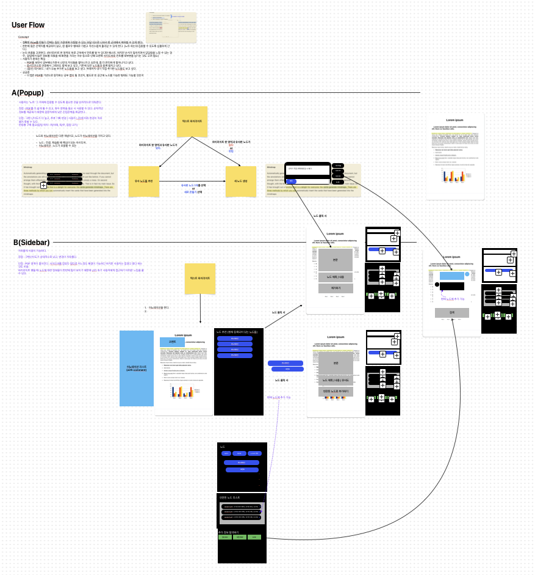

신규 서비스를 개발할 때 1인 개발이 아니라면 다수가 이 프로젝트의 컨셉을 이해하고 있는 것이 중요하다.
서로 다른 생각으로 개발하고 있다가 중간에 수정하는데 더 많은 시간이 소요될 수 있기 때문에 초반에 이 과정은 중요하다고 생각한다.

기획자가 없다면 이 과정은 순조로울 수 있다. 하지만, 기획자가 없다면 개발자들끼리 어떻게 이 소통을 할 수 있을까?

나는 최대한 가벼우면서도 접근성이 좋은 FreeForm을 이용했다. 같은 맥 유저들끼리 접속하기가 굉장히 쉽다. 링크만 전달하면 기본적으로 깔려있는 FreeForm 앱을 통해 접속이 되서 함께 편집하거나 보기만하는 권한을 부여해줄 수 있다.

정제되지 않은 설계를 막 쓰면서 머리를 정리하는 용도로 좋은 것 같다.

## 장단점

하루 사용해 본 장단점을 정리해보면 다음과 같았다.

- 장점 : 가볍고 빠르고 공유가 가능하다는 점.
- 단점 : 제공되는 단축키가 없어서 텍스트, 스티커, 블럭을 만들고 속성을 수정하고 할 떄 다 클릭으로 해줘야 한다. 그런데, 다행인건 가볍지만 꼭 필요한 것들만 다 배치되어있는 느낌이라서 마우스 클릭으로도 빠르게 할 수 있었다.

## 결론

프로토타입(초안)정도로 다같이 수정이 필요하고, 생각하고 의견을 좁혀야 한다면 FreeForm을 사용해도 좋을 것 같다. 아니면 더 좋은 대안으로 FigJam도 있긴하다. 내 기억으로 무료로 몇 개를 만들 수 있다.
