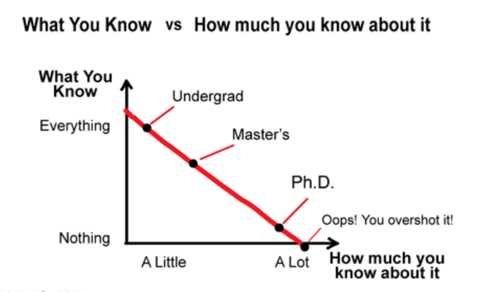

> 전세계 수만 명의 개발자가 수십 년 동안 서비스를 운영하고 있는 구글의 엔지니어는 어떤 모습일지 영감을 얻기 위해 "구글 엔지니어는 이렇게 일한다." 책을 구매했다. 이 포스팅은 이 책을 요약한 글이다.

## Part1 전제

#### Chapter 1. 소프트웨어 엔지니어링이란?

- 소프트웨어 엔지니어는 **언젠간 변경될 가능성**에 신경써야 한다.
- 프로그래밍 작업과 엔지니어링 작업(개발 + 수정 + 유지보수)의 차이는 시간이라는 요소가 더해지면서 입체적으로 바뀐다는 점이다.
- 십 년 이상 살아남는 시스템은 거의 모든 의존성이 처음과 달라질 것이다. 소프트웨어 엔지니어링과 프로그래밍을 가르는 핵심은 이 사실을 인식하는 데서 시작한다. 이 차이가 소프트웨어의 지속 가능성의 핵심이다.
- 초기에 소프트웨어 엔지니어링을 "여러 버전의 프로그램을 여러 사람이 참여해 개발하는 것"이라고 정의했다. **협업 자체로 새로운 문제를 유발하지만, 한 명이 개발하는 것보다 가치 있는 시스템을 만들어낼 잠재력 또한 지닌다.**
- '조직이 성장하고 프로젝트가 확장될수록 소프트웨어 생산 효율도 높아지는가?' 규모에 따른 소통, 인력 충원 문제는 소프트웨어 엔지니어링 초창기부터 논의되어 온 주제다.
- 주기적으로 여러 선택지 사이의 트레이드오프를 평가 해야 한다. 때로는 불완전한 지표에 기대어 결과에 커다란 영향을 주는 선택을 해야 한다.
- 지속 가능성을 잃지 않으면서 조직, 제품, 개발 워크플로우의 규모를 확장하는 비용을 관리해야 한다. 이런 사실을 주지하고 트레이드오프를 평가해 합리적인 결정을 내려야 한다.
- 때로는 유지보수에 도움되는 변경, 확장성이 떨어지는 정책을 받아들여야 할 때도 있다. 이런 결정은 **훗날 다시 검토해야 할 수 있음을 잊지 말아야 하고, 이 결정 때문에 생긴 지연 비용을 정확히 계산해둬야 한다.**
- 규모가 커질수록 효과도 커지는 엔지니어링 생태계의 보고서같은 책이라고 생각하라고 한다.
- 구글에서 대부분 프로젝트는 5년 이내에 업그레이드를 했다.
- **수명이 길어질수록 '동작한다'와 '유지보수 가능하다'의 차이를 더 분명하게 인지해야 한다.**
- 하이럼의 법칙 : **최선의 의도, 최고의 엔지니어, 꼼꼼한 코드 리뷰가 뒷받침되더라도 완벽한 구현이라고 단정할 수 없다는 현실을 표현한 말**이다. 이미 사용자가 API를 사용하고 있다면 가장 무해할 듯한 변경도 일부 사용자의 소프트웨어를 망가뜨릴 수 있다. 따라서 변경이 얼마나 유용할 지 조사할 때는 이런 충돌 조사를 하는 비용도 고려해야 한다.
- '기발한'이 칭찬으로 느껴지면 프로그래밍이라 하고, 질책으로 느껴진다면 소프트웨어 엔지니어링이라고 한다.
- **코드베이스 자체도 확장 가능해야 한다.** 빌드 시간, 레포지토리에서 새로 프로젝트를 내려받는 시간 같은 지표는 적극적으로 관리하지 않으면 천천히 악화된다. 마치 '끓는 물 속의 개구리'처럼 위험 순간까지 눈치채지 못할 수 있다. 따라서 이런 문제는 조직 차원에서 챙기며 확장 가능성에 신경 써야 안정되게 관리할 수 있다.
- 마이그레이션을 담당하는 전문 그룹을 운영하는 것이 각자에게 부담시키는 방식보다 확장성이 좋았다.
- 지식을 공유하는 것이 조직 성장에 기여하는 바가 크다는 사실을 알았다. 한 명만 질문에 기꺼이 대답해 줄 엔지니어가 있다면 100명이 있는 조직일 때 더 나은 코드를 작성하는 100명의 엔지니어가 탄생한다.
- 인프라(조직 내 사용하는 모든 자원)는 더 자주 변경할수록 변경하기가 오히려 쉬워진다. 코드가 더 견고해지고, 다음 업그레이드를 하기도 더 쉬워진다. 무엇을 업그레이드하든 첫 번째 업그레이드 때 코드베이스 수정량이 가장 많을 것이다. 이런 경험을 통해 전문성, 안정성, 코드베이스의 순응(업그레이드를 겪지 않은 코드가 더 적다), 익숙함(자동화 노력), 정책(CI같은 유용한 시스템 구축)을 얻을 수 있었다.

> 이전 회사와 지금 회사에서 겪은 2번의 큰 경험으로 얻었던 교훈을 2006년 구글에서는 이미 가지고 있었다.

- 원점 회귀 : 결함 수정 비용은 왼쪽일수록 낮다. 구글에서는 가능한 많은 버그를 왼쪽에서 잡기 위해 다층 방어 전략을 구축하기 위해 노력한다.
  - 개념잡기 → 설계 → 구현 → 리뷰 → 테스트 → 커밋 → 카나리 → 배포
- 비용을 평가할 때 **조직의 건설성**도 포함되어야 한다. 엔지니어들이 **스스로 가치를 느끼고 생산적인 일을 하고 있다고 생각하는지**가 포함된다. **행복을 느끼고, 일에 집중하고 참여할 수 있게 해주면 10~20% 생산성 향상은 우습게 만들어 낸다.**

## Part2 문화

### Chapter 2. 팀워크 이끌어내기

- 소프트웨어 개발은 '팀의 단합된 노력'의 결실이다.
- 엔지니어링팀이 성공하려면 겸손, 존중, 신뢰에 맞게 자신의 행동을 바로 잡아야 한다.
- 버스 지수 : 몇 명의 팀원이 버스에 치어서 일을 할 수 없게 될 때 프로젝트가 망하게 되는지 나타내는 지수
- 혼자 일하는 것은 고되고, 사람들 기대보다 훨씬 느리다는 점을 잊기 쉽다. 페어프로그래밍을 하는 이유가 여깄다.
- 함수를 짜고 테스트를 짜고, 리팩터링을 하는 것이 가장 빠르게 버그를 잡는 길이다.
- 문제를 빨리 찾을수록 고치는 비용이 낮아진다.
- 사례 연구를 통해, 4~8명 정도마다 사무실을 배정했을 때 생산적인 대화가 이루어진다.
- 구글에서는 "지금은 바쁘니 가능한 방해하지 말아달라"의 뜻을 만들어 사용했다고 한다. 모니터 위에 토큰이나 인형 같은 것을 올려놓는 식으로.
- 하지만, 소통의 단절은 좋지 않다. 적절한 균형점을 찾는 것이 중요하고 정답은 없다.
- 위대한 소프트웨어를 만드는 위대한 팀을 만들기 위해서는 '세 기둥'을 먼저 배우고 익혀야 한다.
  - 겸손 : 당신과 당신의 코드는 우주의 중심이 아니다. 당신은 모든 것을 알지도, 완벽하지도 않다. 겸손한 사람은 배움에 열려있다.
  - 존중 : 함께 일하는 동료를 진심으로 생각한다. 친절하게 대하고, 그들의 능력과 성취에 감사해한다.
  - 신뢰 : 동료들이 유능하고 올바른 일을 하리라 믿는다. 필요하면 그들에게 스스로 방향을 정하게 한다.
- 건설적인 비판하는 사람은 상대방을 진심으로 생각하고, 상대방 업무가 개선되길 바라야 한다는 것.
- 동료를 존중하는 법을 배우고, 건설적이고 공손하게 비평하는 법을 배워야 한다.
- 반대로 자신도 비평을 잘 수용할 줄 알아야 한다.
- "잘못했다"고 하고 "고치라고 요구"도 해서는 안된다.
- "이 부분의 제어 흐름이 좀 헷갈리네요. 혹시 xyz 코드 패턴을 적용하면 더 명확해질까요? 나중에 관리하기 쉬워질지도 모르겠네요"식으로 상대가 아닌 자신을 겸손하게 낮춰서 대화하는 것이 좋다. 아무것도 요구하지 않고, 동료가 제안을 거부해도 부담을 느끼지 않도록 배려했다. "가치"나 "코딩 기술"이 아니라 코드 자체에 집중하고 있다.
- 구글에서는 '실패는 선택이다'라는 좌우명이 있다. '가끔씩 실패하지 않는다면 충분히 혁신적이지 않거나 위험을 충분히 감수하지 않은 것이다'라는 믿음으로 통용된다.
- 실패를 '배우고 다음 단계로 넘어갈 수 있는 절호의 기회'라고 생각한다.
- 구글 X사업부에서는 "실패"를 보상 제도에 녹였다. 잘못된 아이디어임을 증명할 수 있는 동료가 하나도 없는 경우에 초기 프로토타이핑 단계로 넘어갔다.
- 실패한 근본 원인을 분석해서 문서로 남기는 것이 실수로부터 배우는 '핵심'이다. 이를 '포스트모템'이라고 한다.
- 포스트모템을 작성할 때 주의할 점 : 사죄, 변명, 지적으로 채워지지 않도록 주의하라.
- 포스트모템을 작성할 때 다음 내용이 담겨야 한다.
  - 사건 개요
  - 인지 ~ 해결까지 타임라인
  - 원인
  - 피해 평가
  - 즉시 해결한 조치 사항
  - 재발 방지 방법
  - 교훈

### Chapter 3. 지식 공유

- 가장 중요한 사실은 조직에 배움의 문화가 자리 잡혀 있어야 한다는 것이다. 그러려면 사람들에게 모르는걸 인정할 수 있도록 돕는 **심리적 안정을 제공**해야 한다.
- 배움을 가로막는 장애물
  - 심리적 안전 부족 : 불이익이 두려워서 위험을 감수하거나 실수를 드러내기 꺼리는 환경을 말한다. 이 현상은 두려움이 팽배한 문화에서 나타난다.
  - 정보 섬 : 각 부서가 소통이나 자원을 공유하지 않아서 지식이 파편화된다. 각각의 부서가 일하는 환경을 제각기 만들어나간다.
  - 단일 장애점 : 중요한 정보를 한 사람이 독점하면 병목이 생긴다. 위에서 얘기한 버스 지수와 관련이 있다. "여러분을 위해 내가 다 처리하지"같은 마음에서 시작한 것은 단기 효율을 높여주는 대신에 장기 확장성을 희생하는 꼴이다.
  - 전부 아니면 전무 전문성 : 구성원이 '모든 것을 아는' 사람과 '아무것도 모르는'초심자로 나뉜다. 중간층은 사라지게 된다. 이러면 **새로운 전문가를 키우기 위한 멘토링이나 문서화에 신경 쓸 여력이 줄어들어 문제가 눈덩이처럼 커진다.** 지식과 책임이 이미 전문가가 된 사람들에게 집중되고, 새로운 팀원이나 초심자들은 그들만의 울타리에 갇혀 느리게 성장한다.
  - 앵무새처럼 흉내내기 : 이 증상에 빠진 사람들은 목적을 이해하지 못하고, 무의식적으로 기존 패턴이나 코드를 따라한다.
  - 유령의 묘지 : 무언가 잘못될 게 두려워서 아무도 손대지 않는 영역(코드)를 말한다.
- 이번 장에서 설명하는 내용은 위 문제들을 극복하며 깨우친 전략들이다.
- 소프트웨어 엔지니어링에서 가장 중요한 것은 사람이다.
- 조직의 성패는 인력에 얼마나 투자해서 얼마나 잘 키워내느냐에 따라 달려있다.
- 1:1로 해주는 조언의 가치는 이루 말할 수 없이 크지만 팀이 커졌을 때 그리 유용하지 못하다.
- 반면, 문서화된 지식은 팀을 넘어 조직 전체로 퍼트릴 수 있다. 하지만 트레이드오프가 있다. 최신 정보를 계속 반영하기 위해 유지보수 비용이 들어간다.
- 모든 것이 완벽하게 문서로 돌아간다고 하더라도, 개인별 컨설팅은 필요없는 것이 아니다. 전문가에게는 맞춤형으로 다양한 지식을 종합할 수 있는 능력이 있다.
- 현장 지식과 문서화된 지식은 서로 보완해준다.
- 어떤 조합이 최선일지는 조직에 따라 다르다. 조직 스스로 교육하고 배우고 성장하는 데 집중하고, 충분한 수의 전문가를 양성해야 한다. 엔지니어링 전문성이 너무 높아서 문제가 되는 경우는 없다.
- 심리적 안전은 학습 환경을 조성하는데 매우 중요하다.
- 먼저 자신이 이해하지 못한 게 있음을 인정해야 무언가를 배울 수 있다. 우리는 타인의 무지를 탓하지 말고 그 솔직함을 반겨야 한다.
- **배움에는 '무언가를 시도하다가 실패해도 안전하다'는 인식이 엄청나게 중요하다.**
- 건강한 환경에서라면 사람들은 질문을 던지고, 틀리고, 새로운 지식을 얻는 걸 편안하게 생각한다.
- **구글의 연구에 따르면 심리적 안전이 효과적인 팀을 이루는 데 가장 중요한 요인이었다.**
- 멘토 제도 : 새로 직원이 입사하면 멘토를 정해주는데 심리적인 안전을 심어주는 효과적인 방법이다. 같은 팀의 팀원이나 관리자, 테크 리드는 멘토에서 제외된다. 이럴 경우, 동료의 시간을 너무 뺏는 것은 아닐까 걱정하지 않고 마음 편히 궁금한 걸 물어볼 수 있게 된다. 멘토는 지원자 중에서 선별하고, 1년 이상 근무해야 한다. **결정적으로 멘토는 멘티가 누구에게 조언을 구해야 할지 알 수 없을 때 찾아갈 수 있는 안전망이 되어준다.**
- 그룹 차원에서 긴슈 입사자가 부담 없이 질문할 수 있게 해주고, 성장 중인 전문가는 기존 전문가들이 자신의 답변에서 허점을 찾아 공격할지 모른다는 두려움 없이 도움의 손길을 내밀 수 있도록 해야 한다.
- 그룹 내 소통 패턴은 다음과 같이 이루어져야 한다.
  - 자신의 지식을 뽐낼 목적으로 설명하는 것이 아니라 질문자가 배우게끔 도와줄 목적으로 설명해야 한다.
  - 잘난 체하고 비난하며 건설적이지 못한 방식으로 대응하는 것이 아니라 인내심을 갖고 도움이 되게끔 대응한다.
  - 승자와 패자를 가리는 논쟁 형식으로 이루어지는 것이 아니라 해법을 찾기 위해 공개 토론 형식으로 상호작용이 이뤄져야 한다.
- 프로그래밍 교육 기관인 Recurse Center의 사회적 규칙에서 도움이 될만한 규칙이 있다.
  - 거짓된 놀람 금지("뭐라고? 스택이 뭔지 모른다니 믿을 수가 없네!") : 심리적 안전을 방해하여 구성원들은 모른다는 사실을 인정하기 두려워하게 된다.
  - "음 실제로는.." 금지 : 지나칠 정도로 세세하게 고쳐주는 행위는 정밀성보다 자신을 뽐내려는 무의식에 기인하는 경향이 있다.
  - 뒷좌석 운전 금지 : 토론 중에 적절한 발언권 없이 끼어들어 의견을 제시하지 말기.
- **인간은 언제나 아는 것보다 배워야 할 것이 더 많다. 이게뭔지 모르겠는데, 설명 좀 해주시겠어요? 라고 말하는걸 두려워하지 말자.**
- **리더들이 솔선수범해서 이런 문화를 만들어야 한다. '상급자라면 모든 걸 알아야 한다'라는 인식이 생겨나지 않도록 주의해야 한다.**
- **우리는 많이 알면 알수록 모르는 것이 더 많음을 깨닫게 된다.**
  
- 레거시 코드가 떠넘겨졌을 때 기존 코드를 공부하기 보다는 새로 짜고 싶어집니다. 이럴 때 체스터슨의 울타리 원칙 '무언가를 옮기거나 바꾸려면 왜 그 자리에 있는지부터 이해하자'를 떠올리자.
- 기존 코드가 명확하지 않다거나 잘못된 디자인 패턴이 적용됐을 리 없다고 주장하는 것이 아니라 엔지니어들은 성급하게 잘못됐다고 결론 짓는 경향이 있다. 생소한 코드, 언어, 패러다임을 접할 때 더욱 심하다. 구글도 마찬가지다. 변경하려는 방향이 더 나은지 고민하고 변경했을 때 더 나으면 수정하고, 그렇지 않으면 생각한 근거를 남겨두자. 그러면 다음 사람이 근거를 이해하는 데 도움되는 맥락 정보를 얻게 된다.
- **전문성은 다차원 벡터다. 전문성은 '초심자 아니면 전문가'처럼 이분법으로 나눠지지 않는다. 누구나 영역별로 다양한 수준의 전문성을 갖추고 있다. **
- 오피스 아워 : 특정 주제에 관한 질문에 답해줄 목적으로 시간을 비워 두는 정기적인 이벤트다. 어떻게 질문해야 할지 불명확할 때나(새로운 서비스 설계 시작) 문서화되지 않은 특수한 문제에 맞닥뜨렸을 때 특히 유용하다.
- **많은 회사에서 조직 문화를 생각할 때 나중에 생각해볼, 깔끔하게 딱 떨어지지 않는 '사람 사이의 문제'로 치부한다. 구글은 코드 같은 산출물보다 문화와 환경을 첫 번째로 두고 생각해야 더 나은 결과를 얻는다고 믿는다.**
- 좋지 않은 환경에서는 초심자가 궁금한 게 생겨도 커뮤니티 외부에서 답을 찾으려 하고, 전문가로 성장하기위해 노력하기를 멈춰버린다. 최악의 경우 해로운 구성원으로 바뀌어 버린다. 이 상태까지 간다면 회복하기가 매우 어렵다.
- 지식을 공유할 때는 상냥함과 존중을 담아야 한다.
- 구글의 엔지니어링 직무 사다리에서 리더십 항목은 다음 내용을 명확히 밝히고 있다 : 높은 수준의 기술 리더십을 요구하지만, 모든 리더십이 기술 문제와 관련된 것은 아니다. 리더는 주변 사람들을 성장시키고, 팀의 심리적 안정을 개선하고, 팀워크와 협업 문화를 조성하고, 팀 내 긴장감을 해소하고, 더 활기차고 신나는 일터로 가꿔 나가야 한다.
- 지식 공유 문화를 장려하려면 인정과 보상 제도가 뒷받침되어야 한다.
- **구글에는 동료 상여 제도가 존재하는데 관리자가 아닌 직원이 주도하는 제도이므로 중요하고 강력한 풀뿌리 효과를 발휘한다.**
- **동료 상여와 비슷한 제대로 쿠도스(공개 칭찬)이 있는데 동료의 기여를 공개적으로 인정하는 제도로, 동료간에 이루어진 기여를 더 널리 알리는 효과가 있다.**
- **동료의 업적을 인정해주는 공식적이고 손쉬운 제도는 직원들에게 계속해서 이타적이고 멋진일을 하도록 강한 동기를 부여해준다. 상여금보다 동료를 인정해준다는 점이 더 중요하다.**
- 구글에는 '가독성 제도'가 있다. 단순한 코드 가독성 이상을 의미한다. 코드 구조, API 설계, 공통 라이브러리 올바른 사용법, 문서화, 테스트 커버지리 등 전문 지식을 광범위하게 다룬다. 공백 규칙까지 이르기에 매우 엄격한 규칙이였고, 덕분에 구글의 코드베이스는 일관된 모습을 갖추게 됐다. 오늘날 구글 엔지니어의 약 20%가 리뷰어 혹은 코드 작성자가 되어 가독성 인증 프로세스에 참여하고 있다.
- 구글은 사람이 너무 많아져서 코드 리뷰만으로 모범 사례들을 충분히 가르치는 것이 불가능해졌다. 그래서 가독성 승인 장치가 추가됐다. '가독성 자격증'이 있는 누군가가 승인했다는 것이다. 일반적으로 언어별로 존재한다.
- **가독성 인증 프로세스를 두는 이유는 작성되는 횟수보다 훨씬 많이 읽히기 때문이다.**
- 가독성 비용은 절대 저렴하지 않으며, 코드 리뷰를 인간에게 의존하면서 조직 성에 맞춰 선형적으로 확장할 수 밖에 없다.
- **문제는 들이는 비용에 비해 얻어지는 이익이 더 많은가이다. 혜택의 시간 척도를 길게 잡을수록 코드 기대 수명이 길다는 뜻이 된다.**
- 구글의 엔지니어링 생산성 연구(EPR)팀에 문의 결과. 가독성 제도를 면밀히 연구했을 때 엔지니어링 속도에 긍정적인 영향을 준다는 결론을 얻었다.

### Chapter 4. 공정 사회를 위한 엔지니어링

- 우리가 어떤 사람들을 대표하고 있는지를 이해해야 한다.
- 엔지니어들이 폭넓은 주제의 교육과 훈련을 받도록 장려해야 한다.
- 사업에 성공하려면 컴퓨터 과학 학위나 업무 경험만으로 훌륭한 엔지니어가 될 수 있다는 통념에서 벗어나는 일부터 출발해야 한다.
- 고려하기 가장 어려운 사용자는 절차나 환경 때문에 기술을 이용하지 못하고 소외된 사람들이다. 엔지니어링팀은 현재는 물론 미래의 사용자도 대표해야 한다.
- **뛰어난 엔지니어라면 무언가를 만들어야 할 때와 아닐 때를 구분하는 안목도 갖춰야 한다. 부정적인 결과를 낳는 기능이나 제품을 알아채는 역량과 거부할 수 있는 용기를 기르는 것도 이 안목에 포함된다. 고상하고 어려운 목표다. 왜냐하면 높은 성과를 내는 엔지니어가 되는 데는 개인주의적인 성향이 크게 작용하기 때문이다. 그러나 성공하기 위해서는 우리가 속한 커뮤니티를 벗어나서 시야를 넓혀야 한다.**
- **뛰어난 엔지니어가 되기 위해서 첫 번째 단계는 많은 사회적, 교육적 요인 떄문에 심어진 편견의 현재 상태를 인식하는 것이다.**
- 구글에서는 낮은 평가를 받았던 사람이 다른 팀으로 이동하는 경우에 대해 심층 분석했다. 결과적으로는 대부분 평가가 낮았던 팀원이 팀 이동 후 평가가 좋아졌다. 성과 등급은 그 시점에 그 사람이 맡고 있던 일을 얼마나 잘 수행했냐를 말해줄 뿐. 다른 일에서는 더 잘할 수 있었던 것이다.
- 구글의 브랜드 구호는 모두를 위한 제품을 만든다는 것이고 단기적인 속도를 위해 공정성을 포기하지 말자고도 한다.
