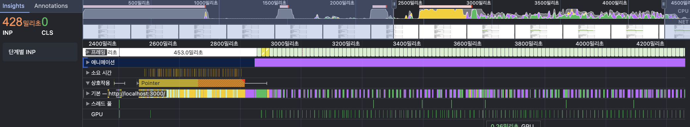
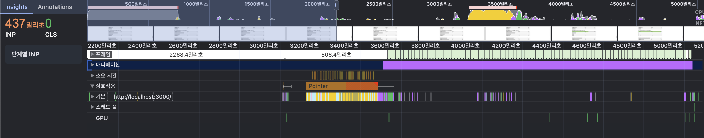
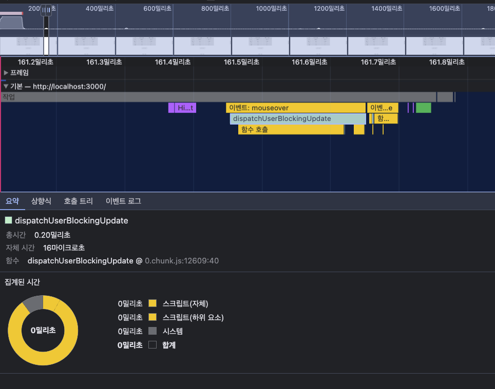
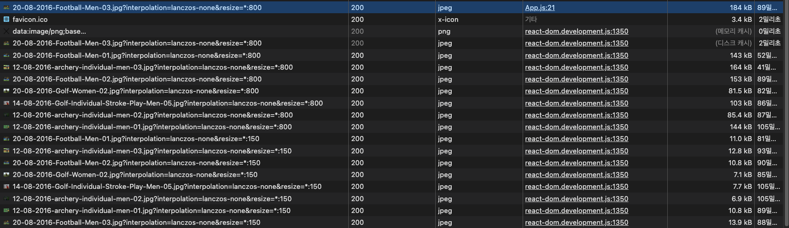

## 2장
### 목적
- CSS 애니메이션 최적화
- 컴포넌트 지연 로딩 : 1장에서는 페이지 단위로 적용했다면 여기서는 단일 컴포넌트에 적용하고, 쓰이는 순간 불러온다.
- 컴포넌트 사전 로딩 : 코드가 필요한 시점보다 먼저 코드를 로드해서 지연없이 사용할 수 있도록 한다.
- 이미지 사전 로딩 : 컴포넌트와 마찬가지로 필요한 시점보다 먼저 다운하고, 필요할 때 바로 보여줄 수 있게 한다.

### 애니메이션 최적화

막대 그래프를 클릭하면 width가 변한다.
CPU를 많이 사용하면서 끊기는 것을 확인하기 위해 우리는 performance에서 톱니바퀴를 누르고 CPU에서 6x slowdown을 걸어볼 수 있다.
> 요소가 화면에 많지 않고 width정도만 바뀌기 때문에 현재 PC에다가 최신 브라우저에서는 20배 정도 제한을 걸어야 조금 버벅거리는게 보인다.


코드는 아래와 같다.
```Bar.ts
const BarGraph = styled.div`
    width: ${({width}) => width}%;
    transition: width 1.5s ease;
    /* 다른 스타일.. */
`
```

끊김 현상은 쟁크(jank)현상이라고 하는데, width를 바꾸는데 왜 끊김 현상이 일어나는지에 대해 이해하기 위해서 브라우저에서 애니메이션은 어떻게 동작하는지, 화면을 어떻게 그리는지에 대해 이해할 필요가 있다.

### 애니메이션
애니메이션의 원리는 이미지를 빠르게 전환해서 우리 눈에 잔상을 남겨서 움직이는 것처럼 느껴지게 하는 것이다.
이 때 중간에 1장의 이미지가 없다면 우리는 끊기는듯한 느낌을 받을 것이다.
브라우저에서 애니메이션이 끊기는 듯한 느낌을 받는 것은 CPU가 다른 일을 하느라 중간에 몇 장의 화면을 처리하지 못한 것이다.
만약, 모니터가 60프레임일 경우 애니메이션은 60프레임으로 표시될 것인데, 일부 프레임이 누락되는 과정을 알고 싶다면 브라우저가 화면에 그리는 과정을 알아야 한다.

### 브라우저 렌더링 과정
크게 아래 순서로 렌더링이 진행된다.

1. DOM + CSSOM : HTML, CSS 코드를 파싱해서 DOM + CSSOM 트리를 만든다.
2. 렌더 트리 : DOM + CSSOM 트리를 통해서 렌더링할 화면을 구성하기 위해 렌더 트리가 형성된다. (display: none이거나 이런 요소를 제외한다)
3. 레이아웃 : 화면 구성 요소들의 위치나 크기를 계산해서 영역을 잡는다.
4. 페인팅 : 색을 입힌다.
5. 컴포지트 : 여러 레이어를 나눠서 만든 구성을 합친다.

### 브라우저 렌더링 과정과 일부 프레임 누락이 어떤 관련이 있는가?

위 브라우저 렌더링 과정 중에서 일부 스타일 변경은 리플로우, 리페인팅을 일으킨다. 즉, 위 예제에서 width를 변경하게 되면 짧은 시간 동안 여러 번의 리플로우, 리페인팅을 일으키게 되니 브라우저 리소스를 많이 사용하게 된다.

### 리플로우, 리페인팅

**리플로우, 리페인팅을 발생시키는 속성**

- 리플로우 : position, display, width, float, height, font-family, top, left, font-size, font-weight, line-height, min-height, margin, padding, border 등
- 리페인팅 : background, background-image, background-position, border-radius, border-style, box-shadow, color, line-style, outline 등

> 내 생각에 이건 외우고 있어야 되는건 아니다. 처음에 웹 개발을 공부할 때는 외우려고 했으나, 그것보다는 실전으로 개발하면서 애니메이션 같이 짧은 시간안에 화면이 바뀌어야 하는 상황일 때 이 스타일이 리플로우, 리페인팅을 일으키는 요소인지만 확인하면 된다.
> 

리페인팅을 하면 브라우저 렌더링 과정에서 페인팅과 컴포지트만 수행하면 되는거 아닌지 생각할 수 있다. 하지만, 중간에 있는 레이아웃 과정만 거치지 않을 뿐 나머지 과정은 그대로 수행하기 때문에 비용이 적지 않다.

### 리플로우, 리페인팅 피하기

transform, opacity 같은 속성을 이용해서 피할 수 있다. 이런 속성은 별도의 레이어로 분리해서 GPU에 위임하여 처리한다. 여기서 하드웨어 가속을 사용한다. (이런 속성은 레이아웃 단계와 페인트 단계를 건너뛴다.)

> transform: translate()를 사용하면 처음부터 레이어가 분리되어 있는게 아니라, 변화가 일어나는 순간에 레이어를 분리한다. 반면, transform: translate3d()나 scale3d()같은 3d속성또는 will-change속성은 처음부터 레이어를 분리해놓기 때문에 빠르게 상황에 대처가 가능하다. 하지만, 레이어가 너무 많으면 메모리를 더 많이 사용하게 되니 주의해야 한다.
> 

위 예제에서 width를 바꿔줬다면, 우리는 이제 transform을 사용할 수 있다.

```tsx
width: 100%;
transform: scaleX(${({ width }) => width / 100}); // 1이 100%라고 보면 된다.
transform-origin: center left; // scale의 origin. 즉, 시작점을 변경한다.
transition: transform 1.5s ease;
```

개선 전



개선 후



> 책은 출시된지가 좀 시간이 지났기 때문에 퍼포먼스탭을 직접 해석해봤는데, 2024년 3월에 구글에서 중요한 웹 성능 지표 중 하나로 보고있는 INP(Interaction to Next Point)나 애니메이션에 걸리는 시간은 거의동일했다. 다만 기본탭과 GPU탭이 상당히 많이 차이나는 것을 볼 수 있다. 기본 탭에서는 스타일 다시 계산 등 리플로우 리페인팅 작업을 계속하는 것을 볼 수 있었고 개선 후에는 확실히 CPU나 GPU가 덜 일하는 것을 볼 수 있다. (추가 포인트로 개선 전에 width를 이용하여 리플로우 리페인팅이 계속 발생할 때도 GPU가 사용되는 것을 볼 수 있는데 페인팅 자체가 GPU를 사용하기 때문이다. 개선 전에는 리페인팅을 계속 하다보니 GPU를 반복적으로 사용하는 것이다. 하지만, transform을 사용하게 되면 GPU가 깔끔하게 동작을 하다보니 확실히 덜 찍힌걸 볼 수 있다)
> 

### 컴포넌트 지연 로딩
이미지 써드파티를 사용하는 컴포넌트만을 lazy하게 불러올 수 있다.
```tsx
// import ImageModal from './components/ImageModal'

const LazyLoadModal = lazy(() => import('./components/ImageModal'));

function App() {
    const [showModal, setShowModal] = useState(false)

    return (
        <div className="App">
            <Header />
            <InfoTable />
            <ButtonModal onClick={() => { setShowModal(true) }}>올림픽 사진 보기</ButtonModal>
            <SurveyChart />
            <Footer />
            <Suspense fallback={<div>Loading..</div>}>
                {showModal ? <ImageModal closeModal={() => { setShowModal(false) }} /> : null}
            </Suspense>
        </div>
    )
}
```

개선 전


개선 후


## 컴포넌트 사전 로딩
위와 같이 컴포넌트 지연 로딩을 했을 경우 페이지 초기속도는 빠를 수 있지만 이미지 컴포넌트 모달을 띄울 때는 이미지가 뜨기까지 많은 시간이 소요될 수 있다. 그렇다면 페이지 초기에는 로딩하지 않지만, 이미지 컴포넌트 모달을 띄우는 경우에 더 빠르게 로드될 수 있는 방법은 무엇이 있을까?

두 가지 방법이 있다.
1. 모달을 띄우는 버튼에 마우스를 올렸을 경우 이미지 컴포넌트를 미리 로드한다.
2. 초기 페이지가 마운트 다 되었을 때 이미지 컴포넌트를 미리 로드한다.


### 모달을 띄우는 버튼에 마우스를 올렸을 경우 이미지 컴포넌트를 미리 로드하기
마우스를 버튼 위에 올렸을 때 미리 네트워크를 통해 코드를 불러오고, 스크립트를 평가하는 시간을 갖게 한다.

```tsx
const LazyLoadModal = lazy(() => import('./components/ImageModal'));

function App() {
    const [showModal, setShowModal] = useState(false);

    const handleMouseEnter = () => {
        import('./components/ImageModal').then((module) => {
            console.log('ImageModal dynamically imported:', module);
        });
    }

    return (
        <div className="App">
            <Header />
            <InfoTable />
            <ButtonModal onMouseEnter={handleMouseEnter} onClick={() => { setShowModal(true) }}>올림픽 사진 보기</ButtonModal>
            <SurveyChart />
            <Footer />
            <Suspense fallback={<div>Loading..</div>}>
                {showModal ? <LazyLoadModal closeModal={() => { setShowModal(false) }} /> : null}
            </Suspense>
        </div>
    )
}
```

**개선 후**
마우스를 hover했을 때 chunk파일을 로드하는 함수가 실행되는 것을 볼 수 있다.


### 마운트가 완료된 후 이미지 컴포넌트를 미리 로드하기
```tsx
const LazyLoadModal = lazy(() => import('./components/ImageModal'));

function App() {
    const [showModal, setShowModal] = useState(false);

    useEffect(() => {
        import('./components/ImageModal').then((module) => {
            console.log('ImageModal dynamically imported:', module);
        });
    }, [])

    return (
        <div className="App">
            <Header />
            <InfoTable />
            <ButtonModal onClick={() => { setShowModal(true) }}>올림픽 사진 보기</ButtonModal>
            <SurveyChart />
            <Footer />
            <Suspense fallback={<div>Loading..</div>}>
                {showModal ? <LazyLoadModal closeModal={() => { setShowModal(false) }} /> : null}
            </Suspense>
        </div>
    )
}
```

### 사전 로딩 기법 이것만 있는 것일까?
위 예시는 마우스를 버튼에 hover후에 다운받는 경우가 이미지 컴포넌트가 로드되는 시간과 클릭하는 시간과 비슷하여 가장 적합했다.
하고 싶은 말은 사전 로딩 기법을 적용할 때 각 상황에 맞게 적용하는 것이 중요하지. 어떤 기법을 반드시 사용해야 하는 것이 아니다.

## 이미지 사전 로딩
이번에는 이미지 모달 내부에 들어가는 첫 번째 이미지를 사전로드해보자.
new 연산자로 Image객체를 만들고 src속성에 이미지 주소를 입력하면 네트워크를 통해 미리 불러올 수 있다. 콘솔창에서 확인해볼 수도 있다.
```tsx
    useEffect(() => {
        import('./components/ImageModal').then((module) => {
            console.log('ImageModal dynamically imported:', module);
        });

        const img = new Image();
        img.src = 'https://stillmed.olympic.org/media/Photos/2016/08/20/part-1/20-08-2016-Football-Men-03.jpg?interpolation=lanczos-none&resize=*:800'
    }, [])
```

결과는 아래와 같다. 마운트가 끝났을 때 184kb로 이미지를 다운받고 있고, 이미지 모달이 열렸을 때 data:image/png;base... 바로 밑에 있는 이미지를 보면 파일 용량이 (디스크 캐시)라고 적혀있는 것을 볼 수 있고, 매우 빠른 속도로 로드한 것을 확인할 수 있었다.



> 이미지를 미리 몇 장을 로드할 것인지는 상황에 따라 판단할 줄 알아야 한다.