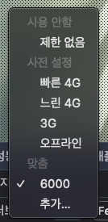
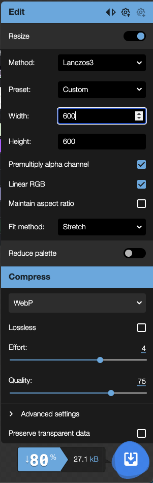

## 3장

### 네트워크 테스트를 위해서 임의의 설정으로 세팅을 추가할 수 있다.

제일아래 추가를 눌러서 다운로드 속도, 업로드 속도, 지연시간을 조절할 수 있고 패킷 손실까지 컨트롤 할 수 있다.

> 기존에 제공하는 4G, 느린 4G등을 사용할 때 그 중간 제어 정도가 있으면 좋겠다 싶었는데 그 질문에 대한 해답을 찾았다.
패킷까지는 수정하지 않고, 다운로드/업로드 속도 및 지연시간만 제어하더라도 원하는 테스트가 가능할 것 같다.



### 메인 배너의 비디오를 최우선 로딩하고, 그 밑에 이미지는 보였을 때 로드하고 싶을 때.
scroll컴포넌트가 아니라 웹 브라우저에서 제공하는 API인 intersectionObserver를 써야한다.
> 여기서 포인트는 이미지를 지연로딩하는 방식(data속성에 넣어놨다가 필요한 타이밍에 꺼내서 img의 src에 할당하는 것), 한 번 이미지를 로드한 후에 unobserve로 해체해 주는 것이다.

```tsx
function Card(props) {
	const imgRef = useRef(null);
	useEffect(() => {
		const callback = (entries) => {
			entries.forEach(entry => {
				if (entry.isIntersecting) {
					entry.target.src = entry.target.dataset.src;
            // 한번 호출한 이후로는 호출할 필요가 없다.
            observer.unobserve(entry.target);
          }
        }
      );
		}
		const options = {
			root: null,
			rootMargin: '0px',
			threshold: 1.0
		}
		const observer = new IntersectionObserver(callback, options);
		observer.observe(imgRef.current);

		return () => observer.disconnect();
	}, [])

	return (
		<div className="Card text-center">
			
			<div className="p-5 font-semibold text-gray-700 text-xl md:text-lg lg:text-xl keep-all">
				{props.children}
			</div>
		</div>
	)
}
```

### 이미지 최적화(변환)은 squoosh.app을 이용하자.
구글에서 만든 이미지 컨버터로 웹에서 돌아간다.

사이즈는 사용하려는 크기의 2배로 설정하자. (같은 공간대비 더 높은 픽셀에 대응한다.)
압축방식은 현재 대부분 브라우저가 지원하는 WebP 형식을 사용하고, 압축률은 70-80 정도로 설정한다.
그랬을 때 얼마나 용량을 절약할 수 있는지 밑에 함께 나온다.

> 만약에 브라우저의 하위호환성을 고려하고 싶다면, picture 태그를 사용하자.
뷰포트 크기에 따라 혹은 브라우저에서 지원 가능한 타입을 찾아서 이미지를 렌더링 할 수 있다.




### 동영상 최적화
동영상도 마찬가지로 이미지처럼 구글에서 개발한 동영상 포맷이 있다. 바로 webM이다.
기존에 51mb였던 동영상을 bitrate 512Kbps, webM으로 설정해서 포맷을 변환했더니 12MB가 됐다.

> video파일도 마찬가지로 이미지파일의 하위호환성을 고려할 수 있다. picture가 아닌 video 태그를 사용하고
자식에는 이미지와 마찬가지로 source태그를 사용한다.
```tsx
<video autoPlay loop muted>
	<source src={video_webm} type="video/webm" />
	<source src={video} type="video/mp4" />
</video>
```

### 폰트 최적화
크롬은 FOIT(Flash of Invisible Text)방식을 사용한다. 
하지만 완전 FOIT방식은 아니다. 다운로드 될 때까지 보여주지 않아야 FOIT방식이지만 크롬은
처음 3초간 폰트가 다운로드 되는 것을 기다렸다가 폰트가 완전히 다운되었다면 보여준다.
3초를 기다려도 폰트가 다운로드가 되지 않았다면 기본 폰트를 보여줬다가, 커스텀 폰트 다운로드가 끝나면 보여준다.

> 폰트 최적화가 불필요할 것이다라고 생각할 수 있다. 나도 프론트엔드 처음 입문할 때 이미 인터넷이 이렇게 빠른 시대에서
"폰트가 커봤자 얼마나 크고, 커스텀 폰트 다운로드가 느려봤자 얼마나 느릴까"라고 생각했었던 때가 있었는데
커스텀 폰트가 1개일 때는 큰 문제가 아닐수도 있고, 일반적으로 데스크탑으로 접근 했을 때에는 문제가 없을 수 있다.
하지만, 커스텀 폰트 여러개가 들어가거나 최적화가 되지 않은 몇 개의 큰 용량 폰트가 들어갔을 때 초반에 다운로드 속도가 느릴 수 있고
인터넷이 원활하지 않은 모바일에서 접근 시에도 생각해야 한다.