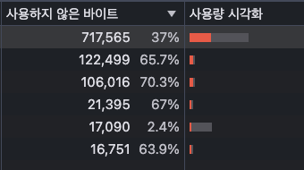

## 3장

### 네트워크 테스트를 위해서 임의의 설정으로 세팅을 추가할 수 있다.

제일아래 추가를 눌러서 다운로드 속도, 업로드 속도, 지연시간을 조절할 수 있고 패킷 손실까지 컨트롤 할 수 있다.

> 기존에 제공하는 4G, 느린 4G등을 사용할 때 그 중간 제어 정도가 있으면 좋겠다 싶었는데 그 질문에 대한 해답을 찾았다.
패킷까지는 수정하지 않고, 다운로드/업로드 속도 및 지연시간만 제어하더라도 원하는 테스트가 가능할 것 같다.


### 메인 배너의 비디오를 최우선 로딩하고, 그 밑에 이미지는 보였을 때 로드하고 싶을 때.
scroll컴포넌트가 아니라 웹 브라우저에서 제공하는 API인 intersectionObserver를 써야한다.
> 여기서 포인트는 이미지를 지연로딩하는 방식(data속성에 넣어놨다가 필요한 타이밍에 꺼내서 img의 src에 할당하는 것), 한 번 이미지를 로드한 후에 unobserve로 해체해 주는 것이다.

```tsx
function Card(props) {
	const imgRef = useRef(null);
	useEffect(() => {
		const callback = (entries) => {
			entries.forEach(entry => {
				if (entry.isIntersecting) {
					entry.target.src = entry.target.dataset.src;
            // 한번 호출한 이후로는 호출할 필요가 없다.
            observer.unobserve(entry.target);
          }
        }
      );
		}
		const options = {
			root: null,
			rootMargin: '0px',
			threshold: 1.0
		}
		const observer = new IntersectionObserver(callback, options);
		observer.observe(imgRef.current);

		return () => observer.disconnect();
	}, [])

	return (
		<div className="Card text-center">
			
			<div className="p-5 font-semibold text-gray-700 text-xl md:text-lg lg:text-xl keep-all">
				{props.children}
			</div>
		</div>
	)
}
```

### 이미지 최적화(변환)은 squoosh.app을 이용하자.
구글에서 만든 이미지 컨버터로 웹에서 돌아간다.

사이즈는 사용하려는 크기의 2배로 설정하자. (같은 공간대비 더 높은 픽셀에 대응한다.)
압축방식은 현재 대부분 브라우저가 지원하는 WebP 형식을 사용하고, 압축률은 70-80 정도로 설정한다.
그랬을 때 얼마나 용량을 절약할 수 있는지 밑에 함께 나온다.

> 만약에 브라우저의 하위호환성을 고려하고 싶다면, picture 태그를 사용하자.
뷰포트 크기에 따라 혹은 브라우저에서 지원 가능한 타입을 찾아서 이미지를 렌더링 할 수 있다.


### 동영상 최적화
동영상도 마찬가지로 이미지처럼 구글에서 개발한 동영상 포맷이 있다. 바로 webM이다.
기존에 51mb였던 동영상을 bitrate 512Kbps, webM으로 설정해서 포맷을 변환했더니 12MB가 됐다.

> video파일도 마찬가지로 이미지파일의 하위호환성을 고려할 수 있다. picture가 아닌 video 태그를 사용하고
자식에는 이미지와 마찬가지로 source태그를 사용한다.
```tsx
<video autoPlay loop muted>
	<source src={video_webm} type="video/webm" />
	<source src={video} type="video/mp4" />
</video>
```

### 폰트 최적화
크롬은 FOIT(Flash of Invisible Text)방식을 사용한다. 
하지만 완전 FOIT방식은 아니다. 다운로드 될 때까지 보여주지 않아야 FOIT방식이지만 크롬은
처음 3초간 폰트가 다운로드 되는 것을 기다렸다가 폰트가 완전히 다운되었다면 보여준다.
3초를 기다려도 폰트가 다운로드가 되지 않았다면 기본 폰트를 보여줬다가, 커스텀 폰트 다운로드가 끝나면 보여준다.

> 폰트 최적화가 불필요할 것이다라고 생각할 수 있다. 나도 프론트엔드 처음 입문할 때 이미 인터넷이 이렇게 빠른 시대에서
"폰트가 커봤자 얼마나 크고, 커스텀 폰트 다운로드가 느려봤자 얼마나 느릴까"라고 생각했었던 때가 있었는데
커스텀 폰트가 1개일 때는 큰 문제가 아닐수도 있고, 일반적으로 데스크탑으로 접근 했을 때에는 문제가 없을 수 있다.
하지만, 커스텀 폰트 여러개가 들어가거나 최적화가 되지 않은 몇 개의 큰 용량 폰트가 들어갔을 때 초반에 다운로드 속도가 느릴 수 있고
인터넷이 원활하지 않은 모바일에서 접근 시에도 생각해야 한다.

UX를 위해서 좀 더 부드라운 폰트 전환을 할 수도 있다. 성능이 향상된 것처럼 느낄 수도 있다.
`npm i fontfaceobserver`로 폰트가 다운로드 되었을 떄를 감지할 수 있는 라이브러리를 이용할 수 있는데
transition으로 opacity를 기본적으로 부여한 뒤, 폰트가 다운로드 되었을 떄 opacity를 1로 만드는 것이다.
```tsx
function BannerVideo() {
  const [isFontLoaded, setIsFontLoaded] = useState(false);

  useEffect(() => {
    font.load(null, 20000).then(() => {
      console.log("font loaded");
      setIsFontLoaded(true);
    });
  }, []);

  return (
    <div
      className="..."
      style={{ opacity: isFontLoaded ? 1 : 0, transition: "opacity 0.3s ease" }}
    >
      ...
    </div>
  );
}

export default BannerVideo;
```

추가로 폰트 포맷을 변경해서 크기를 줄일 수도 있고, 사용되지 않은 문자들을 제거한 폰트를 사용할 수도 있다.
파일 크기는 다음과 같다. EOT < TTF/OTF < WOFF < WOFF2
변환한 폰트 파일은 아래처럼 하위 브라우저 호환성을 고려할 수 있다.
```css
@font-face {
  font-family: BMYEONSUNG;
  src: url("./assets/fonts/BMYEONSUNG.woff2") format("woff2"),
    url("./assets/fonts/BMYEONSUNG.woff") format("woff"),
    url("./assets/fonts/BMYEONSUNG.ttf") format("ttf");

  font-display: block;
}
```

일반적으로 사용되지 않은 문자들을 제거한 subset폰트는 data-uri형태로 만들어서 로드할 수도 있다.
폰트 데이터를 미리 CSS파일에 인라인으로 포함하므로 추가적인 HTTP요청이 필요없을 수 있다.
하지만, data-uri 형태로 임베드된 폰트는 브라우저가 별도로 캐싱할 수 없다. 그래서 페이지를 새로 로드할 때마다 폰트를 다시 다운받아야 한다.

> 일반적으로 웹 폰트를 다운받는 방식 vs data-uri 방식
책에서는 data-uri의 장점에 대해서 많이 어필해주고 있지만, 실제로 찾아보면 성능 부분에서 폰트 파일로 다루는 것이 압축된 파일로 전달할 수 있어서
크기가 평균 33%정도 더 작아서 이득이고 CDN 및 캐싱도 이용할 수 있어서 반복적으로 파일을 받을 필요가 없다는 점도 이점이다.
그리고 서비스 단에서 봤을 때 폰트 파일 관리가 잘 되는 것이 서비스의 지속가능성을 위해서 중요하기 때문에 파일로 관리하는 방식이 더 좋다고 생각된다.
간단한 소규모 프로젝트 혹은 단일 페이지만 있을 경우에는 HTTP요청을 더 적게해서 초기 로딩 속도 올리는데 도움을 줄 수 있을 것 같다.

### 캐시의 종류
웹에서 사용하는 캐시는 크게 두 가지다. 메모리 캐시와 디스크 캐시.
- 메모리 캐시 : 메모리(RAM)에 저장하는 방식.
- 디스크 캐시 : 파일 형태로 디스크에 저장하는 방식.

특정 페이지를 들어가서 새로고침을 하면 네트워크 탭에서 각 리소스의 크기를 보면 알 수 있다.
이 캐시는 브라우저의 알고리즘에 의해서 자동으로 분류된다.

### 서버 응답헤더에 캐시를 적용해보자.
```js
const express = require("express");
const app = express();
const port = 5001;
const path = require("path");

const header = {
  setHeaders: (res, path) => {
    res.setHeader("Cache-Control", "max-age=10");
  },
};

app.use(express.static(path.join(__dirname, "../build"), header));
app.get("*", (req, res) => {
  res.sendFile(path.join(__dirname, "../build/index.html"));
});

app.listen(port, () =>
  console.log(`Example app listening at http://localhost:${port}`)
);
```

네트워크에서 확인해보면 각 리소스의 크기에 메모리캐시가 적용된 것을 볼 수 있고, 응답헤더를 봐도 Cache-control이 추가된 것을 볼 수 있다.


하지만, 위 방식은 잘못됐다. 전체 파일을 다 캐싱하면 안되기 때문이다. 
특히, HTML파일은 최신의 상태를 항상 전달해주기 위해서 보통 no-cache 전략을 사용한다.
no-store는 완전히 캐싱을 사용하지 않는다는 것이고, no-cache는 서버의 데이터가 변경되었다면 브라우저의 ETag와 비교하여 최신의 데이터가 필요하다면 최신의 HTML을 보내준다.
HTML을 최신으로 받아야하는 이유는 그래야만 CSS, JS파일이 변경되었을 때 최신으로 받을 수 있기 때문이다.

정리하면
- HTML은 항상 최신버전을 보장하기 위해 no-cache를 사용한다.
- JS/CSS 파일은 변경되지 않는 경우가 많기 때문에 캐싱 전략을 사용해서 네트워크 비용을 줄이고, 성능을 향상시킨다.
- JS/CSS파일이 변경되었다면 HTML이 새로운 파일 이름을 참조하고 최신 파일을 다운로드 받을 수 있게 한다.

### 개발자 도구 > 도구 더보기 > 범위(Coverage)로 코드 사용률 보기
현재 코드가 얼마나 많이 사용되고 있는지 알 수 있다. 이를 통해 놀고 있는 코드가 얼마나 많은지도 확인할 수 있는데


javascript는 분기문 떄문에 처음부터 100% 사용률이 나오기 어렵고, css파일도 다른 페이지에서 사용하는 클래스들이 있기 때문에 100%가 나올 수 없다.
점점 사용하면서 사용비율이 증가하게 되는데, 비정상적으로 사용하지 않은 바이트가 높지는 않은지 정도는 확인할 수 있다.
그래서 CSS파일 같은 경우 purgeCSS같은 유틸리티를 사용해서 사용하고 있지 않은 클래스들을 제거해주는 툴도 사용할 수 있다.
