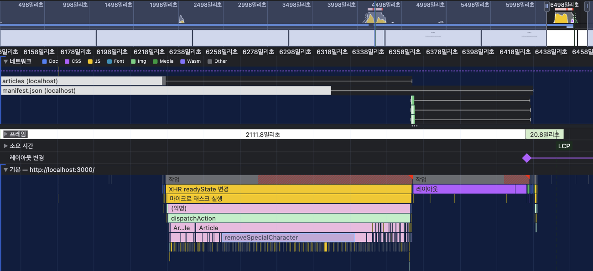

## 성능 최적화가 필요한 이유
구글이 주장하는 핵심 "성능이 저하되면 사용자가 떠나고 매출이 감소한다."
반대로 말하면 성능이 향상되면 사용자가 늘고, 매출이 오른다는 뜻이다.

페이지 표시 시간이 1초에서 3초가 되면 이탈율이 32%가 증가하고, 1초에서 5초가 되면 90%가 증가한다.

## 성능 최적화는 어떻게 이루어질까
크게 "로딩" 성능과 "렌더링" 성능으로 나눌 수 있다.

로딩 성능을 개선하는 가장 좋은 방법은 `다운로드 해야 하는 리소스 수를 줄이거나 크기를 줄이는 것`이다.
즉, 코드를 분할 및 우선순위가 높은 코드를 먼저 다운받는 방식 등이 있겠다.

렌더링 성능은 얼마나 코드를 효율적으로 짰느냐에 따라 화면이 그려지는 속도, 사용자의 자연스러운 인터랙션 정도가 달라진다.

## 1장
### 이 장의 목적
- 이미지 사이즈 최적화 : 이미지 사이즈를 무작정 작게 만들면 화질이 저하되서 서비스 이용이 불편하다. 어느정도 이미지 사이즈가 적절한지 살펴보자.
- 코드 분할 : 리액트는 SPA특성상 모든 리액트 코드가 하나의 자바스크립트 파일로 번들링되어 로드된다. 따라서, 첫 페이지 진입 시 당장 사용하지 않는 코드가 포함되어 있다. 필요한 코드를 원하는 시점에 따로 로드하자.
- 텍스트 압축 : HTML, CSS, JS 등 다양한 리소스를 다운로드 전에 서버에서 미리 압축하자.
- 병목 코드 최적화 : 느리게 만드는 코드를 찾자.

### LightHouse

#### Mode
- navigation : 초기 페이지 로딩 시 발생하는 성능 문제를 분석
- timespan : 정의한 시간 동안 발생한 성능 문제 분석
- snapshot : 현자 상태 성능 분석

#### Performance
검사를 했을 때 performance 점수는 바로 아래 metrics에 가중치를 적용해 계산한 점수다.
이러한 지표를 `Web Vital`이라 부른다.

- FCP(First Contentful Paint) : DOM 콘텐츠의 첫 번째 부분을 렌더링하는데 걸리는 시간. 가중치는 10%다.
- SI(Speed Index) : 페이지 로드 중에 콘텐츠가 '시각적'으로 표시되는 속도. 페이지가 완성되기까지 동일한 시간이 걸리더라도 일부분이 더 빨리 뜨는 케이스를 말한다. 가중치는 10%다.
- LCP(Largeste Contentful Paint) : 화면 내 가장 큰 이미지나 텍스트가 렌더링되는데 걸리는 시간. 가중치가 25%다.
- TTI(Time to Interactive) : 페이지가 상호작용이 가능하게 되는데까지 걸리는 시간. 
> 현재는 LightHouse Metrics에서 제외됐다. -> LightHouse 10에서 삭제되었고 점수 가중치가 CLS로 옮겨갔다고 한다. TTI의 경우 네트워크 요청, 긴 작업에 지나치게 민감하게 반응했고 LCP와 SI에서 측정된 지표가 사용자에게 로드된 느낌을 주는 데 더 나은 휴리스틱이라고 판단되고 TBT(Total Blocking Time)에서 더 강력하게 처리되어서 제외한듯 하다. 자세한 내용은 [developer.chrome](https://developer.chrome.com/blog/lighthouse-10-0?hl=ko)에서 확인할 수 있다.
- TBT(Total Blocking Time) : FCP이후 메인 스레드를 독점해서 다른 동작을 방해하는 시간. 가중치가 30%다.
- CLS(Cumulative Layout Shift) : 페이지 로드 과정에서 레이아웃이 이동한 지표.
> 책에서는 15%라고 나와있지만, TTI가 없어지면서 25%가 됐다.

> 다 중요하지만, 가중치가 큰 순으로 정리하자면 TBT > LCP = CLS > FCP = SI다. 사용자가 얼마나 빨리 화면에 가장 큰 요소가 렌더링이 된 것을 볼 수 있었는지, 그리고 얼마나 빠르게 interactive하게 웹 페이지를 사용할 수 있었는지, Layout이 갑자기 변하지는 않았는지 등을 주요하게 본다는 것을 크롬은 알고 가중치를 이렇게 정했을 것이다.

LightHouse로 검사를 해보면 웹 페이지 속도가 더 느린 것을 볼 수 있는데, 그 이유는 LightHouse제일 아래로 내려보면 네트워크 정보에 어떤 제한을 걸고 측정을 했는지를 볼 수 있다.

### 이미지 최적화
실제로 화면에 표시되는 이미지 사이즈는 120x120이었는데, 실제로는 1200x1200짜리 이미지를 사용 중이었다.

LightHouse에서 이미지 최적화를 제안하면서 절감효과 가능한 KiB까지도 보여준다.

그렇다고 120x120짜리 이미지로 만들기 보다는 요즘 동일 공간에 더 많은 픽셀을 보유하고 있는 레티나 디스플레이 같은 경우를 생각하여 240x240 사이즈로 사용하는 것이 적절하다.

### JS 코드 병목 최적화
LightHouse에서는 Chunk.js 파일이 문제다. 이런 식으로 알려주기 때문에 정확한 위치를 찾을 수 없다. 그래서 Performance탭에서 확인해야 한다. 여기서도 마찬가지로 우측에 설정을 열고, Fast3G같은 제한을 걸고 측정해보면 도움이 된다.

성능 측정이 완료되면, 제일 위에 그래프 영역은 cpu, network, 스냅샷 순으로 배치되어있다. js실행 영역은 노란색, 레이아웃 및 페인팅 작업은 보라색, 기타 시스템은 회색으로 표시된다. 그래프 위에 있는 빨간색 선은 병목이 발생하는 지점이다. 특정 작업이 메인 스레드를 붙잡고 있다는 뜻이다. net차트도 2개로 나뉘어져 있는 것을 볼 수 있는데 윗 부분은 우선순위가 높은 네트워크 리소스이고 아래 부분은 우선순위가 낮은 네트워크 리소스다.

위쪽 영역말고 아래 쪽 영역은 이제 하나하나 자세한 것을 나타낸다. 이 중 network 타임라인을 보면 끝에 길게 나와있는 직선도 있고, 색깔이 진하게 칠해져 있는 부분, 옅게 칠해져 있는 부분 등이 나뉘어져 있는데 마우스를 Hover해보면 크롬 최신 버전 기준 무엇을 의미하는지 자세하게 명시되어 있다. 프레임 섹션은 화면의 변화가 있을 때 기록한다.

본격적으로 네트워크 섹션에서 초기 로드에 가장 큰 비중을 차지하고 있는 Chunk.js 네트워크 리소스의 요약을 보면 디코딩된 크기가 4.2mb라는 것을 알 수 있다. development환경이라 minify되지 않아서 더 큰 것도 있다.


**네트워크 섹션과 main섹션 함께 보기**

- 네트워크 섹션에서 localhost로드가 끝났을 때 메인 섹션에서 html 파싱이 끝난 것을 볼 수 있다.
- 네트워크 섹션에서 chunk.js 로드가 끝났을 때 javascript가 실행되면서 리액트 코드인 src/App.js가 평가되고 있는 것을 볼 수 있다.
- 어떤 함수가 오래 병목이 되었는지 확인할 수 있는 방법은 특정 컴포넌트 아래에 떠있는 함수 이름을 보면 알 수 있다. 이 함수를 최적화 하면 된다.
    

### 코드 분할 & 지연 로딩

webpack이나 vite같은 번들러를 사용하고 있을 경우, analyzer 패키지를 설치 후 실행하여 번들 파일에서 어떤 파일이 가장 큰지 확인 할 수 있다. 예를 들어, 해당 강의의 파일에는 refactor라는 파일이름이 큰 것을 확인 할 수 있었는데, package-lock.json에서 refactor를 검색해보니 마크다운 코드 블럭에 스타일을 입히는데 사용되고 있었다. 메인 페이지에 마크다운을 이용하고 있는 부분은 없기 때문에 굳이 메인에서 다운로드 할 필요는 없다.

이 때 리액트에서 제공해주는 lazy나 suspense로 동적 import구문을 사용할 때 promise형태로 반환하는 모듈을 지연로딩할 수 있다.

### 텍스트 압축
텍스트 압축은 서버 측에서 해줘야 한다. 현재 프로젝트의 경우에는 node.js로 로컬 서버를 만들고 있는데, -u flag를 넣었을 경우 응답 헤더에 압축을 해제하는 코드가 들어가있었다. 아래 코드는 직접 node_modules 내부로 들어가서 node.js 소스를 발췌했다.
```js
    const compress = args['--no-compression'] !== true;

    if (compress) {
        await compressionHandler(request, response);
    }
```

-u flag를 제거하면 응답헤더에 content-encoding이 gzip으로 다시 들어오는 것을 확인할 수 있다.


## 2장

