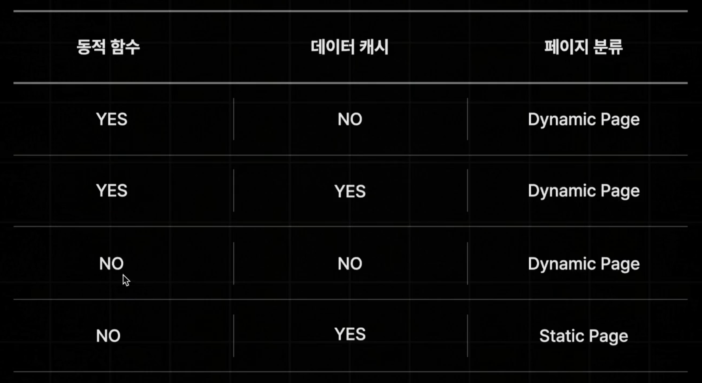
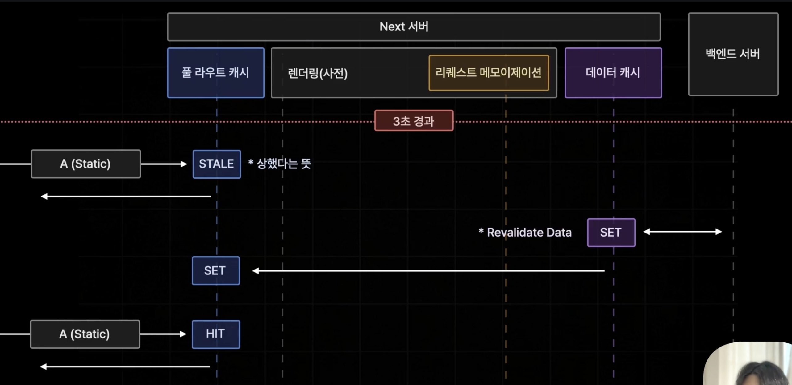
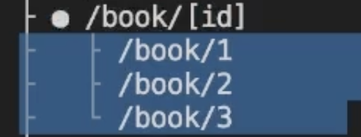

## Full Route Cache

Next 서버측에서 빌드 타임에 특정 페이지의 렌더링 결과를 캐싱하는 기능이다.

빌드 타임에 특정 페이지에서 API까지도 요청해서 페이지 자체를 캐싱해놓고 접속 요청이 왔을 때 풀라우트 캐시된 페이지를 보내준다.


Next는 각 페이지에서 어떤 기능을 사용하느냐에 따라서 Static한 페이지 혹은 Dynamic Page로 나뉜다.

이 중에서 Static Page에만 풀 라우트 캐시가 적용된다.

## Static, Dynamic Page를 Next에서 분류하는 기준은?

- Dynamic Page로 설정되는 기준 : 접속 요청을 받을 때마다 변화가 있거나, 데이터가 달라지는 경우

  - 캐시되지 않는 Data Fetching을 사용하는 컴포넌트가 있을 경우 (서버 컴포넌트만 해당된다.)

  - 동적 함수(쿠키, 헤더, 쿼리스트링)을 사용하는 컴포넌트가 있을 경우 (서버 컴포넌트만 해당된다.)

    ```tsx
    import { cookies } fom 'next/headers';

    async function Comp() {
      const cookieStore = cookies();
      const theme = cookieStore.get("theme");

      return ...
    }
    ```

- Static Page로 설정되는 기준 : Dynamic Page가 아니면 모두 Static Page가 된다. (Default)

정리하면 다음과 같다.

> - 동적 함수란 쿠키, 헤더나 쿼리스트링 등 페이지 요청에 따라 달라질 수 있는 값이다.
> - 3번째의 경우 데이터를 요청한다는 가정이다. 캐싱을 사용하지 않더라도 페이지를 렌더링할 때마다 새로운 데이터를 받아와야 한다.
> - 결과적으로 4번째 케이스에만 풀 라우트 캐시가 적용된다.



> 기본적으로 Static페이지로 만드는 것으로 생각하면 좋지만 검색 페이지같은 페이지는 동적이어야만 하기 때문에 모든 페이지를 반드시 Static 페이지로 만들 필요는 없다. Dynamic 페이지들도 리퀘스트 메모이제이션이나 데이터 캐시를 이용해서 충분히 성능을 확보할 수 있다.

## 데이터 캐시에 revalidate를 정하면 풀 라우트 캐시도 적용된다.

revalidate를 3초로 정했을 경우, 데이터 캐시는 3초 후에 상한 캐시가 된다. 그러면 풀 라우트 캐시, 즉 이미 완성된 페이지인 풀 라우트 캐시도 상한 캐시인 것이다. 그래서 페이지도 업데이트 해줘야 한다.


3초 이후에 접속하면 Stale한 페이지를 미리 보여주고 서버측에서 최신 데이터를 다시 받아와서 데이터를 갱신하고, 페이지까지 다시 렌더링을 해서 저장한다. 3초 이내에 다시 접속하면 풀 라우트 캐시에 저장된 페이지를 다시 보여준다.



## 중간 정리

앞쪽에서 배운 Static, Dynamic과 SSG방식으로 미리 빌드된 것과, SSR방식으로 요청 시에 페이지를 렌더링 하는 방식 등을 복합적으로 중간정리를 하는 시간을 갖자.

Next.js 에서 빌드를 하면 Static한 것과 Dynamic을 구별해서 보여준다. Static한 것들은 빌드 타이밍에 미리 생성된 페이지다. 이 페이지들은 html파일과 서버 컴포넌트 코드인 RSC만 받아서 페이지를 빠르게 보여줄 수 있다. 반면 Dynamic한 페이지들은 페이지 요청 시에 html, RSC와 JS Bundle을 받아서 생성한다. 이렇게 구분되는 이유는 생각해보면 쉽다. 미리 만들 수 있는 페이지이냐, 미리 만들 수 없는 페이지이냐의 차이다.

예를 들어서 A라는 페이지가 URL로 부터 쿼리스트링을 읽지도 않고 헤더나 쿠키도 읽지 않으면서 항상 동일한 API를 요청하고 있는데 캐싱까지 사용하고 있을 경우에 풀 라우트 캐시로 인해서 가장 성능이 좋은 페이지가 나오는 것이다.

어떤 페이지에 서버 컴포넌트만 존재하고 있고, 서버 컴포넌트들이 다 변하지 않는 그런 컴포넌트들이라면 해당 페이지는 Static할 수 있고 클라이언트 컴포넌트가 섞여있거나 서버 컴포넌트여도 데이터를 요청하는데 캐싱을 사용하지 않거나 동적 함수를 사용해야만 하는 경우 Dynamic한 페이지가 된다.

## 검색 페이지 캐싱

검색 페이지에 검색어에 따라 API를 요청할 경우 force-cache를 써서 한번 검색한 API의 경우에는 재활용이 가능하도록 할 수 있다.

```tsx
export default async function Page({ searchParams }: Props) {
  const { q } = await searchParams;
  const response = await fetch(`${process.env.NEXT_PUBLIC_API_SERVER_URL}/book/search?q=${q}`, {
    cache: "force-cache",
  });
```

## 상세 페이지 캐싱

상세 페이지의 경우 url에 param으로 데이터를 로드하고 페이지를 띄워주는 경우에 어떤 param이 들어올 수 있을지 미리 알려줄 수 있는 방법이 있다. 바로 generateStaticParams 함수를 붙이고 어떤 params들이 들어올 수 있을지 배열내부에 객체 형태로 전달하는 것이다.

```tsx
export function generateStaticParams() {
  return [{ id: "1" }, { id: "2" }, { id: "3" }]; // 각 param값은 문자열로만 전달한다.
}

export default async function Page({ params }: { params: Promise<{ id: string | string[] }> }) {
  const { id } = await params;

  const response = await fetch(`${process.env.NEXT_PUBLIC_API_SERVER_URL}/book/${id}`);
```

미리 정적으로 생성된 것을 볼 수 있다. 즉 static한 것들은 다 풀 라우트 캐시가 적용되었다고 보면된다. (빌드 시 미리 API요청까지 완료하고 페이지 렌더링까지)

> page Router에서 사용했던 getStaticPatahs의 App Router버전이 generateStaticParams다.

> 위 코드를 자세히 보면 fetch 메서드 두번째 인자로 캐싱을 적용하지 않았음에도 static 한 파일이 되었음을 알 수 있는데 이것은 generateStaticParams를 사용했을 때 이렇게 된다.



### generateStaticParams에 미리 등록해놓은 param들이 아니면 어떻게 될까?

접속 시에 처음에는 동적으로 페이지를 만들고, 그 다음부터 풀 라우트 캐시가 적용되어 빠르게 로드된다.

아래 사진을 보면 미리 param에 추가해놓지 않았던 book/4, book/5 url로 적용했을 때 생성된 html파일들이다.


브라우저 네트워크 탭에서도 확인할 수 있다. 처음에 페이지를 요청했을 때 보다 새로고침해서 받아올 때가 더 빠른데, 이것을 보면 풀 라우트 캐싱이 적용된것을 알 수 있다.


## DynamicParams 막기

만약에, generateStaticParams에 정의해놓은 param들을 제외한 다른 param들을 막고 싶은 경우에 dynamicParams 변수에 false값을 주면 된다.

```tsx
export const dynamicParams = false;

export function generateStaticParams() {
  return [{ id: "1" }, { id: "2" }, { id: "3" }];
}

export default async function Page({ params }: { params: Promise<{ id: string | string[] }> }) {
  const { id } = await params;

  const response = await fetch(`${process.env.NEXT_PUBLIC_API_SERVER_URL}/book/${id}`);
```

결과는 다음과 같이 404페이지로 리다이렉션한다. (기본값은 true다.)


