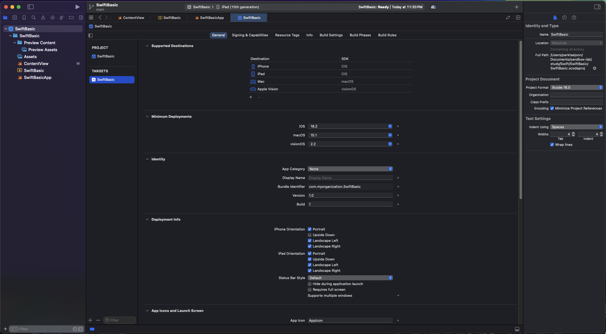
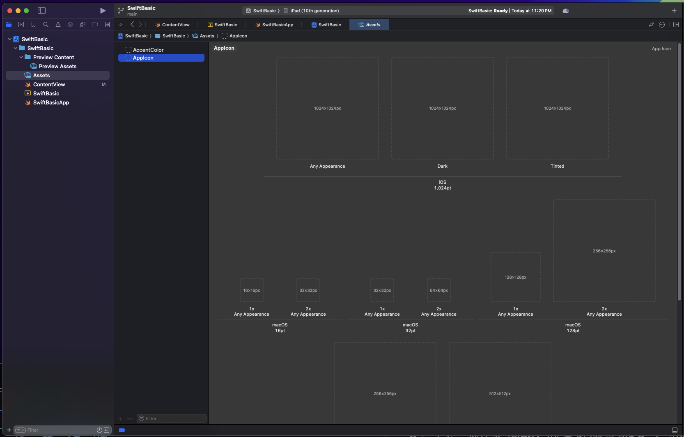
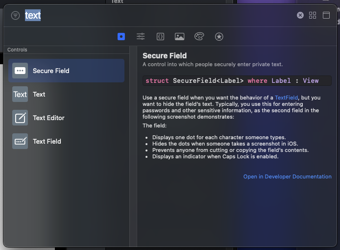
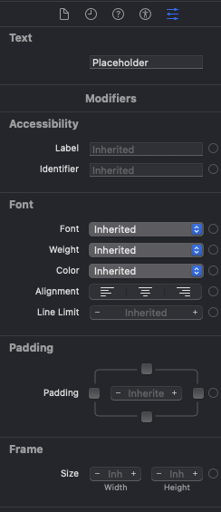

```
layout: ../../../layouts/MarkdownPostLayout.astro
pubDate: 2024-12-30
title: 'SwiftUI'
description: 'SwiftUI를 학습해보자.'
tags: ["SwiftUI"]
```

> 공부에 앞서 : 왜 갑자기 Swift를 공부하는걸까?
프론트엔드 개발자로서, 프론트엔드 한 분야에서 잘하는 것도 중요하지만 만들고 싶은 제품을 만들 수 있는 개발자가 진정한 개발자라고 느끼기 때문이다. 약 3년 넘게 Js, React, Next만 보다가 지인의 연락을 받고 함께 Swift기초부터 공부해서 생각한 제품을 만들어보기로 했다.


> [참고한 강의](https://www.youtube.com/watch?v=N-ntKJdVNBs&list=PLwvDm4VfkdphqETTBf-DdjCoAvhai1QpO&index=2)

## SwiftUI vs UI Kit

UIKit는 AppStore가 등장한 2008년에 등장하여 기존 앱들은 UI Kit으로 만들어졌다.

하지만, 2019년에 SwiftUI가 등장한 이후로는 Apple에서 SwiftUI의 미래를 그리고 있으며 기존 앱들은 SwiftUI를 사용하여 마이그레이션을 하기도 한다.

## XCode Project Setting

새 프로젝트를 만들 때 다음을 입력해야 한다.

- Product Name: 제품 이름 (특수기호나 공백을 넣지말자. 이유는 바로 뒤에 나오지만 번들 식별자에 포함될 것이기 때문이다, 이는 나중에 문제를 일으킬 수 있다)
- Team: App Store에 올릴려면 전문가 계정이어야 한다.
- Organization Identifier: 조직 식별자다. 공부용이니까 com.myorganization 으로 만든다. 입력하면 Bundle Identifier이 Product Name과 합쳐서 만들어진다.

## 프로젝트 관리
좌측 파일 탐색기에서 제일 상단의 폴더를 클릭하면 금방 세팅한 프로젝트 설정 외에도 다양한 설정 기능들이 나온다.



Version의 경우 외부에 공개할 버전이다. Build의 경우 만약에 1.0.1이라는 Version에서 버그가 발생해서 기능 추가나 개선 없이 bug만 잡고 퍼블리싱하는 경우 Build숫자를 올려서 고쳤음을 팀원들에게 알릴 수 있다.

Minimum Deployments의 경우 사용자가 사용할 수 있는 최소 버전을 의미한다. 높은 버전일수록 버그도 개선되고 기능도 추가되었기 때문에 더 많은 것을 할 수 있다.
하지만, 바로 최신버전을 보통 선택하지 않는 이유는 모든 사용자가 업데이트를 바로하지 않기 때문이다.

렌더링 될 방향을 정해놓을 수도 있다. Deployment Info > iPhone Orientation 에서 가로방향으로만 출력되게 하려면 Portrait와 Upside Down 체크박스를 해제한다. 반대로 세로방향으로만 출력되게 하려면 Portrait, Upside Down만 체크하거나 만약에 FaceID등을 반드시 사용해야 하는 앱의 경우 Portrait만 체크해서 기본적인 세로방향만 지원하도록 한다.

앱 아이콘을 지정할 수 있다. App Icons and Launch Screen > App Icon의 이름을 지정할 수 있다. 여기서 지정할 아이콘의 asset폴더는 좌측 파일 탐색기에서 Assets폴더에서 확인할 수 있다.



## 컴포넌트

우측 상단에 있는 + 버튼을 눌러서 원하는 요소를 검색할 수 있다.  



또한 이 텍스트에 대한 세부 설정을 하려면 우측 패널에서 제일 우측에 있는 설정 아이콘을 클릭하면 폰트를 변경하는 등의 세부 작업을 할 수 있다.

