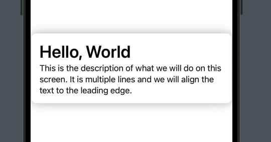

> **Swift를 공부하는 이유**  
> 한 분야에서 잘하는 것도 중요하지만 분야에 제한없이 만들고 싶은 것을 만들 수 있어야 된다고 생각하던 중 지인의 연락을 받고 함께 LLM을 활용하여 Obsidian + GoodNote의 장점을 섞은 서비스를 만들어보기로 했다.

> - [참고한 공식문서 튜토리얼](https://developer.apple.com/tutorials/swiftui-concepts/exploring-the-structure-of-a-swiftui-app)
> - [참고한 강의](https://www.youtube.com/watch?v=N-ntKJdVNBs&list=PLwvDm4VfkdphqETTBf-DdjCoAvhai1QpO&index=2)

## SwiftUI vs UI Kit

UIKit는 AppStore가 등장한 2008년에 등장하여 기존 앱들은 UI Kit으로 만들어졌다.

하지만, 2019년에 SwiftUI가 등장한 이후로는 Apple에서 SwiftUI의 미래를 그리고 있으며 기존 앱들은 SwiftUI를 사용하여 마이그레이션을 하기도 한다.

## XCode Project Setting

새 프로젝트를 만들 때 다음을 입력해야 한다.

- Product Name: 제품 이름 (특수기호나 공백을 넣지말자. 이유는 바로 뒤에 나오지만 번들 식별자에 포함될 것이기 때문이다, 이는 나중에 문제를 일으킬 수 있다)
- Team: App Store에 올릴려면 전문가 계정이어야 한다.
- Organization Identifier: 조직 식별자다. 공부용이니까 com.myorganization 으로 만든다. 입력하면 Bundle Identifier이 Product Name과 합쳐서 만들어진다.

## 프로젝트 관리

좌측 파일 탐색기에서 제일 상단의 폴더를 클릭하면 금방 세팅한 프로젝트 설정 외에도 다양한 설정 기능들이 나온다.


Version의 경우 외부에 공개할 버전이다. Build의 경우 만약에 1.0.1이라는 Version에서 버그가 발생해서 기능 추가나 개선 없이 bug만 잡고 퍼블리싱하는 경우 Build숫자를 올려서 고쳤음을 팀원들에게 알릴 수 있다.

Minimum Deployments의 경우 사용자가 사용할 수 있는 최소 버전을 의미한다. 높은 버전일수록 버그도 개선되고 기능도 추가되었기 때문에 더 많은 것을 할 수 있다.
하지만, 바로 최신버전을 보통 선택하지 않는 이유는 모든 사용자가 업데이트를 바로하지 않기 때문이다.

렌더링 될 방향을 정해놓을 수도 있다. Deployment Info > iPhone Orientation 에서 가로방향으로만 출력되게 하려면 Portrait와 Upside Down 체크박스를 해제한다. 반대로 세로방향으로만 출력되게 하려면 Portrait, Upside Down만 체크하거나 만약에 FaceID등을 반드시 사용해야 하는 앱의 경우 Portrait만 체크해서 기본적인 세로방향만 지원하도록 한다.

앱 아이콘을 지정할 수 있다. App Icons and Launch Screen > App Icon의 이름을 지정할 수 있다. 여기서 지정할 아이콘의 asset폴더는 좌측 파일 탐색기에서 Assets폴더에서 확인할 수 있다.


## 컴포넌트

### Text

우측 상단에 있는 + 버튼을 눌러서 원하는 요소를 검색할 수 있다.


또한 이 텍스트에 대한 세부 설정을 하려면 우측 패널에서 제일 우측에 있는 설정 아이콘을 클릭하면 폰트를 변경하는 등의 세부 작업을 할 수 있다.


코드로 작성할 경우 1번 방법처럼 폰트를 적용할 수도 있고, 2번 방법처럼 폰트를 적용할 수도 있다.

> 2번 방법의 size 부분을 보면 정적인 사이즈를 주고 있는 것을 볼 수 있는데, 이렇게 주게 되면 font(.title) 이런 식으로 줬을 때처럼 동적으로 사이즈를 대응할 수 없다. (아이폰, 아이패드 등등..)

```swift
import SwiftUI

struct textTest: View {
    var body: some View {
        Text("Hello, World!")
        // 1번 방법
//            .font(.body)
//            .fontWeight(.bold)
//            .foregroundColor(Color.red)
//            .underline(color: Color.red)
//            .strikethrough(color: Color.green)

        // 2번 방법
            .font(.system(size: 24, weight: .semibold, design: .serif))
    }
}
```

여러 줄을 입력하는 경우

```swift
import SwiftUI

struct textTest: View {
    var body: some View {
        Text("Hello my name is ParkTaejoon! This is Swiftful Thinking Bootcamp. I am really enjoying this course and learning alot")
            .multilineTextAlignment(.center)
    }
}
```

텍스트가 들어갈 Frame크기를 지정하고, 각 문자의 첫번째가 대문자가 될 수 있게 하고 텍스트의 색상을 바꾸고, 자간(kerning) 및 Frame에 모든 글자가 딱맞게 들어갈 수 있도록 조정할 수도 있다.

> multiline 좌우정렬은 우측인데, Frame의 정렬을 좌측으로 설정하게 되면 만약 한 줄로 텍스트가 나올 경우에는 좌측에 정렬하게 해주고 여러 줄일 경우 우측에 정렬되게 해준다.

```swift
import SwiftUI

struct textTest: View {
    var body: some View {
        Text("Hello world".capitalized)
            .font(.system(size: 24, weight: .semibold, design: .serif))
            .baselineOffset(30.0) // 줄 높이
            .multilineTextAlignment(.trailing) // 좌우 정렬
            .foregroundStyle(Color.red) // 텍스트 색상
            .kerning(5) // 자간
            .frame(width: 200, height: 200, alignment: .leading) // 프레임 크기 및 정렬 설정
            .minimumScaleFactor(0.1) // 0.1로 하면 Frame에 딱맞게 들어간다.
    }
}
```

### Circle

```swift
struct CircleTest: View {
    var body: some View {
        // Ellipse, Capsule도 동일한 메서드를 이용할 수 있다.
        Circle()
            .trim(from: 0.2, to: 1.0)
            .stroke(Color.purple, lineWidth: 10)
            .frame(width: 100, height: 100)
    }
}
```


> 추후 애니메이션을 Spinner를 만들 수 있다.

### Rectangle

버튼 같은 요소처럼 배경으로 적절하다.

> Circle 및 Rectangle 이런 Shape들은 fill, foregroundColor(배경), stroke, trim 다 사용할 수 있다.

```swift
struct CircleTest: View {
    var body: some View {
        // Rectangle().frame(width: 200, height: 100)
        RoundedRectangle(cornerRadius: 10)
            .frame(width: 100, height: 50)
    }
}
```

## Color

### 특정 Hex코드 사용핳기

특정 Hex코드의 색상을 사용하고 싶을 수 있다.

> Edit > Format > Show Color에서 색상 선택하거나 #colorLiteral()을 입력하면 색상을 선택할 수 있다.

```swift
RoundedRectangle(cornerRadius: 25)
    .fill(Color(#colorLiteral(red: 0, green: 1, blue: 0.6039558649, alpha: 1)))
    .frame(width: 200, height: 100)
```


### 시스템 컬러 사용하기

특히 배경색상을 지정할 때 흰색말고 시스템 배경색(옅은 회색)을 사용하고 싶을 때 유용하다. (화이트/다크모드 지원)

```swift
RoundedRectangle(cornerRadius: 25)
    .fill(Color(UIColor.secondarySystemBackground))
    .frame(width: 200, height: 100)
```

### 직접만든 커스텀 컬러 사용하기

LNB > Assets에서 컬러를 직접 하나 만들어둘 수 있다.


사용할 때는 다음과 같이 문자열을 넣어주면 된다.

```swift
RoundedRectangle(cornerRadius: 25)
    .fill(Color("CustomColor"))
```

### Shadow 넣기

(default)radius값만 넣을 수도 있고, 색상 및 XY좌표로 얼마나 이동시킬지도 결정할 수 있다.

> Color에 opacity로 투명도 조절할수도있다.

```swift
RoundedRectangle(cornerRadius: 25)
    .fill(Color("CustomColor"))
    .frame(width: 200, height: 100)
    // .shadow(radius: 20)
    .shadow(color: Color.red.opacity(0.3), radius: 10, x: 20, y: 10)
```

### Gradient 넣기

리니어

```swift
RoundedRectangle(cornerRadius: 25.0)
    .fill(
        LinearGradient(
            gradient: Gradient(colors: [Color(#colorLiteral(red: 0.8039215803, green: 0.8039215803, blue: 0.8039215803, alpha: 1)), Color.blue]),
            startPoint: .topLeading,
            endPoint: .bottomTrailing
        )
    )
    .frame(width: 300, height: 250)
```

방사형

```swift
RoundedRectangle(cornerRadius: 25.0)
    .fill(
        RadialGradient(
            gradient: Gradient(colors: [Color.red, Color.blue]),
            center: .topLeading,
            startRadius: 5,
            endRadius: 400
        )
    )
    .frame(width: 300, height: 250)
```

## Icon

필요한 대부분 아이콘이 이미 존재한다.

```swift
Image(systemName: "heart.fill")
    .resizable()
    .aspectRatio(contentMode: .fit) // 프레임에 꽉 맞춘다.
    // .scaledToFit() // 위와 같다.
    // .font(.largeTitle)
    .font(.system(size: 200))
    // .foregroundStyle(.green)
    .frame(width: 200, height: 200)
    .clipped() // 프레임 영역 밖을 잘라낸다.
```

더 많은 아이콘을 확인하고 싶을 때는 https://developer.apple.com/sf-symbols/ 에 방문해서 SF Symbols를 다운받는다.
그러면 종류를 볼 수 있고, 각 아이콘의 이름을 알 수 있다.

multiColor아이콘의 경우, 색상이 입혀진다. 파란색 부분은 색상을 변경할 수 있다.
이 아이콘들의 경우 renderingMode(.original)을 통해 apple이 지정해놓은 부분의 컬러의 original색상을 넣을 수 있다.

```swift
Image(systemName: "person.fill.badge.plus")
    .renderingMode(.original)
```

## Image

이미지 파일을 Assets폴더에 넣고 파일이름을 Image에 전달한다.
원하는 크기로 자를 수도 있다.

```swift
Image("stair")
    .resizable()
    // .cornerRadius(30) borderRadius
    .clipShape(Circle())
```

## Frames and Alignments

Frame을 잘 다뤄야 배치를 잘할 수 있다.

개발하는 동안에는 Frame에 배경을 추가해서 디버깅에 용이하게 할 수 있다.

```swift
Text("Hello World") // Layout: 제일 상단
    .background(Color.red)
    .frame(height: 100, alignment: .top) // Layout: 중단
    .background(Color.green)
    .frame(maxWidth: .infinity, alignment: .leading) // Layout: 하단
    .background(Color.orange)
```


## Background & Overlay

Background는 컨텐츠 뒤에있고 Overlay는 컨텐츠 위에 있다.

overlay나 background에 (컨텐츠, alignment: 위치) 이런 식으로도 배치가 가능하다.

```swift
Rectangle()
    .frame(width: 100, height: 100)
    .overlay(
        Rectangle()
            .fill(.blue)
            .frame(width: 50, height: 50)
        , alignment: .topLeading // 주의: Rectangle의 위치가 아니라 Overlay의 두번째 인자로 주입한 위치다.
    )
    .background(
        Rectangle()
            .fill(.red)
            .frame(width: 150, height: 150)
    )
```


```swift
Image(systemName: "heart.fill")
    .font(.system(size: 40))
    .foregroundStyle(Color.white)
    .background(
        Circle()
            .fill(
                LinearGradient(colors: [Color(.purple), Color(.blue)], startPoint: .topLeading, endPoint: .bottomTrailing)
            )
            .frame(width: 100, height: 100)
            .shadow(color: Color(#colorLiteral(red: 0.245982796, green: 0.4570168853, blue: 0.9919729829, alpha: 0.5)), radius: 10, x: 0.0, y: 10)
            // circle의 위에 알람을 표시할 수 있다.
            .overlay(
                Circle()
                    .fill(Color.blue)
                    .frame(width: 35, height: 35)
                    .overlay(
                        Text("5")
                            .font(.headline)
                            .foregroundColor(.white)
                    )
                    .shadow(color: Color(#colorLiteral(red: 0.245982796, green: 0.4570168853, blue: 0.9919729829, alpha: 0.5)), radius: 10, x: 5, y: 5)
                , alignment: .bottomTrailing
            )
    )
```


## Stacks

VStack(Vertical), HStack(Horizontal), ZStacks(zIndex)

ZStack에서는 제일 마지막이 제일 위다.

> - 간격에 4말고 기본값으로 nil을 입력할 수도 있다. 8과 같다.
> - ZStack위에 VStack, HStack등을 올리거나 복잡한 형태의 레이어를 만들 수 있다. 이 때 Bracket 위치를 찾기 힘들면 Bracket을 더블클릭 하면 된다.

```swift
VStack(alignment: .leading, spacing: 4, content: {
    Rectangle()
        .fill(Color.red)
        .frame(width: 200, height: 100)

    Rectangle()
        .fill(.blue)
        .frame(width: 150, height: 100)

    Rectangle()
        .fill(.green)
        .frame(width: 100, height: 100)
})
```


아래 두 코드는 같은 코드다. SwiftUI에서는 다양한 방법으로 UI 구성을 제공한다.

```swift
VStack(spacing: 50) {
    Text("1")
        .foregroundColor(.white)
        .background(
            Circle()
                .fill(.black)
                .frame(width: 100, height: 100)
        )

    ZStack {
        Circle()
            .fill(.black)
            .frame(width: 100, height: 100)

        Text("1")
            .foregroundColor(.white)
    }
}
```


## Padding

padding을 연속으로도 추가할 수 있다.
컨텐츠 크기에 따라 동적으로 변하기 때문에 여태까지 위에서 했던 방식처럼 frame에 크기를 정해놓는 것이 아니라 padding을 사용해서 동적인 크기를 대응한다.

```swift
Text("Hello")
  .padding(.all, 30)
  .background(.blue)
```

실 사용 예시를 보면 아래와 같이 frame을 좌우로 꽉차게 하고 글씨를 좌측에 배치 한 뒤에 padding을 주입해서 살짝 떨어트린다.

```swift
Text("Hello, World")
  .font(.largeTitle)
  .fontWeight(.semibold)
  .frame(maxWidth: .infinity ,alignment: .leading)
  .padding(.leading, 30)
```


실 사용 예시 두번째다. 각 padding영역을 잘 확인할 수 있도록 코드를 나눠봤다.

```swift
VStack(alignment: .leading) {
      Text("Hello, World")
          .font(.largeTitle)
          .fontWeight(.semibold)

      Text("This is the description of what we will do on this screen. It is multiple lines and we will align the text to the leading edge.")
          .multilineTextAlignment(.leading)
  }
  .background(.blue)

  .padding(.horizontal, 30)
  .background(.gray)

  .padding(.all, 20)
  .background(.green)
```


실 사용 예시 3

> padding을 추가하고 background 메서드로 배경 색상 및 그림자를 한번에 추가하는 방법을 배울 수 있다.

```
 VStack(alignment: .leading) {
      Text("Hello, World")
          .font(.largeTitle)
          .fontWeight(.semibold)

      Text("This is the description of what we will do on this screen. It is multiple lines and we will align the text to the leading edge.")
          .multilineTextAlignment(.leading)
  }
  .padding()
  .background( // 배경 색상 및 그림자 추가
      Color.white
          .cornerRadius(10)
          .shadow(
              color: Color.black.opacity(0.3),
              radius: 10,
              x: 0.1,
              y: 0.1
      )
  )
```



## Spacer

- Spacer로 배치를 편하게 할 수 있다.
- Spacer를 쓰면 자동으로 빈 영역을 채워줘서 배치를 편하게 해주는 느낌이다.
- 동일한 스택 내에 Spacer가 여러 개 있으면 간격을 동일하게 가져간다.
- minLength

```swift
HStack(spacing: 0) {
    Spacer()
        .frame(height: 10)
        .background(.orange)

    Rectangle()
        .fill(.red)
        .frame(width: 50, height: 50)

    Rectangle()
        .fill(.blue)
        .frame(width: 50, height: 50)

    Spacer()
        .frame(height: 10)
        .background(.orange)
}
```


- Spacer내에 minLength를 주면 최소 범위를 가져간다.
- 그래서 만약에 아래 코드처럼 padding이 좌우 공간을 다 먹어서 남은 간격이 없다면 Spacer는 나타나지 않는다.

```swift
HStack(spacing: 0) {
    Spacer(minLength: 0)
        .frame(height: 10)
        .background(.orange)

    Rectangle()
        .fill(.red)
        .frame(width: 50, height: 50)

    Spacer(minLength: nil)
        .frame(height: 10)
        .background(.orange)

    Rectangle()
        .fill(.blue)
        .frame(width: 50, height: 50)

    Spacer(minLength: 0)
        .frame(height: 10)
        .background(.orange)
}
.background(.yellow)
.padding(.horizontal, 200)
.background(.gray)
```

실 사용 예제

```swift
VStack {
    HStack{
        Image(systemName: "xmark")
        Spacer()
            .frame(height: 10)
            .background(.gray)
        Image(systemName: "gear")
    }

    .padding(.horizontal)

    Spacer()
        .frame(width: 10)
        .background(.orange)
}
```


## Init, Enum

### Init

파라미터를 전달하는 View를 만들 때 init은 암묵적으로 만들어지지 않는다.  
하지만, 아래처럼 "apple"을 받았을 때 빨간색 글자가 나오는 것 같은 조건을 걸 수 있다.  
init은 View가 실행될 때 바로 실행된다.

위에 변수를 선언해서 내부에서 반복적으로 사용할 수 있다.

> 타입을 선언할 때는 대문자로 시작한다.

### Enum

enum의 위치를 밖에 만들어도 되고 구조체 안에 만들어도 동작한다.  
내부에 case로 선언해두면 사용할 때 자동완성이 잘 된다.

결과적으로 재사용이 가능한 View를 만들었다.

```swift
import SwiftUI

enum fruits {
    case apple
    case banana
}

struct GradientTest: View {
    let backgroundColor: Color
    let title: String

    // 매개변수로 title을 받는다.
    init(title: String, fruit: fruits) {
        self.title = title

        if fruit == .apple {
            self.backgroundColor = Color.red
        } else {
            self.backgroundColor = Color.orange
        }
    }

    var body: some View {
        Text(title)
            .font(.largeTitle)
            .foregroundColor(backgroundColor)
    }
}

#Preview {
    HStack {
        GradientTest(title: "사과다", fruit: .apple)
        GradientTest(title: "바나나다", fruit: .banana)
    }
}
```


## ForEach

반복문

```swift
import SwiftUI

struct GradientTest: View {
    let data: [String] = ["Hello", "World", "SwiftUI"]

    var body: some View {
        ForEach(data.indices) { index in
            HStack {
                Circle()
                    .frame(width: 10, height: 10)
                Text("\(data[index])의 인덱스 : \(index)")
            }
        }
    }
}

#Preview {
    GradientTest()
}
```

## Scroll

기본적으로 스크롤 가능하게 하려면 ScrollView안에 넣어야 한다.

그 다음 스크롤바 렌더링 여부를 결정할 수 있다. ex) 인스타그램 같은 곳은 스크롤바를 없앴다.

```swift
ScrollView(.vertical, showsIndicators: false, content: {
    VStack {
        ForEach(0..<3) { i in
            Rectangle()
                .fill(.blue)
                .frame(width: .infinity, height: 300)
        }
    }
})
```

실 사용 예로는 아래처럼 할 수 있다.

그리고 아직 화면에 보이지 않는 요소들을 Lazy하게 불러오기 위해서 LazyVStack, LazyHStack을 사용할 수 있다.

```swift
LazyVStack {
    ForEach(0..<10) { _ in
        ScrollView(.horizontal, showsIndicators: false, content: {
            LazyHStack {
                ForEach(0..<20) { _ in
                    RoundedRectangle(cornerRadius: 10)
                        .fill(.gray)
                        .frame(width: 200, height: 200)
                }
            }
        })
    }
}
```


## LazyVGrid, LazyHGrid

기본적으로 Grid는 Lazy하게 동작한다.

```swift
let columns: [GridItem] = [
    GridItem(.fixed(50), spacing: nil, alignment: .center), // fixed로 가로크기를 정적으로 정할 수 있다.
    GridItem(.fixed(50), spacing: nil, alignment: .center),
    GridItem(.fixed(50), spacing: nil, alignment: .center)
]

var body: some View {
    LazyVGrid(columns: columns, content: {
        Rectangle()
            .fill(Color.orange)
            .frame(width: 50, height: 50)
        Rectangle()
            .fill(Color.red)
            .frame(width: 50, height: 50)
        Rectangle()
            .fill(Color.blue)
            .frame(width: 50, height: 50)
        Rectangle()
            .fill(Color.gray)
            .frame(width: 50, height: 50)
    })
}
```


flexible하게 Grid를 배치할 수도 있다.
GridItem의 첫번째 인자로 .flexible()을 전달한다.

> 각 기기의 사이즈가 다르기 때문에 flexible하게 설계하는 것이 좋다.

```swift
let columns: [GridItem] = [
    GridItem(.flexible(), spacing: nil, alignment: .center),
    GridItem(.flexible(), spacing: nil, alignment: .center),
    GridItem(.flexible(), spacing: nil, alignment: .center),
    GridItem(.flexible(), spacing: nil, alignment: .center),
    GridItem(.flexible(), spacing: nil, alignment: .center),
]

var body: some View {
    LazyVGrid(columns: columns, content: {
        ForEach(0..<50) { _ in
            Rectangle()
                .fill(Color.orange)
                .frame(height: 50)
            Rectangle()
                .fill(Color.red)
                .frame(height: 50)
            Rectangle()
                .fill(Color.blue)
                .frame(height: 50)
            Rectangle()
                .fill(Color.gray)
                .frame(height: 50)
            Rectangle()
                .fill(Color.gray)
                .frame(height: 50)
        }
    })
}
```

## Button

Button은 인자로 Button내부에 들어갈 내용을 정의하고, 함수 내부에는 동작을 정의한다.

@State의 경우에는 View가 계속 주시하고 있다가 상태가 변경되면 리렌더링된다.

```swift
struct StudySwiftUI: View {
    @State var title: String = ""

    var body: some View {
        Button(action: {
            self.title = "Pressed Button"
        }, label: {
            Text("Press Me")
        })

        Text(title)
    }
}
```

실 사용 예제로 스타일을 입힌 버튼과 좋아요 버튼을 만들어봤다.

```swift
struct StudySwiftUI: View {
    @State var title: String = ""

    var body: some View {
        Text(title)
        Button(action: {
            self.title = "Pressed Button"
        }, label: {
            Text("Press Me")
                .font(.largeTitle)
                .fontWeight(.semibold)
                .foregroundColor(.white)
                .padding(.all, 20)
                .background(Color.blue)
                .cornerRadius(10)
                .shadow(radius: 10)
        })

        Button(action: {
            self.title = "Pressed Button"
        }, label: {
            Circle()
                .fill(.white)
                .frame(width: 100, height: 100)
                .shadow(radius: 10)
                .overlay(
                    Image(systemName: "heart.fill")
                        .font(.largeTitle)
                        .foregroundColor(.red)
                )

        })
    }
}
```


## View 모듈 및 func

뷰와 기능을 분리해서 설계하자.

```swift
struct StudySwiftUI: View {
    @State var count: Int = 0

    var body: some View {
        Text("\(count)")
        contentLayer
    }

    var contentLayer: some View {
        Button(action: {
            increaseCount()
        }, label: {
            Circle()
                .fill(.white)
                .frame(width: 100, height: 100)
                .shadow(radius: 10)
                .overlay(
                    Image(systemName: "heart.fill")
                        .font(.largeTitle)
                        .foregroundColor(.red)
                )

        })
    }

    func increaseCount() {
        count += 1
    }
}
```

## 값을 전달받을 수 있는 복잡한 컴포넌트와 간단한 컴포넌트 뷰

```swift
struct StudySwiftUI: View {
    var body: some View {
        contentView
    }

    // 매개변수가 없는 간단한 컴포넌트화
    var contentView: some View {
        VStack {
            TextView(count: 1)
            TextView(count: 100)
        }
    }
}

// 매개변수를 주입해줘야 하는 컴포넌트
struct TextView: View {
    let count: Int // 값을 매개변수로 받기 위해서는 할당하면 안된다.
    var body: some View {
        Text("숫자 : \(count)")
    }
}

#Preview {
    StudySwiftUI()
}
```

## Binding

- `@Binding var 변수: 타입`을 자식에서 선언하면 부모에서 상태를 내려받고 변경도 시킬 수 있다
- 부모에서는 자식 View로 `childText(전달할변수명: $변수)` 이렇게 전달할 수 있다. 핵심은 전달할 State의 Prefix에 `$`를 붙이는 것이다.

```swift
struct studyView: View {
    @State var backgroundColor: Color = .green;

    var body: some View {
        Button("changeColor", action: {
            backgroundColor = .blue
        })

        childText(childrenBackgroundColor: $backgroundColor)
    }
}

struct childText: View {
    @Binding var childrenBackgroundColor: Color

    var body: some View {
        Text("Text")
            .frame(width: 200, height: 200)
            .background(childrenBackgroundColor)
    }
}

#Preview {
    studyView()
}
```

## 조건부 상태

- ProgressView()를 이용하면 IOS특유의 내장된 로딩 UI를 보여줄 수 있다.

```swift
struct studyView: View {
    @State var isShowCircle: Bool = false
    @State var isShowRectangle: Bool = false
    @State var isLoading: Bool = true

    var body: some View {

        if(isLoading) {
            ProgressView() // 내장되어있다.
        }

        Button("isShowCircle: \(isShowCircle)", action: {
            isShowCircle.toggle()
        })


        Button("isShowRectangle: \(isShowRectangle)", action: {
            isShowRectangle.toggle()
        })

        if isShowCircle && isShowRectangle {
            Text("Both condition")
        } else if isShowRectangle {
            Rectangle()
                .frame(width: 200, height: 200)
                .foregroundColor(.blue)
        } else if isShowCircle && isShowRectangle {
            Circle()
                .frame(width: 200, height: 200)
                .foregroundColor(.gray)
        } else {
            Text("not included")
        }
    }
}
```

상한 연산자는 다음과 같이 사용한다. 다른데와 동일하다.

```swift
struct studyView: View {
    @State var isBlue: Bool = true
    var body: some View {
        RoundedRectangle(cornerRadius: 20)
            .fill(isBlue ? .blue : .red)
            .frame(width: 200, height: 200)

    }
}
```
