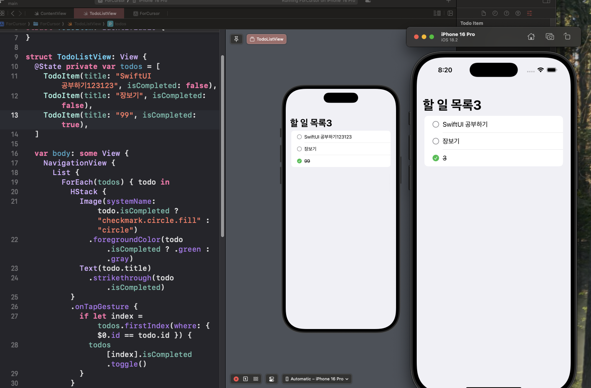

> 참조 : https://dimillian.medium.com/how-to-use-cursor-for-ios-development-54b912c23941

## VSCode(or Cursor같은 VSCode기반 IDE) 기본 설정

각 패키지가 무슨 역할을 하는지는 위 포스팅에서 참조할 수 있다.  
간단하게 순서만 요약하여 빠른 세팅을 도우려고 한다.

1. brew install xcode-build-server
2. brew install xcbeautify
3. brew install swiftformat
4. VSCode에서 Extension을 설치한다. - Swift, Sweetpad
5. VSCode에서 Xcode로 만든 프로젝트 폴더를 연다. (.xcodeproj 파일이 포함된 최상위 폴더를 열어야 한다.)
6. 바로 이어서 LNB에 있는 Sweetpad로 들어간다. 내 프로젝트 이름이 리스트에 바로 뜨면 성공이다.

   > 만약에 Select Workspace가 떠있으면 Run diagnose를 클릭해서 문제를 확인할 수 있다.

7. CMD+SHIFT+P -> Sweetpad: Generate Build Server Config 명령어를 실행하면 buildServer.json 파일을 만들어준다.
8. 프로젝트를 실행하면 아래와 같이 화면이 잘 뜬다.
   

## Hot Reload

XCode에서 SwiftUI를 확인할 때처럼 실시간 수정사항도 확인 가능하다.

1. [Inject라이브러리](https://github.com/krzysztofzablocki/Inject)를 깃헙 레포에 들어가서 설치한다.
2. Xcode에서 File > Add Package .. 에 들어가서 Add local을 눌러서 설치한 Inject 패키지를 추가한다.
3. [InjectionIII](https://github.com/johnno1962/InjectionIII/releases)에 들어가서 앱을 설치하고 응용프로그램(Application)으로 위치를 옮긴다.
4. InjectionIII 앱을 키고, Open Project를 눌러서 우리가 구동중인 프로젝트를 선택한다.
5. InjectionIII 앱에서 Prepare Project를 눌러준다.
6. Xcode에서 Build Settings를 아래사진처럼 Other Linker Flags에 Flag들을 추가해준다.
   
7. Xcode에서 다시 빌드하면 성공!

## 최종 코드

코드는 다음과 같이 필수로 2가지가 추가되어 있어야 한다.

- @ObserveInjection var forceRedraw
- .enableInjection()

```swift
import SwiftUI

struct ContentView: View {

  var body: some View {
    VStack {
      Image(systemName: "globe")
        .imageScale(.large)
        .foregroundStyle(.tint)
      Text("Hello, world10")
      SecondView()
    }
    .padding()
  }

}

struct SecondView: View {
  var body: some View {
    VStack {
      Image(systemName: "globe")
        .imageScale(.large)
        .foregroundStyle(.tint)
      Text("Hello, world21")
    }
    .padding()
  }

}

#Preview {
  @ObserveInjection var forceRedraw

  ContentView()
    .enableInjection()
}
```

## 주의사항

### 변수가 반영되지 않는 현상

실험을 하다보니까, 단점이 발견됐다.
TodoList를 만들어서 확인해보는데 상태의 변경을 따라가지 못하는 문제가 있었다.

XCode의 Preview에서는 바로바로 바뀌는데, 별도로 결과물을 띄워서 보는 방식에서는 변수가 아닌것들은 잘 바뀌는데 변수가 잘 안뷔었다.

아래 사진처럼 99같은 변수는 값이 안바뀌고 제목같은 거는 바로바로 바뀌었다.



### 불필요한 코드가 추가되는 현상

Injection 앱의 prepare을 해보면 `.enableInjection()` 코드와 `@ObserveInjection var forceRedraw` 를 삽입한다. 이로서 비즈니스 로직을 파악하는데 불필요한 코드들이 각 화면들마다 추가되거나 해서 복잡하게 느껴진다.
