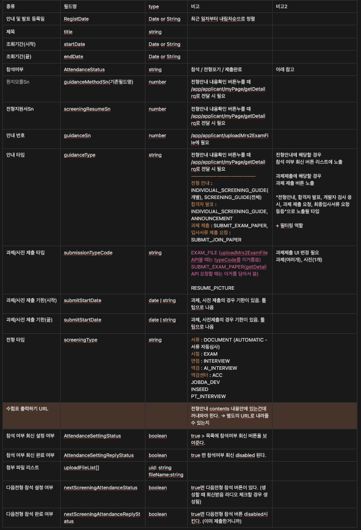

> 채용사이트 마이페이지를 리뉴얼하는 과정의 시작으로 API명세를 만들려고 한다. 보통 새로 개발할 때는 백엔드와 명세를 맞추고, 백엔드는 API개발을 시작하고 프론트엔드는 명세에 맞춰 개발을 시작할 것이다. 하지만, 이번 경우에는 백엔드가 뒤늦게 합류하기 때문에 API 파악 및 설계를 내가 먼저해서 부족한 개발 시간을 맞춰보기로 했다.


## Step1. (구)API의 각 Field가 하는 역할 파악하기

> **왜 (구)API의 Field를 파악해야 할까?**
> - 눈에 보이지 않는 UI가 구 API의 특정 필드에 의해 보일 수 있다.
> - 특정 필드가 어떤 역할을 하고 있는지를 파악해야 신규 API를 만들 때 원활하다. 필요한 데이터와 불필요한 데이터를 빠르게 구별할 수 있다.

아래 예시를 보면 아무리 필드명을 가독성 좋게 짜둬도, 우리는 어떤 필드가 어떤 값을 의미하는지 한번에 알기가 어렵다.

```jsx
"title": "최종합격자 발표지롱",
"postStartDatetime": "2024-07-31 00:00:00",
"postClosingDatetime": "2025-06-30 00:00:00",
"submissionStartDatetime": null,
"submissionClosingDatetime": null,
"submissionYn": null,
"contents": null,
"attachFileList": null,
"uploadFile": null,
"applicantSn": null,
"jobnoticeSn": null,
"stepSn": null,
"recruitfieldSn": null,
"resumeSn": 371721,
"screeningResumeSn": 1671914,
"screeningRecruitNoticeSn": 34207,
"screeningSn": 31021,
"screeningType": "DOCUMENT",
"guidanceSn": 13975,
"guidanceType": "ANNOUNCEMENT",
"guidanceTargetSn": 25206,
"guidanceMethodSn": 39556,
"submissionTypeCode": null,
"canOpen": true,
"guidanceAttendanceReplyYn": null,
"attendanceIntentionYn": null,
"guidanceAgreementInfoVo": null,
"guidanceNextAttendanceReplyYn": true,
"nextAttendanceReplyYn": true
```


## Step2. 신규 API 명세 짜기

(구)API를 파악했다면 신규 API 명세를 짜보자. 간단한 예시로 다음과 같은 모습으로 표현할 수 있을 것이다.

**RQ**

| 종류 | 필드명 | type |
| --- | --- | --- |
| 공고번호 | jobnoticeSn | number |

**RS**

| 종류 | 필드명 | type | 비고 |
| --- | --- | --- | --- |
| 전형안내 및 발표 리스트 | AnnouncementList | AnnouncementItem[] |  |
| 공고명 | jobNoticeName | string |  |
| 지원공고 확인 | isBuilder | boolean | (구)채용사이트 사용중인지, (신)빌더 사용중인지 값이 내려오면 프론트에서 정적 URL로 넘겨준다. |

**`AnnouncementItem`**

| 종류 | 필드명 | type | 비고 |
| --- | --- | --- | --- |
| 안내 및 발표 등록일 | RegistDate | date | 최근 일자부터 내림차순으로 정렬 |
| 제목 | title | string |  |
| 조회기간(시작) | startDate | date |  |
| 조회기간(끝) | endDate | date |  |

## 실제 모습

예제처럼 깔끔하게 나오면 좋겠지만 실제로는 얽히고설킨 실타래를 푸는 것처럼 하나하나 분석하다 보면 아래와 같은 모습이 될 것이다.

내가 정확하게 설계를 하기보다는 필요한 데이터들의 종류를 명시해주고, 필드명도 도메인에 어울리는 네이밍을 1차적으로 지어주고, 백엔드 입장에서 이 API 명세를 받았을 때 이해하기가 어려울 수 있기 때문에 이 필드가 어디서 사용 되는 데이터인지 등 도움을 줄 수 있는 정보도 함께 제공한다면 더할나위 없이 좋다.

이 표는 전달하고 끝이 아니다. 처음부터 완벽할 수 없다. 백엔드와 함께 기획서를 보면서 다시한번 맞추는 작업을 해야 한다.



## 어떤 부분에서 발전할 수 있었을까?

- **프론트와 백엔드의 원활한 소통**  
  1차적으로 눈에 보이는 정리되어있는 API 명세서가 있다는 것과 없다는 것은 차이가 크다.
- **시간을 더 아끼는 길**  
  QA부서가 없어지고, 개발자 및 기획자 모두 처음보는 페이지가 많다. 그렇기 때문에 개발자가 선제적으로 이렇게 파악해서 히스토리도 알게 되면 나중에 나올 버그를 줄이는데 큰 역할을 할 수 있다.
- **설계**  
  나중에 API에 추가될 필드가 있더라도 사전에 구조를 설계할 때 어느정도 고려해서 짜둘 수 있기 때문에 확장성에 좋은 구조가 될 확률이 높다.