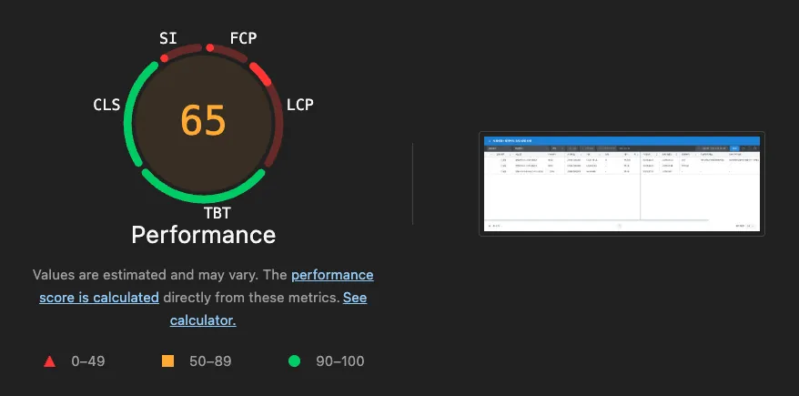
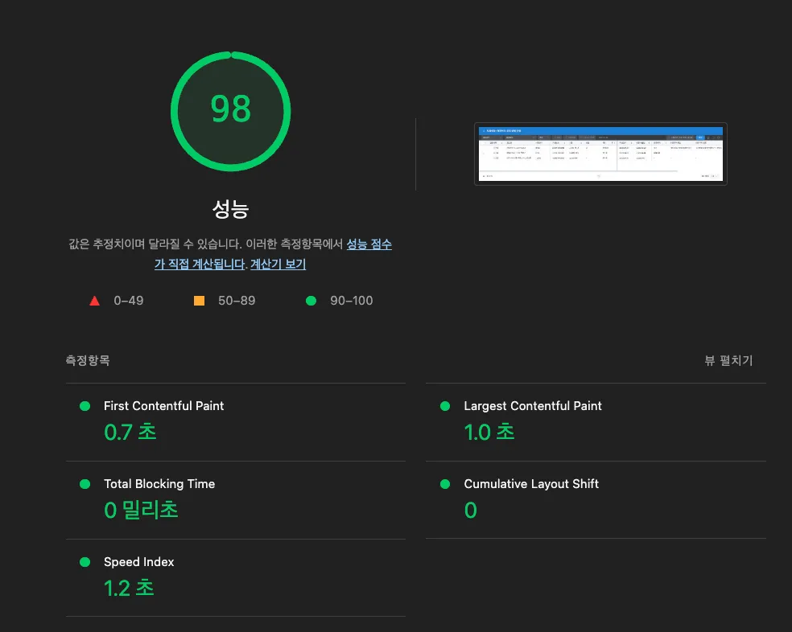
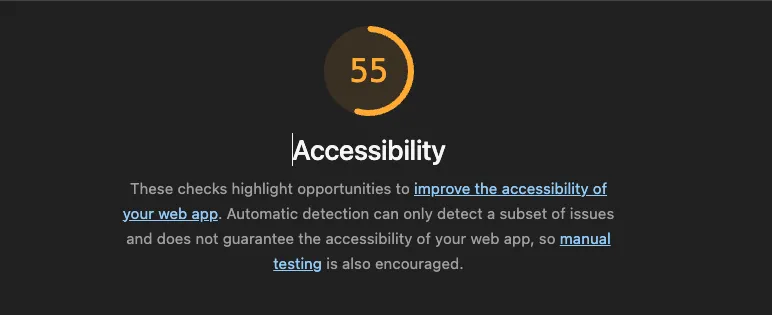
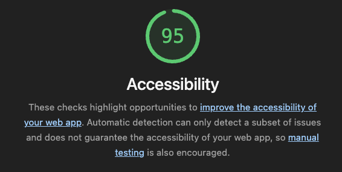

직전 포스팅에서 가독성을 개선했다.

이번에는 한 페이지에서 볼 수 있는 지원자의 최대 수를 100명으로 한계를 두지 않고, 대한항공이나 카카오같이 한번 채용할 때 수 만명이 지원하는 케이스를 고려하여 windowing 기법을 적용하여 limit을 해제하는 것을 목표로 하고 있다.

그 전에 lighthouse를 돌려서 기본적으로 성능을 개선할 수 있는 부분들을 개선하고자 정리했다.

> lighthouse를 돌릴 때는 조건을 어떻게 세팅하는지도 중요한데, 오늘 작성하는 포스팅에서는 기본적으로 설정되어 있는 Simulated throttling를 기준으로 측정했다.

## Performance

### 개선 전

개선 전 Performance 초기 모습이다.
지원자가 3명 밖에 없는데도 불구하고, FCP/LCP가 3초 대로 느린 모습이다. 사용자가 보통 가장 원하는 정보인 LCP는 2.5초 이내에 발생해야 한다고 Google에서 얘기하고 있다. [web.dev - 코어 웹 바이탈](https://web.dev/articles/vitals?hl=ko)

경험상 최적화를 하나도 진행하지 않았을 때 이 정도 점수를 가진 프로덕트가 만들어지는 것 같다. 보통 이럴 때는 적절한 `code spliiting`만 해줘도 불필요한 리소스를 처음에 불러오지 않음으로서 크게 개선이 가능하다. 이제 개선을 해보자.




### 개선 과정

`code splitting`, `api url preconnect`, `font/css load` 최적화, 이미지 최적화를 수행했다.

#### code splitting

React의 Suspsen와 lazyload를 함께 사용해서 공통으로 사용하는 build 결과물에 포함시키지 않고, 해당 페이지에 접속했을 때 그 페이지에서 사용하는 리소스들을 불러오는 방식으로 개선했다.

#### font load

font는 cdn주소를 preconnect로 우선순위를 높여서 통신할 준비를 미리 완료시켜놓고, preload로 html 파싱 초기에 다운로드를 미리 진행시키고 stylesheet로 선언한 link 태그를 만났을 때 렌더링을 더 빠르게 시작할 수 있다. media="print"까지 함께 쓰는 것도 일종의 트릭인데, stylesheet는 html 파서 입장에서 렌더링 차단 리소스라서 만나면 html차단이 일어나기 떄문에 media="print"를 붙여서 block이 일어나지 않게 하고, 다운로드가 끝났을 때 onload이벤트가 발행되면서 media="all"로 바꿔서 화면에 적용시킨다.

#### noscript

noscript태그로 javascript를 로드하지 못하는 환경에서 안정성을 더하는 것은 덤이다.

```html
<link rel="preconnect" href="https://cdn.jsdelivr.net" crossorigin />
<link
  rel="preload"
  as="style"
  href="https://cdn.jsdelivr.net/gh/orioncactus/pretendard@v1.3.9/dist/web/static/pretendard-dynamic-subset.min.css"
  crossorigin
/>
<link
  rel="stylesheet"
  href="https://cdn.jsdelivr.net/gh/orioncactus/pretendard@v1.3.9/dist/web/static/pretendard-dynamic-subset.min.css"
  media="print"
  onload="this.media='all'"
  crossorigin
/>
<noscript>
  <link
    rel="stylesheet"
    href="https://cdn.jsdelivr.net/gh/orioncactus/pretendard@v1.3.9/dist/web/static/pretendard-dynamic-subset.min.css"
    crossorigin
  />
</noscript>
```

#### CSS 최적화

기존에는 작은 reset.css파일을 load하고 있었다. `<link rel="stylesheet" href="./reset.css" />` 위에서 얘기한 것처럼 link태그는 네트워크 왕복, 다운로드가 이뤄져야 렌더링을 이어서 진행하기 때문에 이처럼 크리티컬 CSS 용량이 작고,SPA처럼 html파일이 1개라서 캐싱으로 얻는 이점이 적다면 인라인 스타일로 제공하는 것도 방법이다.

#### 이미지 최적화

이미지 최적화를 위해서는 다양한 기법이 있다. 네트워크 요청 수를 줄이는 스프라이트 기법, 차세대 포맷인 webp를 사용하고 fallback으로 다른 형식을 제공하는 방식, 해상도에 맞춘 최적화 전략, vector기반 svg사용, lazy로 로드하는 등 정말 다양한 방법이 있다.

여기서의 문제는 svg를 사용하면 무조건 용량이 작을 것이라는 생각에서 복잡한 모양의 이미지를 svg로 사용하고 있던 것이 문제가 됐다. 무려 3.5MB씩이나 차지하고 있었다. vector로 복잡한 이미지를 표현하려고 하면 일반적인 이미지 형식보다 훨씬 더 많은 용량을 차지하게 되기 때문에 유의해서 사용해야 한다.

### 개선 결과

lighthouse가 분석하고, 제안해주는 방향을 접목만 시키더라도 상당히 개선할 수 있는 모습이다.



## Accessibility

### 개선 전

접근성의 경우, 성능보다 더 안좋은 지표를 가지고 있었다. lighthouse에서 측정하는 접근성은 기본적인 것들을 점검한다. 실제로 접근성 관련 크롬 익스텐션을 사용해보면 더 많은 문제를 발견할 수 있다.

저시력자나 스크린리더기에 의존하고 있는 사용자라면 이 서비스는 거의 2년동안 사용할 수 없는 지경이었을 것이다.



### 개선 과정

- 모든 button에 `aria-label`을 붙여줬다. 툴팁을 보여주는 title을 제공해주는 것도 버튼이 무슨 역할을 하는 것인지 의미를 부여할 수 있겠지만 스크린 리더마다 동작이 다르고 WAI-ARIA 명세상 접근성을 지정하는 방법에 포함하지 않는다.
- input 요소에도 마찬가지로 `aria-label`을 붙여줘서 스크린리더가 읽을 수 있게 했다.
- 배경색상과 텍스트 색상이 비슷해서 3.5 contrast를 만족하지 못하는 부분도 해결했다.
- 이미지에 대체 텍스트가 누락되어 있는 부분들을 해결했다.

### 개선 결과



## 후기

코드 리팩토링에 이어 성능적인 부분까지 챙기고 나니 한층 더 안정적이고 신뢰할 수 있는 서비스가 되었다고 생각한다.

이제 그 다음은 `windowing` 기법을 적용해서 더 많은 사용자를 화면에서 로드할 때도 지금의 속도를 유지할 수 있도록 개선해야 하고, 다른 전형에서도 해당 Grid를 사용하면서 검증 범위가 넓어져서 `playwright`로 E2E 테스트를 구축할 생각이다.
