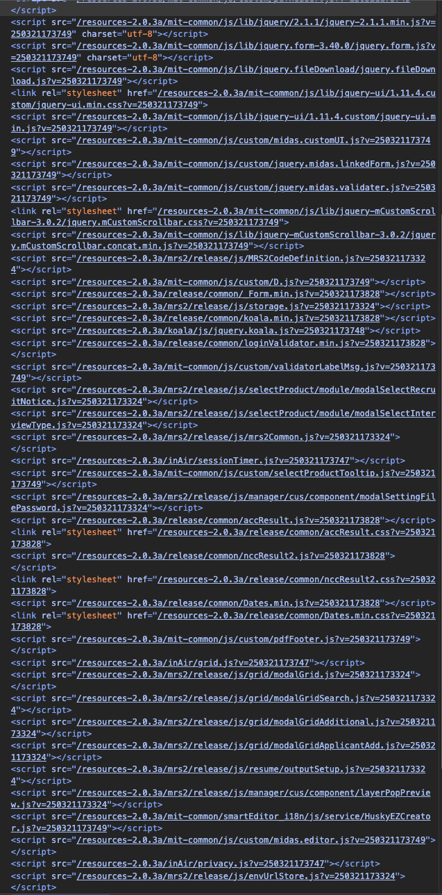
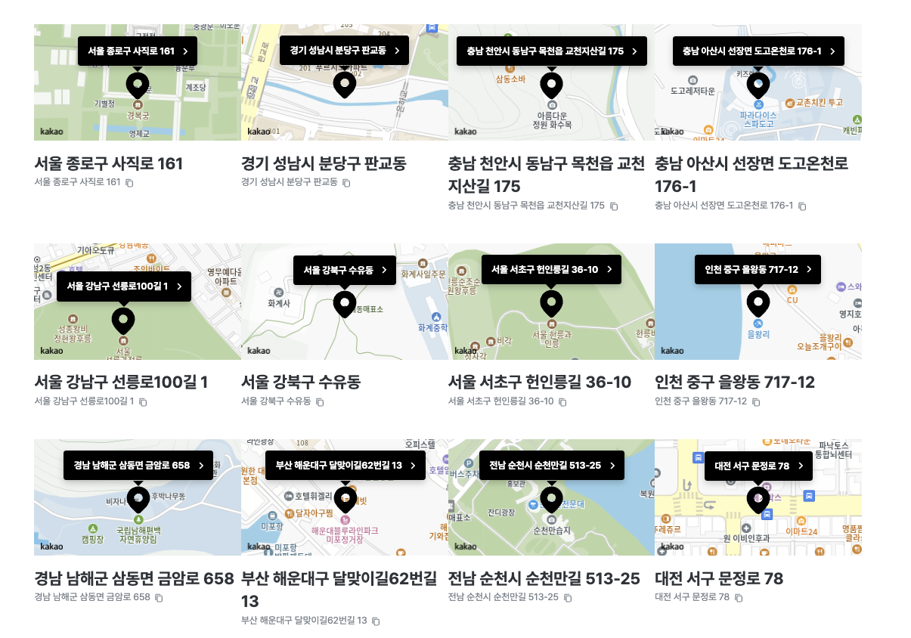

## 배경

채용사이트 빌더 쪽 인원 대다수가 이탈하면서, 지원을 위해 합류했다.
이 포스팅은 합류 후 카카오 API를 사용한 지도 컨텐츠를 개발하면서 "여러 개의 카카오 지도 컴포넌트가 동시에 렌더링 될 때"의 문제점을 해결하는 과정이 담겨있다.

> 채용사이트 빌더란? 인사담당자가 기업별 채용사이트를 자유롭게 커스터마이징하고, 지원자는 커스터마이징한 각 기업의 채용사이트에 들어가서 공고에 지원도 하고, 마이페이지도 확인하는 등의 채용 기능들을 이용할 수 있다.

## 어떤 문제들이 있었을까?

### 1. 카카오 Maps API를 사용하기 위해서는 script태그가 있어야 한다.

나는 화면에 지도 컨텐츠가 있을 때만 HTML에 script태그를 추가하고자 했다. 그 이유는 시간이 지날수록 서비스는 비대해지고, HTML에 가득찬 script태그들을 보고싶지 않았기 때문이다. 점점 script태그들이 많아지면 성능상에도 문제가 있고, 유지보수도 힘들어진다.

> script태그들이 많아지면, 얼마나 많아질 수 있길래 유지보수가 힘들어진다고 하는걸까?  
> 
> 기존에 8년된 레거시 서비스의 HTML이다. 한 화면에 다 담기지도 않는 모습이다..

### 2. 여러 지도 컨텐츠를 로드할 때 '중복'스크립트가 HTML에 들어가서는 안된다.

스크립트가 중복으로 여러개 들어가게 되면 애초에 비정상이지만, 지도가 정상적으로 그려지지도 않았다. 이런 일은 없어야 한다. 그리고 script태그가 들어가는 타이밍과 script를 완전히 로드하고 난 뒤 콜백함수가 실행되는 타이밍(지도를 그리는 타이밍)이 일치해야 한다. 그런 타이밍을 조율할 수 있어야 한다.

즉, 첫번째 지도 컨텐츠가 로드가 되었다면 나머지 지도 컨텐츠들은 로드가 이미 완료되었음을 알 수 있어야 한다. 이 의미는 지도 컨텐츠들이 상태를 공유할 수 있어야 된다는 것이다.

### 3. 간헐적으로 지도가 나오지 않는 문제가 있었는데, 그 때 에러 처리를 할 수 있어야 한다.

카카오 Maps API가 정상동작하지 않아, 지도를 그릴 수 없는 경우에 에러처리를 할 수 있어야 한다. 그런 부분들도 처리해줄 수 있어야 한다.

## 해결

신경 쓴 포인트들은 다음과 같다.

- 각 함수들을 단일 책임을 할 수 있도록 구분했다.
- 핵심인 useLoadKakaoScript 함수에서는 각 추상화된 함수들 내부로 로직을 분석하러 들어가지 않아도, 어떤 기능을 하는지 한눈에 알 수 있도록 했다.
- Promise를 유연하게 사용해서 에러 처리도 하고, 비동기 처리 및 마지막에는 동기적으로 상태를 업데이트 할 수 있도록 했다.

결론으로 다음 코드와 같다.

```tsx
// 카카오맵 초기화 상태 관리
let isKakaoInitialized = false;

// 카카오맵 스크립트 URL 생성
const getKakaoMapScriptUrl = (): string => {
  const apiKey = process.env.NEXT_PUBLIC_KAKAO_APP_KEY;
  if (!apiKey) {
    console.error("카카오맵 API 키가 설정되지 않았습니다.");
    throw new Error("NEXT_PUBLIC_KAKAO_APP_KEY가 정의되지 않았습니다.");
  }
  return `//dapi.kakao.com/v2/maps/sdk.js?appkey=${apiKey}&autoload=false&libraries=services,drawing`;
};

// 이미 카카오맵이 초기화되었는지 확인
const isKakaoMapReady = (): boolean => {
  return isKakaoInitialized;
};

// 카카오맵 스크립트가 로드되었는지 확인
const isKakaoScriptLoaded = (): boolean => {
  return Boolean(window.kakao?.maps?.load);
};

// 카카오맵 스크립트 태그가 DOM에 존재하는지 확인
const isKakaoScriptTagExists = (): boolean => {
  return Boolean(
    document.querySelector('script[src*="dapi.kakao.com/v2/maps/sdk.js"]'),
  );
};

// 카카오맵 초기화 (load 메서드 호출)
const initializeKakaoMap = (): Promise<void> => {
  return new Promise((resolve) => {
    window.kakao.maps.load(() => {
      isKakaoInitialized = true;
      resolve();
    });
  });
};

// 이미 로드된 상태에서 초기화 수행
const handleAlreadyLoadedScript = (): Promise<void> => {
  return initializeKakaoMap();
};

// DOM에 script 태그가 있지만 아직 로드 중인 경우 처리
const handleExistingScriptTag = (timeoutMs: number): Promise<void> => {
  return new Promise((resolve, reject) => {
    const checkInterval = setInterval(() => {
      if (window.kakao?.maps) {
        clearInterval(checkInterval);
        initializeKakaoMap().then(resolve);
      }
    }, 100);

    // 타임아웃 설정
    setTimeout(() => {
      clearInterval(checkInterval);
      reject(new Error("카카오맵 로드 타임아웃"));
    }, timeoutMs);
  });
};

// 새 스크립트 생성 및 로드
const createAndLoadScript = (timeoutMs: number): Promise<void> => {
  return new Promise((resolve, reject) => {
    try {
      const script = document.createElement("script");
      script.src = getKakaoMapScriptUrl();

      // 타임아웃 설정
      const timeoutId = setTimeout(() => {
        reject(new Error("카카오맵 로드 타임아웃"));
      }, timeoutMs);

      script.onload = () => {
        clearTimeout(timeoutId);
        initializeKakaoMap().then(resolve);
      };

      script.onerror = () => {
        clearTimeout(timeoutId);
        reject(new Error("카카오맵 스크립트 로드 실패"));
      };

      document.head.appendChild(script);
    } catch (error) {
      reject(error);
    }
  });
};

// 카카오맵 스크립트 로드 메인 함수
const loadKakaoMapScript = (timeoutMs = 10000): Promise<void> => {
  // 이미 초기화된 경우
  if (isKakaoMapReady()) {
    return Promise.resolve();
  }

  // 이미 로드되어 있는 경우
  if (isKakaoScriptLoaded()) {
    return handleAlreadyLoadedScript();
  }

  // 스크립트 태그가 이미 존재하는 경우 (아직 로드 중)
  if (isKakaoScriptTagExists()) {
    return handleExistingScriptTag(timeoutMs);
  }

  // 새 스크립트 생성 및 로드
  return createAndLoadScript(timeoutMs);
};

// 카카오맵 로드 상태를 관리하는 훅
export const useLoadKakaoScript = (): [boolean, Error | null] => {
  const [isMapReady, setIsMapReady] = useState(isKakaoInitialized);
  const [error, setError] = useState<Error | null>(null);

  useEffect(() => {
    // 서버 사이드 렌더링 대응
    if (typeof window === "undefined") return;

    if (isKakaoInitialized) {
      setIsMapReady(true);
      return;
    }

    loadKakaoMapScript()
      .then(() => {
        setIsMapReady(true);
      })
      .catch((err: Error) => {
        console.error("카카오맵 로드 오류:", err.message);
        setError(err);
      });
  }, []);

  return [isMapReady, error];
};
```

## 이런 방법도 고민했다.

각 지도 컨텐츠의 순서를 동기화해서 한번에 상태를 업데이트 시키는 방법이었다.
이 방법으로도, 상태 싱크를 맞춰서 동시에 렌더링 시키는 것에는 문제가 없었던 방식이다.
하지만, 동시에 처리하지 않고도 순차적으로 실행시킬 수 있는 방법이 있을 것 같아서 위 방식을 택했다.

```tsx
import { useEffect, useState } from "react";
// 카카오맵 초기화 상태 및 콜백 관리
let isKakaoInitialized = false;
let pendingCallbacks: Array<() => void> = [];

/**
 * 카카오맵 초기화 완료 시 모든 콜백 실행
 */
const notifyInitialized = (): void => {
  isKakaoInitialized = true;
  // 대기 중인 모든 컴포넌트에 초기화 완료 알림
  pendingCallbacks.forEach((callback) => callback());
  // 메모리 누수 방지를 위해 배열 비우기
  pendingCallbacks = [];
};

/**
 * 카카오맵 스크립트 URL 생성
 */
const getKakaoMapScriptUrl = (): string => {
  return `//dapi.kakao.com/v2/maps/sdk.js?appkey=${process.env.NEXT_PUBLIC_KAKAO_APP_KEY}&autoload=false&libraries=services,drawing`;
};

/**
 * 카카오맵 스크립트 로드 및 초기화
 */
const loadKakaoMapScript = (): void => {
  // 이미 window.kakao.maps.load 까지 다 존재한다면, 초기화 실행
  if (window.kakao?.maps?.load) {
    window.kakao.maps.load(notifyInitialized);
    return;
  }
  // kakao 로드는 완전히 안됐지만, 이미 스크립트 태그가 존재하는 경우
  // 중복으로 스크립트를 생성하지 않고 대기
  if (document.querySelector('script[src*="dapi.kakao.com/v2/maps/sdk.js"]')) {
    return;
  }
  // 스크립트 생성 및 DOM에 추가
  const script = document.createElement("script");
  script.src = getKakaoMapScriptUrl();
  document.head.appendChild(script);
  // 스크립트 로드 완료 후 카카오맵 초기화
  script.onload = () => {
    window.kakao.maps.load(notifyInitialized);
  };
};

/**
 * 카카오맵 로드 상태를 관리하는 훅
 * @returns [boolean] 카카오맵 로드 완료 여부
 */
export const useLoadKakaoScript = (): [boolean] => {
  const [isMapReady, setIsMapReady] = useState(isKakaoInitialized);
  useEffect(() => {
    // 이미 초기화되었으면 즉시 준비 완료 상태로 설정
    if (isKakaoInitialized) {
      setIsMapReady(true);
      return;
    }
    // 초기화 완료 시 호출될 콜백 등록
    pendingCallbacks.push(() => setIsMapReady(true));
    // 스크립트 로드 시작
    loadKakaoMapScript();
  }, []);
  return [isMapReady];
};
```

## 한번에 렌더링해도 문제가 없이 잘 렌더링 되는 모습



## 지도의 마커와 말풍선은 어떤 식으로 그릴까?

주로 신경쓴 부분은 다음과 같다.

- 확실히 지도를 그릴 준비가 되었는지를 확인한다.
- SVG를 사용해서 렌더링 최적화를 수행한다.
- 가로로 4개를 보여줄 때는 높이가 많이 낮아야 한다. 이 때 지도의 마커와 말풍선이 다 보이도록 해야 한다.
- 반응형을 지원하기 때문에 브라우저 resize에 따라서 지도를 다시 그려줘야 한다. (성능상 문제가 없는 것을 확인했다)

> useEffect가 조금 비대한 느낌이 있다. 충분히 더 분리할 수 있기 때문에, 분리해서 사용하는 것도 추천한다. 혹시 나중에 도움이 필요한 사람들에게 도움이 되었으면 좋겠다.

```tsx
const useMap = ({ mapContent, cx, viewMode, renderDependency }: IProps) => {
  const { setToast } = useToast();

  const { value, style } = mapContent;
  const { latitude, longitude, address, detailAddress } = value;
  const { sizePercentage, markerColor, markerName } = style;
  const encodedText = encodeURIComponent(address);

  const mapContainerRef = useRef<HTMLDivElement>(null);

  useEffect(() => {
    const isMapReadyToRender =
      address &&
      window.kakao &&
      mapContainerRef.current &&
      window.kakao?.maps?.LatLng;

    /** 주소가 없거나 카카오맵이 로드되지 않았다면 return; */
    if (!isMapReadyToRender) return;

    const { kakao } = window;

    /** 마커 그리기 */
    const createCustomMarker = ({
      map,
      coordinate,
    }: {
      map: KakaoMapsMap;
      coordinate: CoordinateType;
    }) => {
      const [latitude, longitude] = coordinate;

      const imageSrc = getMarkerSVG(markerColor);
      const imageSize = new kakao.maps.Size(62, 62);
      const imageOption = { offset: new kakao.maps.Point(31, 60) };

      const markerImage = new kakao.maps.MarkerImage(
        imageSrc,
        imageSize,
        imageOption,
      );
      const markerPosition = new kakao.maps.LatLng(latitude, longitude);

      const marker = new kakao.maps.Marker({
        position: markerPosition,
        image: markerImage,
      });

      marker.setMap(map);
      kakao.maps.event.addListener(marker, "click", function () {
        window.open(`https://map.kakao.com/?q=${encodedText}`, "_blank");
      });
    };

    /** 말풍선 그리기 */
    const createCustomOverlay = ({
      map,
      coordinate,
    }: {
      map: unknown;
      coordinate: CoordinateType;
    }) => {
      const [latitude, longitude] = coordinate;

      const OverlayContent = () => (
        <a
          href={`https://map.kakao.com/?q=${encodedText}`}
          target={"_blank"}
          className={cx("overlay")}
          id={"overlayContainer"}
          onClick={(e) => e.stopPropagation()}
          rel={"noreferrer"}
          style={{ "--pin-color": markerColor } as React.CSSProperties}
        >
          <span className={cx("overlay-text")}>{markerName}</span>
        </a>
      );

      const overlayContent = renderToString(<OverlayContent />);
      const overlayPosition = new kakao.maps.LatLng(latitude, longitude);

      new kakao.maps.CustomOverlay({
        map: map,
        position: overlayPosition,
        content: overlayContent,
      });
    };

    /** 지도 그리기 */
    const createMap = () => {
      // 지도 중심 좌표를 살짝 아래로 내려서, 4단(높이가 낮을 경우)에도 마커와 말풍선이 한눈에 보이도록 함
      const MAP_CENTER_OFFSET = 0.0003;
      const options = {
        center: new kakao.maps.LatLng(latitude + MAP_CENTER_OFFSET, longitude),
        level: 3,
      };

      const map = new kakao.maps.Map(
        mapContainerRef.current as HTMLElement,
        options,
      );

      createCustomMarker({ map, coordinate: [latitude, longitude] });

      if (markerName) {
        createCustomOverlay({ map, coordinate: [latitude, longitude] });
      }
    };

    createMap();

    const handleResize = () => {
      const debounceTimer = setTimeout(createMap, 300);
      return () => clearTimeout(debounceTimer);
    };

    window.addEventListener("resize", handleResize);

    return () => {
      window.removeEventListener("resize", handleResize);
    };
  }, [
    address,
    markerName,
    markerColor,
    sizePercentage,
    window.kakao,
    window.kakao?.maps?.LatLng,
    viewMode,
    renderDependency,
  ]);

  const handleClickCopyIcon = async (
    e: React.MouseEvent<HTMLButtonElement>,
  ) => {
    e.stopPropagation();
    try {
      const textToCopy = `${address}, ${detailAddress}`;
      if (navigator.clipboard) {
        await navigator.clipboard.writeText(textToCopy);
      } else {
        const textArea = document.createElement("textarea");
        textArea.value = textToCopy;
        document.body.appendChild(textArea);
        textArea.select();
        document.execCommand("copy");
        document.body.removeChild(textArea);
      }
      setToast({ icon: "POSITIVE", text: "주소가 복사되었습니다." });
    } catch (error) {
      setToast({ icon: "FAILED", text: "주소 복사에 실패했습니다." });
    }
  };

  return {
    mapContainerRef,
    handleClickCopyIcon,
  };
};

export default useMap;
```
