나는 UX에 관심이 많다.

중고등학교 때는 사람들의 불편함을 해결해 줄 수 있는 아이디어를 고민했고,

대학교 때는 불편함을 해결해 줄 수 있는 직업을 고민했고,

직장인이 되서는 반도체 장비 설계를 하면서 사용자들의 불편을 고려하고,

기술지원/QA를 하면서 불편에 공감하고 직접 해결하기 위해 개발자가 됐다.

그리고 2021년에 시작한 본격적인 개발이 시간이 지나 어느덧 2025년이 됐다.

## 정신없이 달려온 2년
최근 2년간은 특히 정신없는 시간이었다.

기존 Legacy Product들의 리뉴얼을 진행하고 채용에 혁신을 불러올만한 신규 제품을 개발했다. 정신없이 달려오다보니 중간 중간 해소하고자 했지만 해소하지 못했던 기술부채들이 쌓이기 시작했다.

그 중에서 오늘은 UX 얘기를 좀 해보려고 한다.

예전에 관심이 많아서 봐두었던 심리학 기반 UX가 사용자들의 심리를 사전에 파악하면서 개발하는데 많은 도움을 주었다. UX는 아무나 신경쓴다고 쉽게 말할 수 있다. 마치 나는 긍정적이다. 라는 느낌처럼 말이다. 하지만, UX는 결코 쉬운 문제가 아니다. 구글, 애플, 토스 같은 UX의 중요성을 아는 기업들에서는 UX 엔지니어가 별도로 있는 이유이기도 하다.

우리 회사는 제품을 개발하면 사업팀이나 CX팀에게 제품의 사용성을 공유하는 자리가 있다. 이 때 UX 관련되서 더 좋은 의견을 내주시는 경우도 있고, 각자의 첨예한 의견들이 오고 갈 때가 있다.

순간적인 감정, 순간적인 생각에 의해서 UX를 결정하는 경우가 많은데 내가 UX의 정답에 좀 더 가까워져서 주위 사람들에게 더 도움이 되고 싶었다.

## UX 개선 로드맵

그러던 와중 오늘 우연히 Naver D2를 탐색하다가 UX관련해서 좋은 글을 발견해서 간단하게 정리해두고자 한다.

[[UX개선 장기 로드맵] 수립기 - "VOC많은 순"으로만 일하지 않기 위하여](https://d2.naver.com/helloworld/3012756)

해당 포스팅에서는 사용자 문제를 정의하고, 개선하기위한 과제를 정의하고, 과제의 우선순위를 정하는 과정을 거친다. 빠르게 개발된 서비스들을 점검하면서 해당 방법론을 나도 따라가보고자 한다.

### 사용자 문제 정의
1. 우선 사용자 가설을 정의하고, Interview를 설계한다. ex) "사용자가 익숙하게 쓰던 UX와 다를 것이다.", "대부분 사용자는 Beginner 일 것이다" 등
2. 사전 질문을 통해 정보를 수집한 뒤에 해당 제품의 지식 수준, 배경 지식에 따라서 사용자 그룹을 4단계로 나눈다. ex) 해당 직무에 대한 지식 및 제품에 대한 경험이 없는 단계부터 지식과 경험이 많은 부류까지 나눈다.
3. 각 그룹에서 5명 이상은 조사하지 않는다. 이유는 중복되는 이유가 많이 나와서 효율적이지 않기 때문이다.
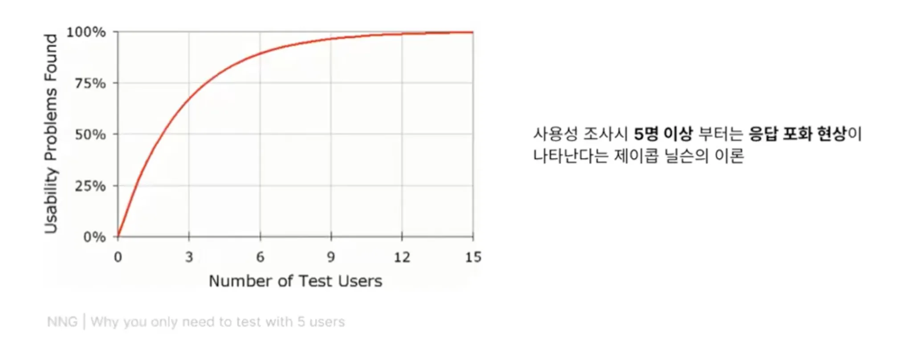

### 리그룹핑
인터뷰한 결과를 한 문장씩 쪼개서 편향된 결과가 나오지 않도록 각 의견을 그룹핑한다.
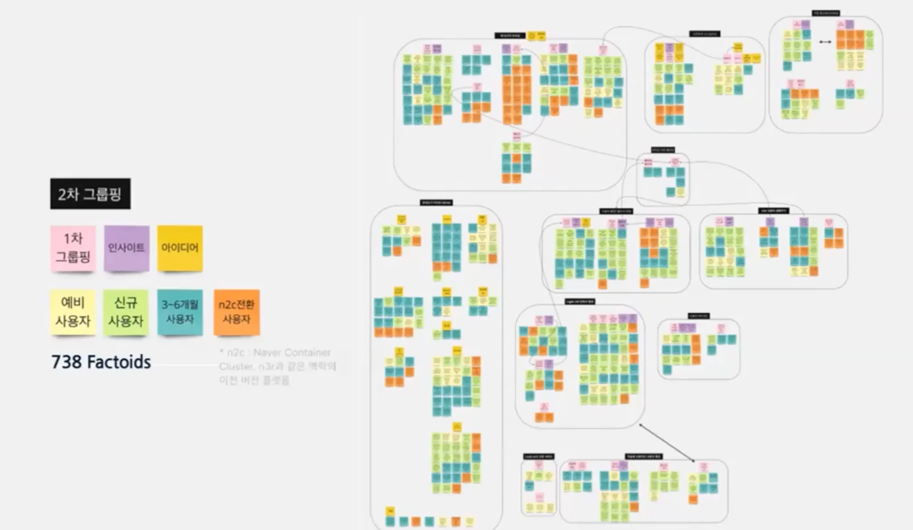

### 다양한 그룹핑
그렇게 새로 그룹핑한 결과로 다양한 그루핑 결과물이 나온다. 해당 결과물들은 첨부한 링크 영상에서 확인할 수 있다. 이 곳에서는 예시로 한가지만 알아보자.
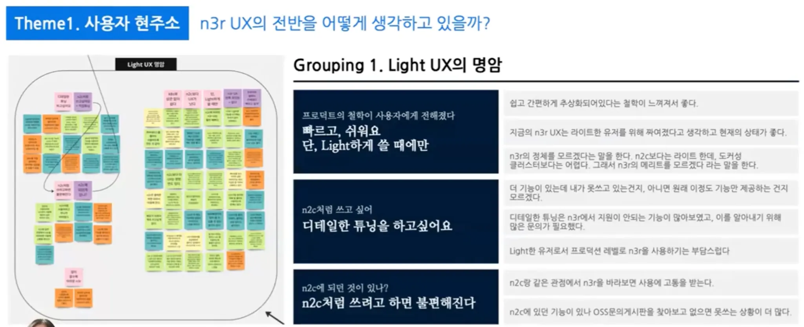

사용자 UX 인터뷰를 할 때 빙산의 일각 부분(눈에 보이는 부분)은 사용자가 “이 버튼이 불편해요”라고 하는 직관적인 부분이고, underline밑에 있는 빙산의 본체는 why에 why를 거듭해서 사용자가 불편한데 왜 불편한지 모르고 그냥 사용하고 있던 것들을 알아내야 한다. 그런 내용들로 심도있는 그룹핑이 가능해졌다.

### 사용자 생애주기 분석
마케팅에서 사용하는 AARRR 프레임워크라고 한다. UX에서도 사용자가 진입부터 활성화, 재방문을 거쳐 추천까지 할 수 있는 단계를 만들 수 있도록 사용자 친화적인 제품을 만들 수 있도록 노력해야 한다.
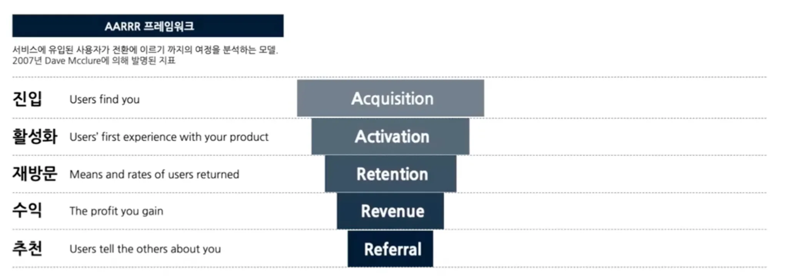

보통은 제품를 사용하기 시작하는 순간에 대한 온보딩만 생각하지만, 단계를 나눠서 사용자가 그 순간에 필요하다고 느끼는 온보딩을 고려해야 한다.
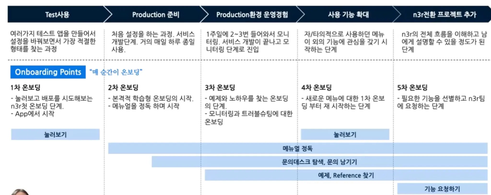

각 단계에서 사용자들이 느끼는 포인트를 정리함으로서 사용자 감정 곡선을 그릴 수 있다.
이로서 pain point를 더 명확히 알 수 있게된다.
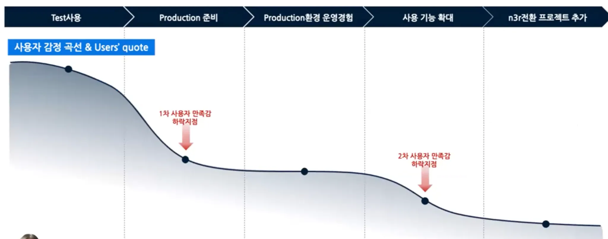

### 과제 선정
이제 각 단계에 어떤 과제가 필요한지 우리는 정리할 수 있다.
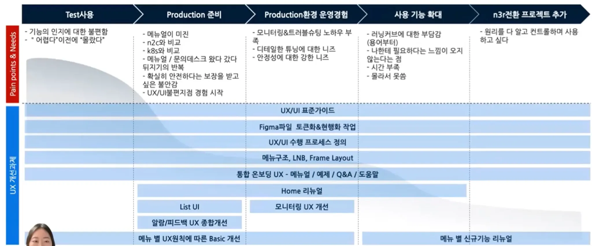

### 우선순위에 따른 과제 나열
적은 투자로, 적은 결과를 얻을 수 있는 단계의 Refine단계가 있는 반면에, Unmet user needs를 건들이는 Rebuild 단계를 수행할 수 있다.

Rebuild 단계는 빙산에서 밑 부분 본체에 해당하는 사용자의 진짜 불편함을 찾아 해결하기 위해서 단순하게 컴포넌트를 수정하는 것이 아니라 여러 페이지에 걸쳐 영향을 미칠수도 있고, 화면, 아키텍처 구조 자체를 바꾸게 될 수도 있다.
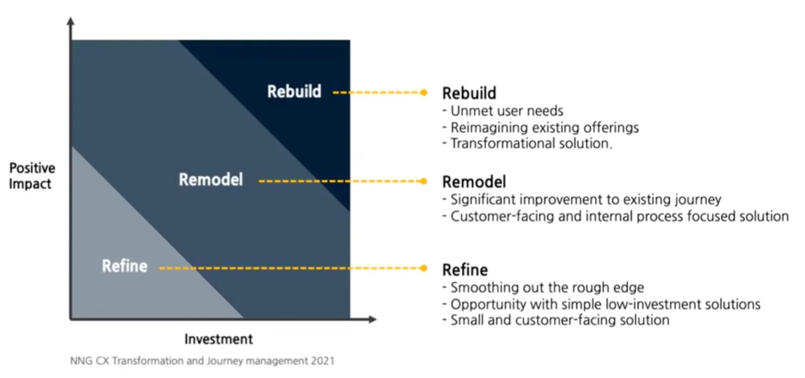

위 모델을 기반으로 정리했을 때 아래와 같은 결과를 도출했다.

쉽게 접근할 수 있는 Refine부터 시작하는데, 이런 것들을 고려하지 않은 상태에서 무작정 시작하는 것보다 우리는 Rebuild단계까지 큰 그림을 그린 뒤에 작업을 시작 할 수 있기 때문에 잘못된 방향으로 가는 일을 사전에 방지할 수 있다.
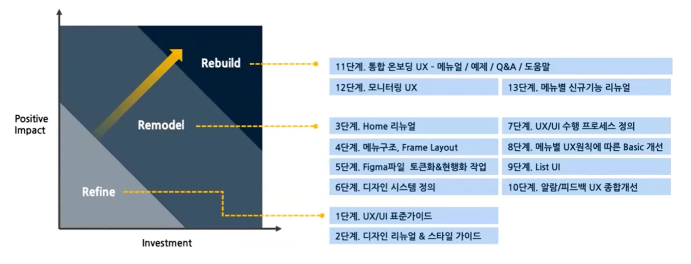

### 로드맵 도출
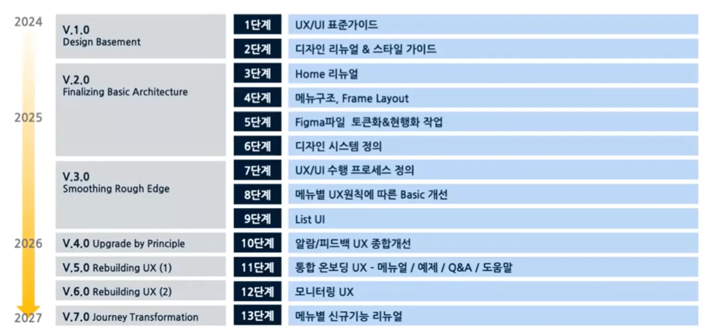

### 장기 로드맵이 잘 유지될 수 있게 해주는 UX 10계명
해당 제품 UX 개선을 하면서 세운 UX 10계명이라고 한다.

실제로, 개발하면서 느낀건데 다른 사람들에게 설득이 필요한 일들을 하다보면 제품의 방향성과 같은 기조를 세우는 것은 꽤나 중요한 역할을 한다는 것을 느꼈다.

아래의 UX 10계명은 읽어만 보고, 내가 개발하는 제품의 기조를 정하기 위해 많은 대기업들에서 행하고 있는 기조와 제품을 보면 많은 부분에서 느낄 수 있다.

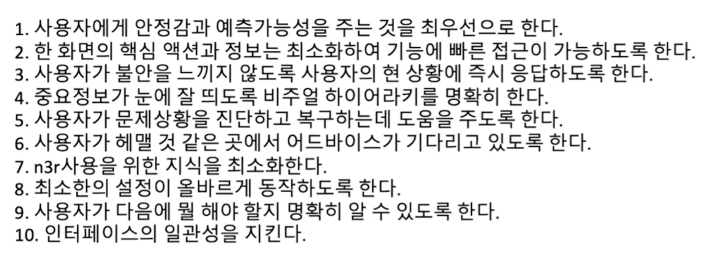

## 후기
요즘 정신없이 개발만하느라 각 기업의 테크 블로그를 잘 들어가지 못했던 것 같다. 퇴근하고 한번씩 들어가서 오늘처럼 인사이트들을 얻어와서 더 풍부한 경험을 쌓아야겠다는 생각을 한다.

2025년의 하반기는 2년간 올라왔었던 울퉁불퉁한 계단을 잘 정비하면서 남아있는 신규 개발 건들도 잘 진행할 수 있도록 해야겠다.
