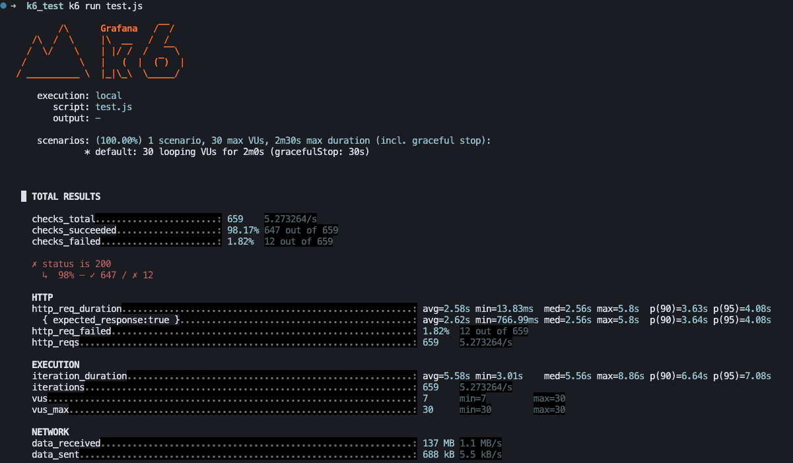

> 최근 지원서 작성 서비스가 리뉴얼되면서 트래픽에 대한 성능 측정이 이뤄졌다. 히스토리가 더 중요한 지원자 마이페이지 쪽에 집중하면서 직접 부하 테스트를 담당하진 않았지만, 팀원으로서 테스트 도구인 k6와 Grafana가 어떻게 쓰이는지 궁금했다. 그래서 개인적으로 작은 시나리오를 만들어 직접 성능 테스트를 진행해봤고, 그 과정을 간단히 정리해두려 한다.

## 간단 사용 테스트: 30명이 2분간 접속

```ts
import http from "k6/http";
import { check, sleep } from "k6";

const task_unit_test = {
  vus: 30, // 가상 사용자 수 접속
  duration: "2m", // 2분 동안 테스트 진행
};
export const options = task_unit_test;

export default function () {
  const params = {
    headers: {
      Cookie: `SESSION_mrs-app=...`,
    },
  };
  const res = http.get(`${domain}}`, params);
  check(res, {
    "status is 200": (r) => r.status === 200,
  });
  sleep(3);
}
```



## 정상부하 테스트
```ts
const normal_load_test = {
  stages: [
    { duration: "10m", target: 1000 },
    { duration: "10m", target: 2000 },
    { duration: "10m", target: 3000 },
    { duration: "10m", target: 4000 },
    { duration: "10m", target: 5000 },
    { duration: "10m", target: 4000 },
    { duration: "10m", target: 3000 },
    { duration: "10m", target: 2000 },
    { duration: "10m", target: 1000 },
  ],
};
export const options = normal_load_test;
```

## 스파이크 테스트
```ts
const spike_test = {
  stages: [
    { duration: "1m", target: 5000 },
    { duration: "14m", target: 5000 },
  ],
};
```

## 최대 부하 테스트: 1만명까지 증가
```ts
const max_load_test = {
  stages: [
    { duration: "10m", target: 2000 },
    { duration: "10m", target: 4000 },
    { duration: "10m", target: 6000 },
    { duration: "10m", target: 8000 },
    { duration: "10m", target: 10000 },
  ],
};
```

> 다양한 케이스를 설정해주고 원하는 테스트 시나리오를 실행하면 된다.

## 간단 후기
### 쉽고 간편하다.
세팅이나 실행 방법이 굉장히 쉬웠다는 점에서 접근성이 굉장히 좋다고 느꼈다.

### 미리 대응하기
운영 환경에서 실제로 발생할 수 있을만한 케이스를 배포 전에 테스트해서 병목 지점을 파악하는 것이 중요하다고 느꼈다.

### 성능 관련 지표를 얻을 수 있다.
- API 성공율, 응답시간을 통해 성능저하나 병목을 예측해 볼 수 있다.
- grafana에서 부하를 줬을 때 datadog을 통해서 시스템 리소스를 모니터링해서 얼마나 시스템에 부하를 주고 있는지를 파악할 수 있다. 스파이크, 부하테스트를 할 때 CPU 사용률이 치솟는 것을 확인해야 한다. 짧은 시간에 굉장히 많은 사용자가 모였을 때 90%까지 올라가는 것은 문제가 아닐 수 있지만 지속적으로 80-100%가 유지된다면 병목, 요청 지연, 컨테이너 재시작 등의 장애로 이어질 수 있다. 코드 최적화나 캐싱 서버 리소스를 확장하는 것을 검토해 볼 수 있다.