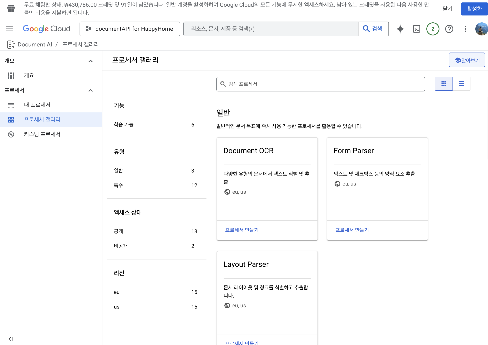
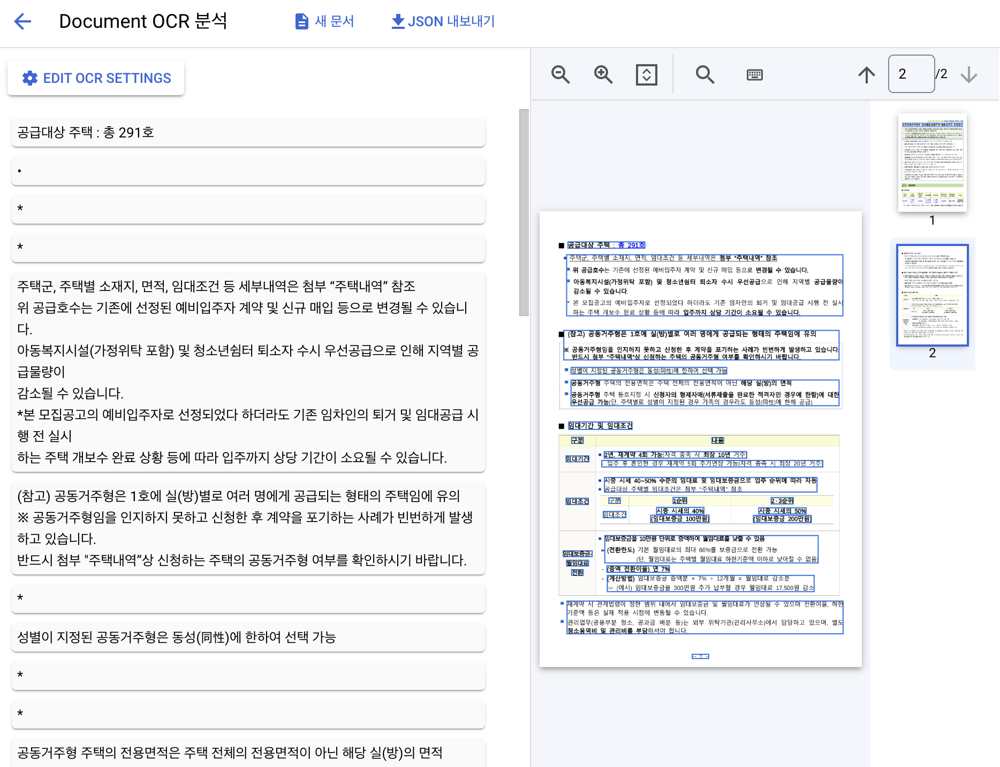

행복주택 API를 이용해서 공고 목록을 가져오고, 중복 PDF를 다운받지 않도록 필터링 한 뒤 Playwright로 각 공고의 URL에 접근하여 PDF파일을 받는데 성공했다.

## Google Document AI

다음으로, PDF파일을 분석해야 한다.
Google의 Document AI를 활용하면 PDF를 분석할 수 있는 것으로 알고 있었다.
그래서, 직접 분석해봤다.

Document AI 하나만 있는 줄 알았는데, 큰 범주에서 Document AI인 것이고 세부적으로 프로세서들이 존재한다. 이 중에서 내가 사용해 볼 만한 것은 Document OCR과 Layout Parser로 보였다. (스크롤을 내려보면, 더 많은 프로세서들이 존재하는데 신분증, 급여명세서, 영수증, 은행 명세서 등 특정 전문 분야에서 사용하는 용도들로 나뉘어져 있다.)



## 결과

비정형 데이터를 얼마나 잘 분석해 줄 수 있을까 기대가 컸다. 하지만, Document AI의 경우에는 OCR 역할을 훌륭하게 대체하는 수준처럼 보였다. 텍스트를 잘 추출한다. 하지만, 의도하려고 했던 것처럼 비정형 데이터 속에서 각 연관된 텍스트들이 이어지는 것을 기대하는 것은 불가능했다. 아래 이미지를 보면 각 Block들이 따로 텍스트 형태로 노는 것을 볼 수 있다.



그나마, Layout Parser를 이용해서 추출한 PDF의 데이터 구조를 다시 한번 가공하는 작업을 거칠 수 있다면 사용할 수 있겠다는 희망은 얻었다.
아래 json은 일부분을 추출한 모습인데, 각 block별로 hierachy구조를 이뤄 데이터의 의미를 파악할 수 있다.

```json
      }
    }, {
      "blockId": "15",
      "textBlock": {
        "text": "1 공급개요",
        "type": "heading-1",
        "blocks": [{
          "blockId": "16",
          "textBlock": {
            "text": "모집일정",
            "type": "paragraph"
          },
          "pageSpan": {
            "pageStart": 1,
            "pageEnd": 1
          }
        }, {
          "blockId": "17",
          "tableBlock": {
            "bodyRows": [{
              "cells": [{
                "blocks": [{
                  "blockId": "18",
                  "textBlock": {
                    "text": "모집 공고 3.27(목)",
                    "type": "paragraph"
                  },
                  "pageSpan": {
                    "pageStart": 1,
                    "pageEnd": 1
                  }
                }],
                "rowSpan": 1,
                "colSpan": 1
```

## 도전

다음 도전은 "이 데이터를 어떻게 이용해서 핵심 데이터들을 뽑아내고, 추후 사용자들이 질문 했을 때 정확한 대답을 얻을 수 있을까"이다.
자고 일어나면, 또 아이디어가 떠오를 것이다.


## 참고

- [Document AI: 인보이스와 여권 등 다양한 문서를 인식](https://cloud.google.com/blog/ko/products/ai-machine-learning/text-and-insights-directly-from-your-scans-and-photos)
- [What is Document AI?](https://www.youtube.com/watch?v=1V96qmfSTe4)