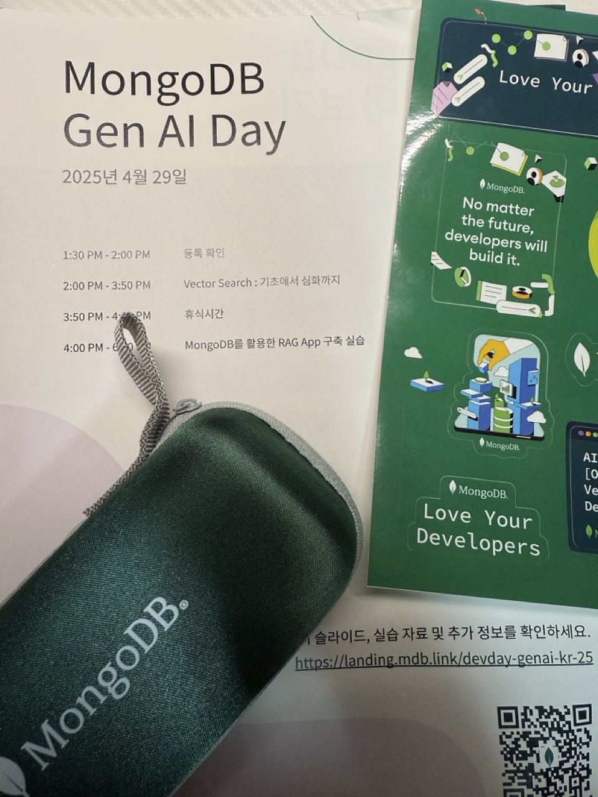
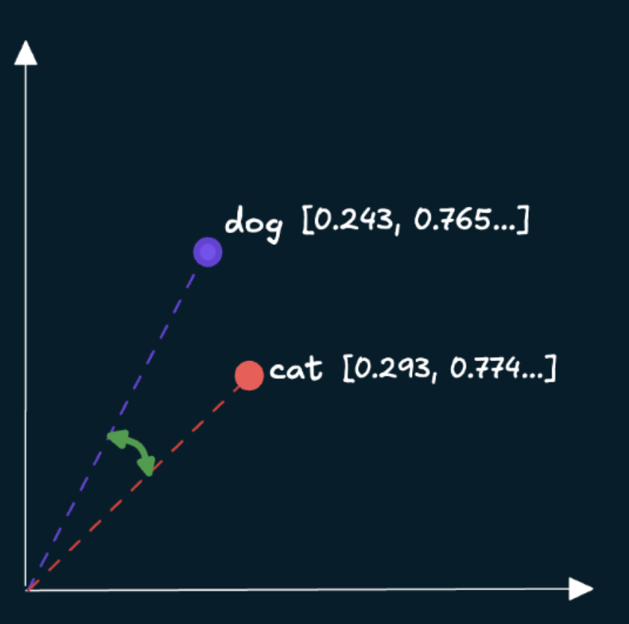
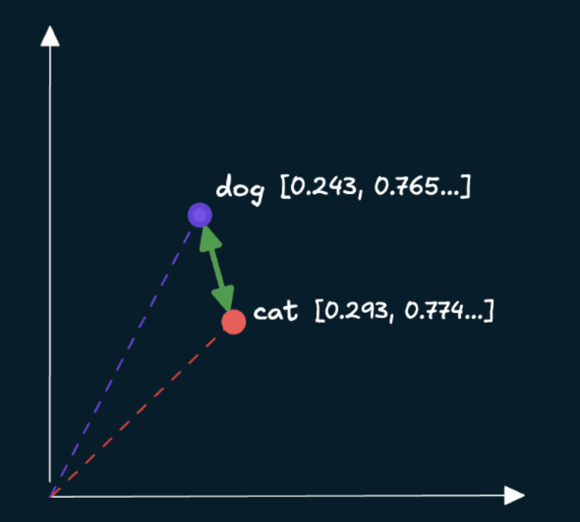
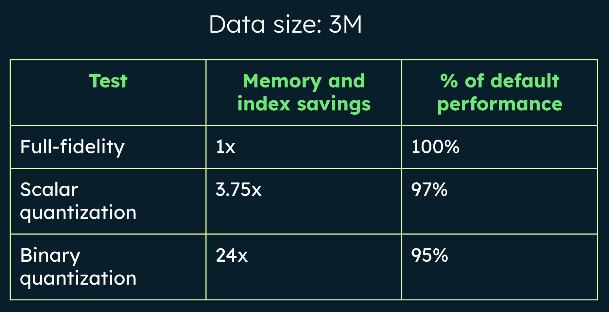
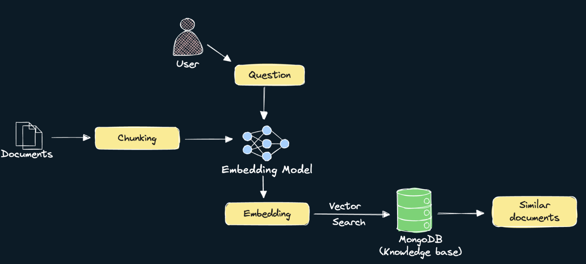
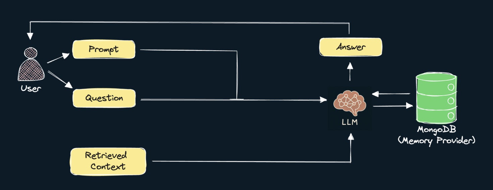
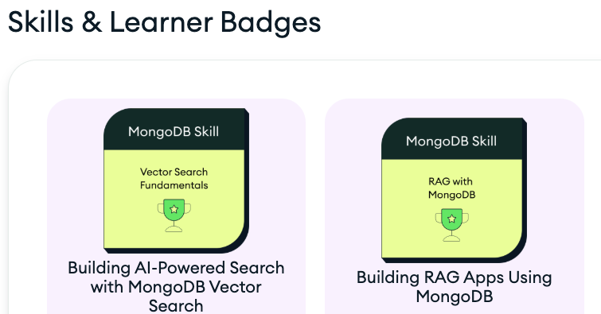

> 요즘 들어 LLM 기반 개발이 점점 더 뜨거워지면서 백엔드와 데이터 쪽 흐름에도 관심이 생겼다. 그러던 중 MongoDB에서 주최한 Gen AI Day라는 교육이 있다는 소식을 듣고 하루 시간을 내어 다녀왔다. 이번 세션에서는 RAG(Retrieval-Augmented Generation) 아키텍처를 MongoDB Atlas 기반으로 어떻게 구축할 수 있는지, 그리고 실제로 어떤 흐름으로 동작하는지를 간단하게 체험할 수 있는 기회였다. 당장 개발에 쓰지 않더라도, 필요할 때 배경 지식으로 알고 있는 것과 모르는 것은 큰 차이가 있기 때문에 꼭 듣고 싶었다. 수강을 마친 후에는 MongoDB에서 제공한 간단한 테스트를 통해 인증 뱃지 2개도 획득할 수 있었는데, 이 역시 실습 내용을 복습하고 정리하는 좋은 계기가 되었다. 이 포스팅에서는 교육을 들으며 경험했던 내용을 간단히 정리했다. 짧은 시간이었기 때문에 부정확한 내용이 포함될 수 있다. 흐름을 파악하는 용도로만 기록한다.

세션은 2개로 나눠졌다. 
- Vector Search
- MongoDB를 활용한 Rag App 구축 실습

## Vector Search
첫번째 세션에서는 DB에 책 데이터를 넣어놓고, 벡터 검색을 통해 높은 유사도를 가지고 있는 책을 찾아내는 실습이었다.

각 데이터에 걸맞는 임베딩 모델을 선택하고, 인코딩하게 되면 배열에 숫자들이 담겨있는 벡터 데이터를 얻을 수 있다.
이 벡터 데이터는 의미공간에서 비슷한 의미를 가진 것들이 가까이 위치하게 되고, 우리는 검색했을 때 비슷한 의미를 가진 데이터들을 얻을 수 있는 것이다.

되게 어려운 일 같지만 의외로 간단했다.
임베딩 모델을 정해주고, 우리는 그 임베딩 모델을 사용해 인코딩하면 된다.
```python
# Load a multimodal embedding model using the Sentence Transformers library
embedding_model = SentenceTransformer("clip-ViT-B-32")

image_url = "https://images.isbndb.com/covers/77/44/9780789467744.jpg"
# Load the image from the URL above
image = Image.open(requests.get(image_url, stream=True).raw)
# Embed the `image` using the `embedding_model` instantiated above and return the embedding as a list
# An array can be converted to a list using the `tolist()` method
embedding = embedding_model.encode(image).tolist()

print(embedding) // [0.29966938495635986, 0.06095565855503082, 0.2394038885831833, -0.21532009541988373, ...]
print(len(embedding)) // 512
```

이렇게 얻은 정보는 DB에서 embedding이란 field를 추가해서 각 데이터가 의미 공간에서 어디에 위치해있는지 벡터 데이터를 저장해놓을 수 있다.

```json
{
    title: "david Copperfield's Tales of the Impossible",
    cover: "https://...",
    year: 1995,
    pages: 385,
    synopsis: "David Copperfield...",
    embedding: Array<number> // embedding field만 추가해서 인코딩된 벡터 데이터를 저장한다
        0: 0.0300023022238238
        1: -0.052390283902390
        ...
}
```

아래 코드는 쿼리 검색부터 결과를 얻는 과정을 수행한다.

```python
def get_embedding(content: str, mode: str) -> List[float]:
    """
    Generate embeddings

    Args:
        content (str): Content to embed
        mode (str): Content mode (Can be one of "image" or "text")

    Returns:
        List[float]: Embedding of the content as a list.
    """
    # If an image URL is provided, first load the image
    if mode == "image":
        content = Image.open(requests.get(content, stream=True).raw)
    return embedding_model.encode(content).tolist()

# Create vector index definition specifying:
# path: Path to the embeddings field
# numDimensions: Number of embedding dimensions- depends on the embedding model used
# similarity: Similarity metric. One of cosine, euclidean, dotProduct.
model = {
    "name": ATLAS_VECTOR_SEARCH_INDEX_NAME,
    "type": "vectorSearch",
    "definition": {
        "fields": [
            {
                "type": "vector",
                "path": "embedding",
                "numDimensions": 512,
                "similarity": "cosine",
            }
        ]
    },
}

# Define a function to retrieve relevant documents for a user query using vector search
def vector_search(
    user_query: str, mode: str, filter: Optional[Dict] = {}
) -> None:
    """
    Retrieve relevant documents for a user query using vector search.

    Args:
    user_query (str): The user's query (can be a piece of text or a link to an image)
    mode (str): Query mode (image or text)
    filter (Optional[Dict], optional): Optional vector search pre-filter
    """
    # Generate embedding for the `user_query` using the `get_embedding` function defined in Step 4
    query_embedding = get_embedding(user_query, mode)

    # Define an aggregation pipeline consisting of a $vectorSearch stage, followed by a $project stage
    # Set the number of candidates to 50 and only return the top 5 documents from the vector search
    # Set the `filter` field in the $vectorSearch stage to the value `filter` passed to the function
    # In the $project stage, exclude the `_id` field, include these fields: `title`, `cover`, `year`, `pages`, and the `vectorSearchScore`
    # NOTE: Use variables defined previously for the `index`, `queryVector` and `path` fields in the $vectorSearch stage
    pipeline = [
    {
        "$vectorSearch": {
            "index": ATLAS_VECTOR_SEARCH_INDEX_NAME,
            "queryVector": query_embedding,
            "path": "embedding",
            "numCandidates": 50,
            "filter": filter,
            "limit": 5,
        }
    },
    {"$project": {"_id": 0, "title": 1, "cover": 1, "year":1, "pages":1, "score": {"$meta": "vectorSearchScore"}}},
]

    # Execute the aggregation `pipeline` and store the results in `results`
    results = collection.aggregate(pipeline)

    # Print book title, score, and cover image
    for book in results:
        cover = Image.open(requests.get(book.get("cover"), stream=True).raw).resize((100,150))
        print(f"{book.get('title')}({book.get('year')}, {book.get('pages')} pages): {book.get('score')}")
        display(cover)
```

벡터 공간에서 유사도를 측정하는 방법으로 3가지가 있다.
어떤 측정 방법을 사용할지는 대부분 임베딩 모델이 어떤 방식으로 학습되었는지에 따라 권장되는 방식이 있기 때문에 크게 고민하지 않아도 된다.

벡터 검색 인덱스를 생성할 때 이 유사도 기법을 기입하는 것이고, ANN 기반 인덱스 검색에 해당 유사도를 사용해서 효율적으로 유사 벡터를 찾는다.
이렇게 생성된 벡터 검색 인덱스를 이용해서 벡터 검색 쿼리를 수행한다.

- 코사인 유사도 : 벡터 간 각도를 측정하여 방향적 유사성을 나타내고, 크기에 영향을 받지 않는다.



- 유클리드 거리 : 두 벡터 간의 절대적 거리를 측정한다.



- 내적 : 방향적 유사성과 벡터의 크기를 모두 고려하고자 할 때 이상적인 측정 방법이다.

### 벡터 검색 튜닝
벡터 검색을 할 때 성능을 높이기 위해서 사전 필터링도 가능하다.

우리가 검색하고자 하는 범위를 미리 사전 필터링하는 것인데
예를 들어서 유사한 책을 찾기 위한 검색 쿼리를 수행할 때 전체 페이지에 대해서 유사도를 비교하는 것이 아니라 앞에 200페이지 안에서만 검색을 수행한다던지 해서 범위를 줄이는 것이다.

위 파이프라인 코드에서 verctor_search를 지정할 때 filter 프로퍼티를 추가해주면 된다.
```python
pipeline = [
    {
        "$vectorSearch": {
            "index": ATLAS_VECTOR_SEARCH_INDEX_NAME,
            "queryVector": query_embedding,
            "path": "embedding",
            "filter": {"pages": { "lte": 200 }}, // 이렇게 필터링 할 수 있다
            "numCandidates": 50,
            "filter": filter,
            "limit": 5,
        }
    },
```

### 벡터 양자화
방대한 벡터 데이터를 다루기 위해서 축소하는 과정이다.
원본 정밀도의 손실을 어느정도로 감수할 것인지를 조율하면서 저장되는 데이터의 크기를 정할 수 있다

좀 더 구체적으로 알아보자.
임베딩 벡터를 저장하기 위한 타입과 필요한 비트 수 규격인 "FP32"를 예로 들었을 때 
50개 데이터를 보관한다하면 50*512*4bytes ~= 102400 bytes ~= 102.4KB가 된다.
만약 100만개라면 약 204GB가 된다.

이 때 벡터 양자화가 필요해진다.
벡터 양자화에는 2가지 방식이 있다.
- scalar: 몇 개의 작은 그룹으로 나눈다.
- binary: 각 벡터의 차원값을 특정 기준점을 기준으로 0 또는 1로만 저장한다.

> binary의 경우 다소 극단적으로 보인다. 0또는 1로만 저장한다니, 하지만 놀랍게도 scala방식과 비교했을 때 save되는 메모리양은 어마어마하지만, 성능 차이는 크지 않았다.


양자화를 적용하는 방식도 간단하다. 벡터 인덱스를 만들 때 적용하면 된다.
```python
{
    "fields": [
        {
            "type": "vector",
            "path": "embedding",
            "numDimensions": 512,
            "similarity": "cosine",
            "quantization": "scalar",
        }
    ...
    ]
}
```

## RAG와 AI Agent

Rag는 요즘 모르는 사람이 없을 정도로 익숙한 기술 중 하나로 자리잡고 있다.
외부 소스를 훈련 시켜서 원하는 정보를 얻을 수 있도록 최적화 시키는 것을 말한다.
AI Agent는 LLM이 문제를 추론하고 도구 같은 것을 활용해서 최종 답변에 도달하는 것을 말한다.

오늘은 MongoDB 데이터를 기반으로 Rag를 구현할 것이다.
Rag는 "검색"부분과 "생성"부분을 구현해야 한다.

### "검색"구현하기



우선, 데이터를 더 작은 세그먼트나 청크로 나눠야 한다. LLM 호출 비용을 절감할 수 있다.
청킹하는 방법은 대표적으로 3가지가 있다.
- 텍스트를 일정 간격으로 분리하는 "고정 토큰 오버랩 방식"
- 텍스트 앞 뒤 문장을 일부 포함시켜 쪼개는 "재귀적 오버랩 방식"
- 의미적인 문장 단위로 쪼개는 "의미적 방식"

여기서는 문맥을 유지하고, Rag 성능 향상을 목적으로 "재귀적 오버랩 방식"을 사용한다.
각 청크된 결과물에 대해 임베딩 모델을 거쳐 벡터 임베딩을 생성한다.
생성된 벡터 데이터는 각 데이터의 embedding필드에 추가한다.

사용자 검색 또한 임베딩 모델로 벡터를 생성한 뒤, 유사한 벡터들을 MongoDB에서 벡터 인덱스로 검색한다.
그러기 위해서 벡터 인덱스를 먼저 생성한다.
```python
# Create vector index definition specifying:
# path: Path to the embeddings field
# numDimensions: Number of embedding dimensions- depends on the embedding model used
# similarity: Similarity metric. One of cosine, euclidean, dotProduct.
model = {
    "name": ATLAS_VECTOR_SEARCH_INDEX_NAME,
    "type": "vectorSearch",
    "definition": {
        "fields": [
            {
                "type": "vector",
                "path": "embedding",
                "numDimensions": 384,
                "similarity": "cosine",
            }
        ]
    },
}

# Create a vector search index with the above definition for the `collection` collection
collection.create_search_index(model=model)
```

그 다음 벡터 검색을 정의하고 수행한다.
```python
# Define a function to retrieve relevant documents for a user query using vector search
def vector_search(user_query: str) -> List[Dict]:
    """
    Retrieve relevant documents for a user query using vector search.

    Args:
    user_query (str): The user's query string.

    Returns:
    list: A list of matching documents.
    """

    # Generate embedding for the `user_query` using the `get_embedding` function defined in Step 4
    query_embedding = get_embedding(user_query)

    # Define an aggregation pipeline consisting of a $vectorSearch stage, followed by a $project stage
    # Set the number of candidates to 150 and only return the top 5 documents from the vector search
    # In the $project stage, exclude the `_id` field and include only the `body` field and `vectorSearchScore`
    # NOTE: Use variables defined previously for the `index`, `queryVector` and `path` fields in the $vectorSearch stage
    pipeline = [
    {
        "$vectorSearch": {
            "index": ATLAS_VECTOR_SEARCH_INDEX_NAME,
            "queryVector": query_embedding,
            "path": "embedding",
            "numCandidates": 150,
            "limit": 5
        }
    },
    {
        "$project": {
            "_id": 0,
            "body": 1,
            "score": {"$meta": "vectorSearchScore"}
        }
    }
]

    # Execute the aggregation `pipeline` and store the results in `results`
    results = collection.aggregate(pipeline)
    return list(results)

ector_search("What are some best practices for data backups in MongoDB?") // <- 쿼리 결과가 나온다.
```


### "생성"구현하기



LLM에게 전달할 시스템 프롬프트를 작성해야 한다.
예를 들어, RAG를 이용하는 경우 전달한 지식에서 데이터를 얻는 것이 목적이기 때문에 모르면 모른다라고 답변해달라고 할 수 있다.
"Answer the question based on the context below. If no context is provided, respond with I DONT'T KNOW" 이런 식으로 말이다.
이어서, 벡터 검색으로 가져온 데이터를 Context에 넣고 Qestion에 사용자 질의를 넣어서 LLM에게 전달하면 된다.

### 히스토리 구현하기
이전 채팅 기록들을 유지하고 싶다면 session_id를 기반으로 DB에 저장하고, 가져오고를 반복하면 된다.

```python
def retrieve_session_history(session_id: str) -> List:
    """
    Retrieve chat message history for a particular session.

    Args:
        session_id (str): Session ID to retrieve chat message history for.

    Returns:
        List: List of chat messages.
    """
    # Query the `history_collection` collection for documents where the "session_id" field has the value of the input `session_id`
    # Sort the results in increasing order of the values in `timestamp` field
    cursor =  history_collection.find({"session_id": session_id}).sort("timestamp", 1)

    if cursor:
        # Iterate through the cursor and extract the `role` and `content` field from each entry
        # Then format each entry as: {"role": <role_value>, "content": <content_value>}
        messages = [{"role": msg["role"], "content": msg["content"]} for msg in cursor]
    else:
        # If cursor is empty, return an empty list
        messages = []

    return messages

def generate_answer(session_id: str, user_query: str) -> None:
    """
    Generate an answer to the user's query taking chat history into account.

    Args:
        session_id (str): Session ID to retrieve chat history for.
        user_query (str): The user's query string.
    """
    # Initialize list of messages to pass to the chat completion model
    messages = []

    # Retrieve documents relevant to the user query and convert them to a single string
    context = vector_search(user_query)
    context = "\n\n".join([d.get("body", "") for d in context])
    # Create a system prompt containing the retrieved context
    system_message = {
        "role": "user",
        "content": f"Answer the question based only on the following context. If the context is empty, say I DON'T KNOW\n\nContext:\n{context}",
    }
    # Append the system prompt to the `messages` list
    messages.append(system_message)

    # Use the `retrieve_session_history` function to retrieve message history from MongoDB for the session ID `session_id` 
    # And add all messages in the message history to the `messages` list 
    message_history = retrieve_session_history(session_id)
    messages.extend(message_history)

    # Format the user query in the format {"role": <role_value>, "content": <content_value>}
    # The role value for user messages must be "user"
    # And append the user message to the `messages` list
    user_message = {"role": "user", "content": user_query}
    messages.append(user_message)

    # Send the chat messages to a serverless function to get back an LLM response
    response = requests.post(url=SERVERLESS_URL, json={"task": "completion", "data": messages})

    # Extract the answer from the response
    answer = response.json()["text"]

    # Use the `store_chat_message` function to store the user message and also the generated answer in the message history collection
    # The role value for user messages is "user", and "assistant" for the generated answer
    store_chat_message(session_id, "user", user_query)
    store_chat_message(session_id, "assistant", answer)

    print(answer)

generate_answer(
    session_id="1",
    user_query="What are some best practices for data backups in MongoDB?",
)
```


## 후기
MongoDB는 LLM이나 RAG 시스템을 구축하는데 최적화가 잘 되어있다고 느꼈다.
다음에 직접 구축해 볼 일이 있다면 사용해봐야겠다.

가장 큰 수확이라고 생각하는 것 중 하나는 Base수준의 Rag 구축 정도는 생각보다 엄청 어렵지는 않을 수 있겠구나를 배웠다는 점이다.

그리고, 성취감을 느낄 수 있도록 뱃지를 획득하는 과정도 즐거웠다.

