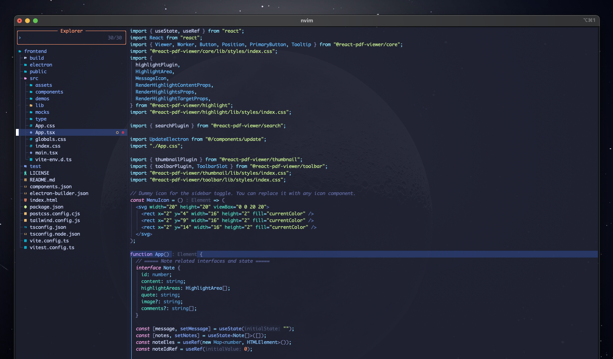

## **사전 설명**

- NeoVim은 Vim을 강력하게 쓰게 해주는 텍스트 에디터다.
- LazyVim은 에디터가 아니라 NeoVim을 일부 미리 설정해 둔 프레임워크라고 생각하면 된다.

## 설치한 이유

vim으로 편집하면 키보드만 이용해서 개발할 수 있기 때문에 예전부터 익히고 싶은 방법이었다. 하지만, 마음이 쉽게 내키지는 않았다. 그러던 중 [이 영상](https://www.youtube.com/watch?v=fFHlfbKVi30&t=559s)을 보게 됐다. 다시 한번 공부하고 싶은 마음이 번뜩였다.

더 이상 미루지 않고, 미래의 생산성을 위해 큰 프로젝트들이 마무리 된 이 시점에 공부해봐야겠다 싶었다.

## 설치 방법

설치 방법은 굉장히 간편하다. [Lazyvim 공식문서](https://www.lazyvim.org/installation)를 따라가면 금방 설치할 수 있다.

## 공부 방법

기본기는 터미널에서 `vimtutor`를 입력해서 시작할 수 있다. mac에 기본 탑재 되어있어서 빠르고, 간편하게 연습해 볼 수 있다. 나 같은 경우에는 하루 1~2시간 정도씩 3일 정도 하면서 손에 익숙해지는 시간을 가졌다. 3일이 지났을 때 자주 사용하는 것들 몇 개는 기억할 수 있었고, 때로는 다시 검색하면서 느리지만 원하는데로 동작할 수 있었다.

## 사용 후기

( Lazyvim에 일부 설정만 좀 수정해주면 위와 같은 에디터를 볼 수 있다. )

약 1주일 정도 사이드프로젝트를 할 때만 사용했는데 장점과 단점이 확실하다는 것을 느꼈다.

### 장점

- 심플한 UI : 불필요한 UI도 없고 단축키만으로 원하는 곳에 빠르게 이동하고 편집할 수 있다는 점은 코드 에디팅에 더 집중할 수 있게 해줬다. (인간의 뇌는 실제로 멀티플레이가 불가능하다. 마치 JS의 싱글스레드에서 이벤트 루프에 의해 멀티 스레드처럼 동작하게 해주는 원리라고 볼 수 있다. 그 부분에서 인간은 1개의 집중할 때 더 높은 생산성이 나온다.)
- 투명도 : 나는 에디터의 배경을 약간 투명하게 하는 것을 좋아하는데 터미널 앱에서 배경 투명도를 올려주기만 하면 끝이라서 좋았다.
- 단축키 : 단축키를 다 못 외우면 사용을 못하지는 않을까 걱정할 필요가 없다. 대부분 스페이스바와 연계해서 명령어를 완성하는데 LazyVim은 친절하게도 우측하단에 조합식이 나온다. 하지만, 유용한 것들을 다 외운다면 정말 파워풀하게 사용할 수 있겠다는 생각이 직접 사용해보니까 더 들었다.
- plugin : VSCode에서 Extension들이 있다면 NeoVim에서도 마찬가지로 정말 많은 플러그인들이 있다.

### 단점

- AI : 요즘은 Cursor나 WindSurf처럼 AI가 결합된 에디터가 나오고 있는 추세다. 이런 에디터를 사용하면 똑똑한 동료와 함께 일하는 것 같은 수준으로 개발을 빠르게 할 수 있는데 NeoVim에서는 이런 혜택을 누릴 수 없다. 그나마 Github Copilot은 연동할 수 있다는 점이 다행인 것 같다.
- UI : 프로젝트가 클 경우에 특정 폴더 내부에서 검색을 해야하는 경우가 있다. 이 때 IntelliJ나 VSCode같이 GUI로 컨트롤 할 수 있는 IDE는 직관적이고 쉽다. 하지만 Vim에서는 텍스트만으로 해야되기 때문에 불편하게 느껴졌다.
- Mode: Normal, Visual, Insert 모드를 오가면서 에디팅하는 경험은 생각보다 나쁘지 않았다. 하지만 빠르게 개발을 하고 싶을 때 생각의 흐름을 방해하는 느낌을 받았다. 근데 이건 익숙함의 문제기 때문에 초보자에게 느껴지는 단점일 것이다.

## 후기

Vim을 본격적으로 사용하기 전에는 마우스를 사용하지 않고, 키보드만으로 생산성을 올리는 것이 극적일 것이라고 생각했지만 실제 1주일 좀 넘게 경험해보니, 생산성을 더 떨어트리는 것이 아닐까하는 생각이 들었다.

그 이유는 AI의 도움 측면 때문이다. 내 생각에 Cursor나 WindSurf처럼 코드 베이스를 AI가 이해해야 활용도가 극대화 된다고 생각한다. 하지만 Vim에서 사용가능한 Github Copilot은 그 부분에서 부족하다. 그렇기에 Vim에 Github Copilot을 사용한다고 한들, Cursor를 사용하는 것에 비해서 생산성이 떨어진다.

사용할수록, 더욱 Cursor의 강력함을 느꼈다. 이제 AI를 잘 활용하는 것 또한 앞으로 하나의 실력이 되는 시대일 것이기 때문에 흐름에 잘 따라가는 것이 중요하다. 그 부분에서 Vim만을 사용하는 것은 앞으로 저물 수 밖에 없는 것 같다. (지극히 개인적인 생각)

그래서 두 생산성을 합치면 좋은 시너지가 날 것 같다고 생각해서 Vim의 강력한 에디팅과 Cursor의 강력한 AI를 함께 사용해보기로 했다. Extension에서 NeoVim을 설치하기만 하면 VSCode기반 에디터에서도 Vim의 기능들을 사용할 수 있다. 

문제는 현재 어떤 모드(insert같은 vim모드)인지 볼 수가 없다는 점, Ctrl+F/B로 현재 코드를 보고 있는 에디터 화면을 위/아래로 넘길 때 부드럽지 않은 점 등 원하는데로 동작을 하지 않는 버그가 발생한다는 점이 크리티컬했다. 개발 흐름이 오히려 더 끊겼기 때문이다. 이 정도면 충분히 체험했다고 생각한다. 다음에 또 Vim병이 도지면 또 사용해보겠지만 당분간은 사용하지 않을 것 같다. 좋은 경험이었다.