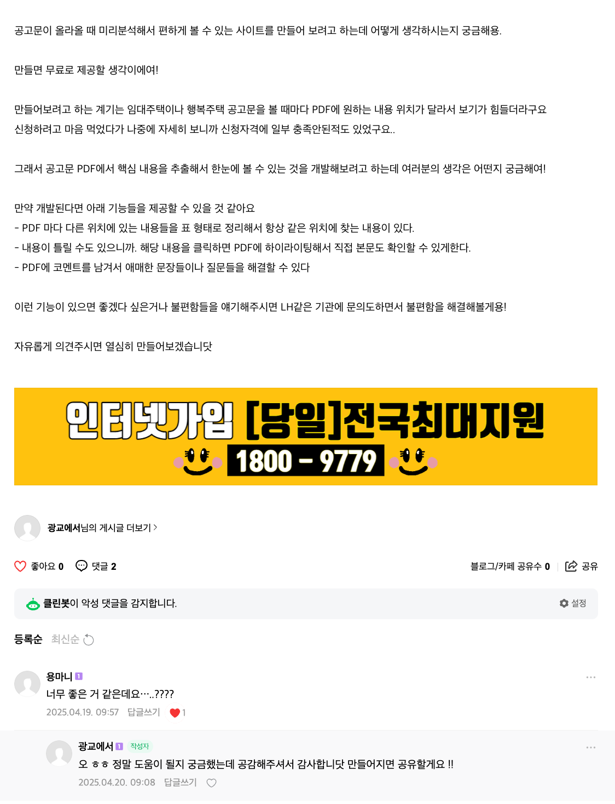
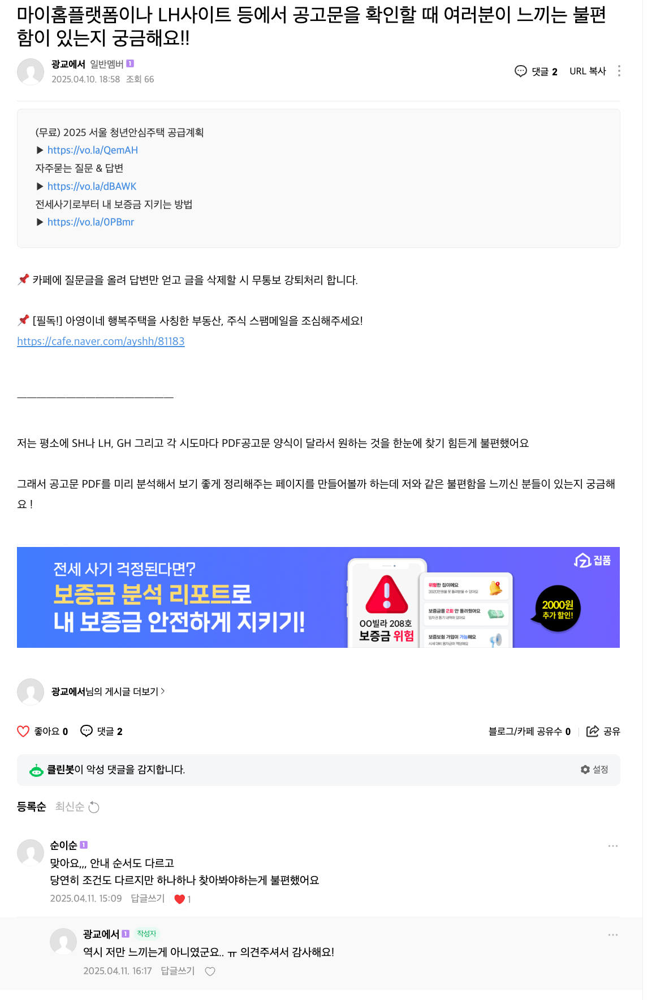

## 아이디어 공유의 가치

많은 사람들이 자신의 아이디어를 공개하면 "뺏길 것"이라는 두려움에 혼자 꽁꽁 싸매고 만들려는 경향이 있다. 하지만 실제로는 아이디어를 사회에 공개하고 피드백을 받을 때 그 아이디어는 성장하고 성공할 가능성이 높아진다. 이는 많은 스타트업에서 얘기하고 있고, '구글 엔지니어처럼 일하기'에서도 강조하는 부분이다.

## 아이디어 공유의 장점

처음에는 나도 아이디어 노출에 대한 두려움이 있었다. 하지만 지금 와서 생각해보니, 내가 생각하는 그림을 가장 가까운 사람에게도 이해시키기 어려운 것이 아이디어다. 인터넷에 간단히 공개하는 컨셉안으로는 나와 같은 그림을 더욱 볼 수 없기에 좋은 아이디어인지에 대해 공감할 수 없다.

따라서 두려워하지 말고, 아이디어를 공유함으로써 아이디어는 더욱 성장할 수 있다.

- 상대방의 다른 관점과 퍼즐 조각을 얻을 수 있다
- 아이디어가 보완되고 성공 확률이 올라간다
- 실제 사용자들의 니즈를 더 잘 파악할 수 있다

## 실제 피드백 수집 시도

### 1. 서비스 컨셉 공유하기

시장 반응을 살피기 위해 네이버 카페에 서비스 컨셉을 공유했다.

비록 한 분의 댓글이었지만, 공감을 해주는 사람이 있다는 것은 큰 위안이 되었다. 혹시 글이 너무 장황해서 공감을 얻지 못했을까 싶어 더 간단한 버전으로 다시 시도해봤다.

### 2. 사용자 불편함 파악하기

이번에는 서비스 아이디어를 직접적으로 설명하기보다는 사용자의 불편함을 먼저 물어보는 방식으로 접근했다. 결과적으로 몇몇 분들이 공감과 함께 실제 경험했던 불편함을 공유해주셨다.

## 피드백 수집의 의미

### 작은 반응도 큰 성공

처음에는 무반응을 예상했지만, 1-2명의 공감과 의견을 받은 것만으로도 큰 성공으로 볼 수 있다. 실제 서비스 출시 후에는 더 구체적인 피드백을 받을 수 있을 것이고, 초기 사용자들의 의견을 꾸준히 반영해나간다면 서비스의 성공은 시간문제일 것이다.

### 반응이 적은 이유 분석

사용자 반응이 예상보다 적은 이유를 생각해보는 것도 생각해보면 좋은 문제같아서 정리해봤다.

1. **습관의 힘**
   - 기존 서비스에 익숙해져 있어 새로운 것을 배우기 꺼려한다
   - 특히 30-40대 타겟층은 새로운 서비스 적응에 더 많은 시간이 필요하다

2. **구독제 피로도**
   - 많은 서비스들이 구독제 모델을 채택하면서 사용자들의 피로도가 증가한다
   - 새로운 서비스에 대한 추가 비용 부담에 대한 우려가 있다

3. **실현 가능성에 대한 회의**
   - 많은 사람들이 개선점을 제시하지만 실제 서비스화까지 이어지는 경우가 드물다
   - 이로 인한 새로운 서비스에 대한 기대감이 저하된다

## 결론

서비스를 만들 때는 기존 서비스와 비교했을 때 명확한 차별점과 가치를 제시해야 한다. 특히 30-40대 타겟층을 위해서는 직관적인 UX/UI 설계가 중요하다. 

이 프로젝트는 사회 공헌 목적으로 진행되는 만큼, 수익 창출보다는 정보 제공에 초점을 맞추고 사용자들의 신뢰를 확보하는 것이 중요하다.

마지막으로, 부족할지언정 완성도 있는 서비스로 사용자들의 기대에 부응해야 한다. 꾸준한 개선과 업데이트를 통해 신뢰를 구축해나가야 한다. 행복주택과 청약에 대해 차원이 다른 편리함을 제공하는 그날까지 개선해보자.