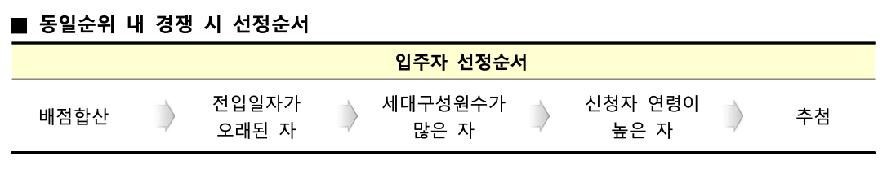
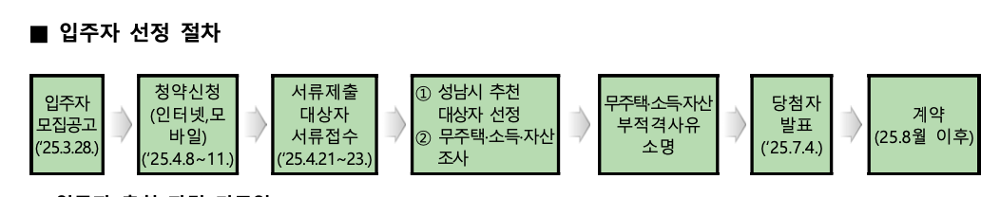

> 떠오르는 아이디어들을 마인드맵으로 그려보고, 시스템 다이어그램으로 정리했다.
이후 텍스트로 요구사항을 다시한번 정리해보니까. 머리속이 확실하게 클리어해진 느낌이다.
아래는 오늘 정의한 요구사항을 정리한 내용이다.

## 현재 방식의 문제

- 긴 PDF를 매번 읽어야만 하는데서 오는 불편함 → **내가 원하는 정보들을 간추려서 보고 싶다.**
    - PDF가 길고, 전문용어들이 있으며, 이해하기 어려운 문장들도 있다. → 이해하기 쉽게 제공해야 한다.
    - 카페에 물어보는 경우가 굉장히 많다. 내가 원하는 답변을 기대하기 어렵기도 하고, 신뢰성 낮은 답변이 올 수도 있다. → 애매한 것들. 정확한 정보를 기반한 chat으로 직접 해소한다.
    - 대중적으로 핵심적으로 궁금한 내용들. 소득 제한, 지역 제한, 1지망/2지망/3지망 이런 것들을 알기 위해서는 PDF 내부에서 숨바꼭질해야 한다. → 가장 먼저 알고 싶다. 만약 내가 가능성이 없다면 해당 공고는 관심을 가질 필요도 없다.
- 언제 공고가 뜰지 알기 어렵기 때문에 매일 시간 날 때마다 들어가야 한다. → 일단은, 웹에서 추천 공고들을 제공해주고 → 추후 앱 알림으로 기능 제공
- 내가 현재 어떤 부적격 관련된 것을 받은 상황일 때, 지원이 가능한 공고인지 불가능한 공고인지 한눈에 알기 어렵다.

## 목적

### 메인 기능

**행복주택 사이트에서 각 사용자의 자비스**를 만든다.

**일단은 경기권만 제공해보자. 경기권에서 원하는 지역을 추가적으로 선택해서 API를 요청할 수 있다.**

**우리는 모든 경기권 공고(3/28기준 44개)를 미리 분석해서 각 사용자가 원하는 공고인지 알맞게 추천해준다.**

나의 소득, 청약 저축 횟수, 거주지, 원하는 거주지, 원하는 종류(집 사이즈, 건물종류, 청년/신혼부부/노약자)와 공고에서 나와있는 정보와 매칭해서 나와의 적합도가 몇 x% or 개수인지 한눈에 알 수 있으면 좋을 것 같다. (몇개나 적합한지?)

**예를 들어, 소득이 애매하게 안될 경우 다시한번 확인해볼수도 있고 사용자에게 얼마나 적합한지 보여주는 것이 좋겠다고 판단. 왜냐하면 100% 이 서비스를 믿지 않을것이고, 사용자 본인에게 판단할 수 있는 권한을 줘야함.**

내가 몇 순위로 지원할 수 있는지, 몇일날 지원할 수 있는지 등을 나온다.

### 서브기능

`+` 가능하다면 PDF분석한 내용을 기반으로 chat 기능 제공

`+`그 다음에 앱 서비스로 만들어서, 알람 기능도 넣어서, 적합한 공고가 떴을 때 알아서 알람도 올 수 있게 한다. 지금은 사용자가 매번 들어가서 뜨는지 봐야 함 (청약도 마찬가지)

## **핵심 요구 사항**

- 기존 공고들 데이터를 저장한다.
    
    PDF를 분석한 데이터를 가지고 있어야 한다.
    
    가지고 있어야 하는 데이터는 다음과 같다.
    
    - 입주대상 : 신혼부부/청년 등
    - 주택유형 : 아파트/오피스텔 등
    - ~~공급기관 : LH/SH/GH~~
    - 주소
    - 모집 세대 수
    - 최초 입주 시기
    - 면적
    - 임대료
    - 공급일정
    - 모집일과 당첨자 발표일
    - 신청조건
    
    > 이 정보는 추후 사용자 개인 데이터 - 청약통장 납입횟수, 거주지, 원하는 거주지, 원하는 면적, 소득과 비교해서 추천리스트를 줄 것이다. **알람을 울릴 수 있으면 베스트인데..**
    > 
- 최초 데이터를 저장한 이후, 주기적으로 공공 API를 요청해서 마지막 보관하고 있는 데이터와 비교해서, 없는 것이 있다면 다시 공고를 분석해서 DB에 추가한다.
- 경기도권 / 진행중으로 필터 걸었을 때 44개정도가 나온다.

## 학습 필요

- 데이터를 분석하는 방법
    1. `API요청` 공공 API를 요청해서 공고문 사이트 주소를 받는다.
        
        공공 API를 요청해서 받아온 응답 데이터들을 보면 각 공고의 주소가 있다.
        
    2. `크롤러` 공고문 사이트 주소로 들어가서 PDF 요소를 찾는다.
    3. `크롤러` PDF를 다운받는다.
    4. `PDF분석` 다운 받은 PDF를 분석한다.
    5. `DB` 분석한 데이터들을 각 필요한 정보로 분류해서 DB에 저장한다.
        - 입주대상 : 신혼부부/청년 등
        - 주택유형 : 아파트/오피스텔 등
        - ~~공급기관 : LH/SH/GH~~
        - 주소
        - 모집 세대 수
        - 최초 입주 시기
        - 면적
        - 임대료
        - 공급일정
        - 모집일과 당첨자 발표일
        - 신청조건

- 사용자 접속 시
    - `API요청` 최초 회원가입 후 로그인 시, 해당 사용자의 청약통장 납입횟수, 거주지, 원하는 거주지, 원하는 면적, 소득을 기입한다.
    - `API요청` 공고 리스트 요청 시, 각 사용자의 개인데이터와 비교해서 최적의 공고들을 추천해준다.

### 하다보니 느끼는 문제

- PDF를 분석해야 하는데, 어마어마한 양이다. 너무 많은 토큰 수를 사용하지 않을까?
- 표가 많다. 표를 의도한데로 분석할 수 있는가?
- 표뿐만 아니라 비정형 데이터들이 많다. 맥락을 유지하면서 이해할 수 있을까?

