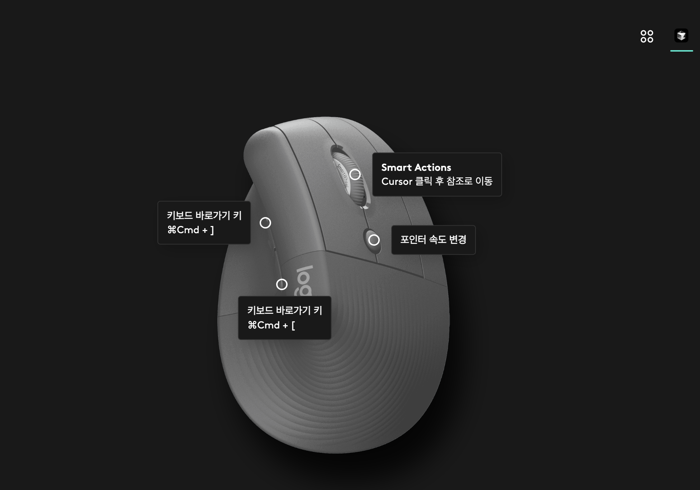
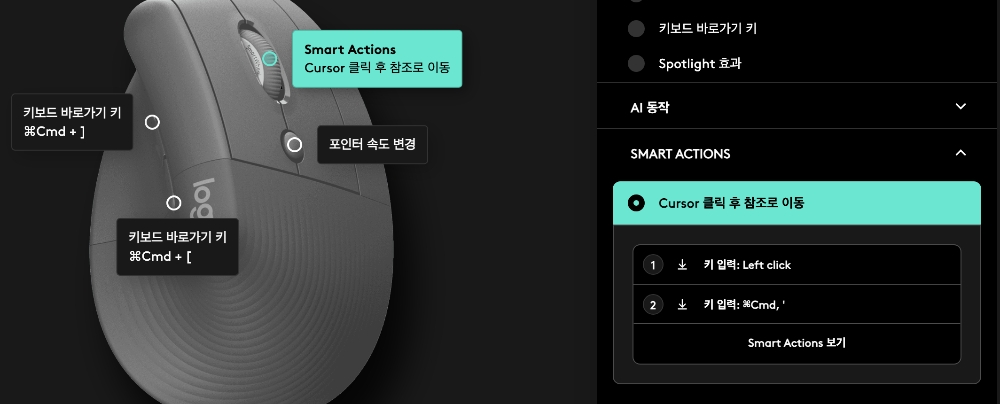

나는 코드를 작성하면서 코드 베이스를 탐색해야 할 일이 있을 때 마우스로 손이 왔다갔다하며 흐름이 끊기는 경험을 해결하고 싶었다.
그래서 키보드만 이용해서 탐색할 수 있도록 세팅을 해 두었다.

문제는 반대로 마우스만을 이용해서 코드 전체의 흐름을 읽어보고 싶을 때 VSCode기반인 Cursor는 IntelliJ처럼 편하지 않았다.
휠 버튼을 눌렀을 때 참조나 정의로 이동이 불가능 했고, 마우스의 이전 이후 버튼이 동작하지 않았다.
검색했을 때도 똑 부러지는 방법을 찾을 수 없었다.

하지만, 아주 쉽게 해결이 가능했다. 나는 집이나 회사에서 Logitech 마우스를 항상 사용하는데 Logi Options 툴을 이용해서 해결이 가능했다.

## 해결방법

첨부한 사진만 봐도 직관적으로 이해가 가능할 것이다.
우측 상단에 Cursor 어플리케이션을 지정하고, 앞으로가기/뒤로가기 버튼과 휠 버튼에 Cursor에서 단축키로 사용하던 키를 할당하면 된다.

휠 키는 Smart Actions을 이용해서 클릭만 하더라도 마우스 좌클릭 + Cursor에서 설정해둔 참조/정의로 이동 단축키를 조합해서 수행하게 할 수 있다.

이제 Cursor를 IntelliJ처럼 사용할 수 있다.
