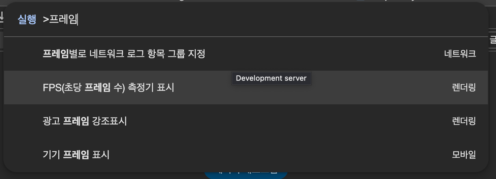
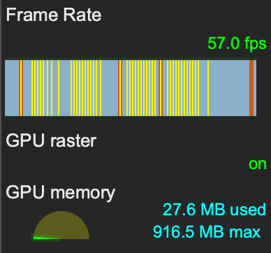

## 브라우저에서 frame 확인하기
화면에 많은 요소가 있을 때 성능 최적화를 해 본 경험이 있을 것이다.
이 때 Performance 탭에서 성능을 녹화하여 분석할 수도 있지만 간단하게 초당 몇 프레임으로 화면을 찍어내고 있는지를 통해서 얼마나 개선되었는지도 확인할 수 있다.

1. 브라우저 세팅이 한글로 되어있다면 브라우저 개발자 도구에서 cmd + shift + p를 눌러서 명령어 입력 모드로 들어가고 "프레임"으로 검색하면 "FPS 측정기 표시"가 나올 것이다. (영어는 show frame으로 검색하면 나온다)

  

2. 브라우저 좌측 상단을 보면 이런 작은 화면이 나올 것이다. 현재 Frame 율과 GPU memory 상황을 보여준다.

  

잘 작동하고 있는지 확인하고 싶다면 브라우저 resize를 하면서 viewport 사이즈를 바꿔보면 fps가 순간적으로 많이 떨어지는 것을 확인할 수 있다.

자, 이제 성능 최적화를 하기 전과 후를 비교해보자.
